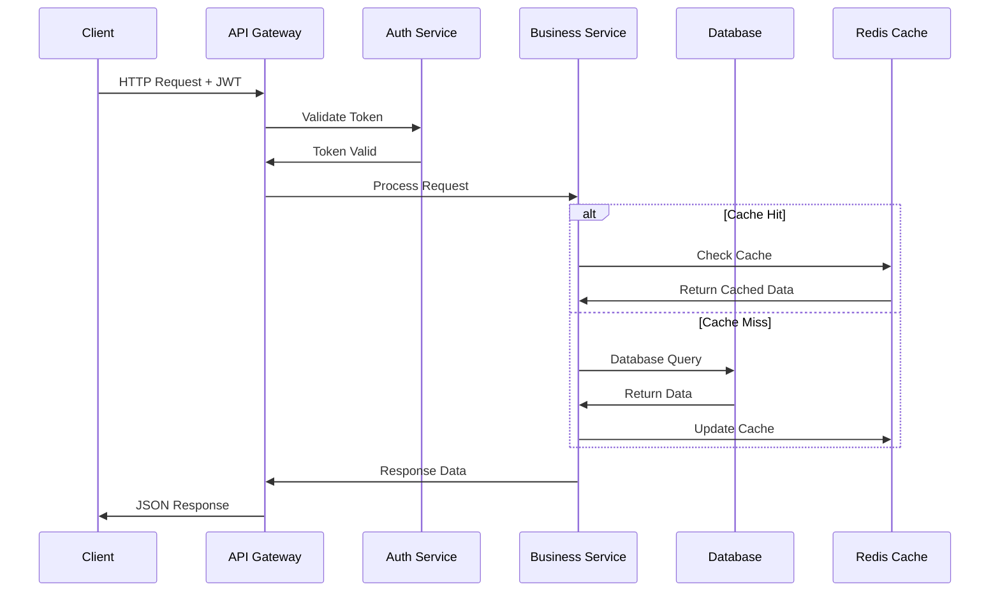
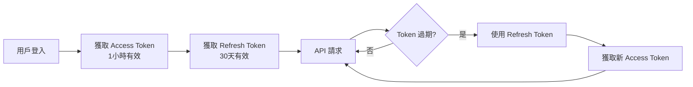
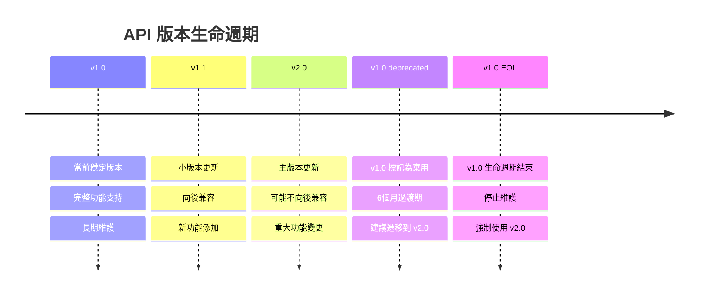

# 🚀 Ocean Shopping Center - API 文檔

## 📋 目錄

- [API 概覽](#api-概覽)
- [認證授權](#認證授權)
- [用戶管理 API](#用戶管理-api)
- [產品管理 API](#產品管理-api)
- [購物車 API](#購物車-api)
- [訂單管理 API](#訂單管理-api)
- [支付處理 API](#支付處理-api)
- [聊天系統 API](#聊天系統-api)
- [錯誤處理](#錯誤處理)
- [API 版本控制](#api-版本控制)

---

## 🌐 API 概覽

Ocean Shopping Center REST API 提供完整的電商功能，包含用戶管理、產品目錄、購物車、訂單處理和支付系統。API 設計遵循 RESTful 原則，使用 JSON 格式進行數據交換。

### 基本資訊
- **Base URL**: `https://api.ocean-shopping-center.com/api/v1`
- **Protocol**: HTTPS (SSL/TLS 1.3)
- **Data Format**: JSON
- **Authentication**: JWT Bearer Token
- **Rate Limiting**: 1000 requests/hour per user
- **API Version**: v1.0

### HTTP 狀態碼

| 狀態碼 | 說明 | 用途 |
|--------|------|------|
| `200` | OK | 請求成功 |
| `201` | Created | 資源創建成功 |
| `204` | No Content | 更新/刪除成功 |
| `400` | Bad Request | 請求參數錯誤 |
| `401` | Unauthorized | 未授權或 Token 無效 |
| `403` | Forbidden | 權限不足 |
| `404` | Not Found | 資源不存在 |
| `409` | Conflict | 資源衝突 |
| `429` | Too Many Requests | 請求過於頻繁 |
| `500` | Internal Server Error | 服務器內部錯誤 |

### API 流程圖



---

## 🔐 認證授權

### JWT Token 認證

所有受保護的 API 端點都需要在請求標頭中包含 JWT token：

```http
Authorization: Bearer <your-jwt-token>
```

### Token 生命週期



### 登入

**POST** `/auth/login`

```json
// Request
{
  "email": "user@example.com",
  "password": "password123"
}

// Response 200
{
  "success": true,
  "data": {
    "accessToken": "eyJhbGciOiJIUzI1NiIs...",
    "refreshToken": "eyJhbGciOiJIUzI1NiIs...",
    "tokenType": "Bearer",
    "expiresIn": 3600,
    "user": {
      "id": 1,
      "email": "user@example.com",
      "name": "John Doe",
      "role": "USER"
    }
  }
}
```

### 註冊

**POST** `/auth/register`

```json
// Request
{
  "name": "John Doe",
  "email": "user@example.com",
  "password": "password123",
  "confirmPassword": "password123"
}

// Response 201
{
  "success": true,
  "message": "用戶註冊成功",
  "data": {
    "id": 1,
    "name": "John Doe",
    "email": "user@example.com",
    "role": "USER",
    "createdAt": "2023-12-01T10:00:00Z"
  }
}
```

### Token 刷新

**POST** `/auth/refresh`

```json
// Request
{
  "refreshToken": "eyJhbGciOiJIUzI1NiIs..."
}

// Response 200
{
  "success": true,
  "data": {
    "accessToken": "eyJhbGciOiJIUzI1NiIs...",
    "refreshToken": "eyJhbGciOiJIUzI1NiIs...",
    "tokenType": "Bearer",
    "expiresIn": 3600
  }
}
```

### 登出

**POST** `/auth/logout`

```json
// Request (需要 Authorization header)
{
  "refreshToken": "eyJhbGciOiJIUzI1NiIs..."
}

// Response 204
// 無內容返回
```

---

## 👤 用戶管理 API

### 獲取當前用戶資訊

**GET** `/users/me`

```json
// Response 200
{
  "success": true,
  "data": {
    "id": 1,
    "name": "John Doe",
    "email": "user@example.com",
    "role": "USER",
    "profile": {
      "avatar": "https://cdn.example.com/avatars/1.jpg",
      "phone": "+886-912-345-678",
      "dateOfBirth": "1990-01-01",
      "gender": "MALE"
    },
    "preferences": {
      "language": "zh-TW",
      "currency": "TWD",
      "notifications": {
        "email": true,
        "sms": false,
        "push": true
      }
    },
    "createdAt": "2023-12-01T10:00:00Z",
    "updatedAt": "2023-12-15T14:30:00Z"
  }
}
```

### 更新用戶資料

**PUT** `/users/me`

```json
// Request
{
  "name": "John Smith",
  "profile": {
    "phone": "+886-912-345-679",
    "dateOfBirth": "1990-01-01",
    "gender": "MALE"
  },
  "preferences": {
    "language": "en-US",
    "currency": "USD",
    "notifications": {
      "email": true,
      "sms": true,
      "push": false
    }
  }
}

// Response 200
{
  "success": true,
  "message": "用戶資料更新成功",
  "data": {
    "id": 1,
    "name": "John Smith",
    "email": "user@example.com",
    // ... 完整用戶資料
  }
}
```

### 更改密碼

**PUT** `/users/me/password`

```json
// Request
{
  "currentPassword": "oldPassword123",
  "newPassword": "newPassword456",
  "confirmPassword": "newPassword456"
}

// Response 204
// 無內容返回
```

### 獲取用戶地址列表

**GET** `/users/me/addresses`

```json
// Response 200
{
  "success": true,
  "data": [
    {
      "id": 1,
      "type": "HOME",
      "isDefault": true,
      "recipientName": "John Doe",
      "phone": "+886-912-345-678",
      "address": {
        "street": "台北市信義區信義路五段7號",
        "city": "台北市",
        "district": "信義區",
        "postalCode": "110",
        "country": "Taiwan"
      },
      "createdAt": "2023-12-01T10:00:00Z"
    }
  ]
}
```

### 新增用戶地址

**POST** `/users/me/addresses`

```json
// Request
{
  "type": "OFFICE",
  "isDefault": false,
  "recipientName": "John Doe",
  "phone": "+886-912-345-678",
  "address": {
    "street": "台北市松山區南京東路四段2號",
    "city": "台北市",
    "district": "松山區",
    "postalCode": "105",
    "country": "Taiwan"
  }
}

// Response 201
{
  "success": true,
  "message": "地址新增成功",
  "data": {
    "id": 2,
    "type": "OFFICE",
    "isDefault": false,
    // ... 完整地址資料
  }
}
```

---

## 🛍️ 產品管理 API

### 獲取產品列表

**GET** `/products`

#### 查詢參數

| 參數 | 類型 | 必填 | 說明 | 範例 |
|------|------|------|------|------|
| `page` | integer | 否 | 頁碼，從1開始 | `1` |
| `limit` | integer | 否 | 每頁數量，最大100 | `20` |
| `category` | string | 否 | 產品分類ID | `electronics` |
| `search` | string | 否 | 搜尋關鍵字 | `iPhone` |
| `minPrice` | number | 否 | 最低價格 | `100` |
| `maxPrice` | number | 否 | 最高價格 | `50000` |
| `sortBy` | string | 否 | 排序欄位 | `price`, `rating`, `createdAt` |
| `sortOrder` | string | 否 | 排序方向 | `asc`, `desc` |
| `inStock` | boolean | 否 | 只顯示有庫存商品 | `true` |

```http
GET /products?page=1&limit=20&category=electronics&sortBy=price&sortOrder=asc
```

```json
// Response 200
{
  "success": true,
  "data": {
    "products": [
      {
        "id": 1,
        "name": "iPhone 15 Pro",
        "description": "最新的 iPhone 15 Pro，配備 A17 Pro 晶片",
        "category": {
          "id": "electronics",
          "name": "電子產品",
          "path": "電子產品 > 手機"
        },
        "price": {
          "current": 35900,
          "original": 39900,
          "currency": "TWD",
          "discount": {
            "percentage": 10,
            "type": "SEASONAL"
          }
        },
        "images": [
          {
            "id": 1,
            "url": "https://cdn.example.com/products/iphone15pro-1.jpg",
            "alt": "iPhone 15 Pro 正面",
            "isPrimary": true
          }
        ],
        "inventory": {
          "stock": 50,
          "reserved": 5,
          "available": 45,
          "status": "IN_STOCK"
        },
        "rating": {
          "average": 4.8,
          "count": 1024,
          "distribution": {
            "5": 800,
            "4": 150,
            "3": 50,
            "2": 15,
            "1": 9
          }
        },
        "attributes": [
          {
            "name": "顏色",
            "value": "太空黑",
            "type": "COLOR",
            "code": "#1C1C1E"
          },
          {
            "name": "容量",
            "value": "256GB",
            "type": "STORAGE"
          }
        ],
        "tags": ["新品", "熱銷", "官方認證"],
        "createdAt": "2023-12-01T10:00:00Z",
        "updatedAt": "2023-12-15T14:30:00Z"
      }
    ],
    "pagination": {
      "page": 1,
      "limit": 20,
      "total": 150,
      "pages": 8,
      "hasNext": true,
      "hasPrevious": false
    },
    "filters": {
      "categories": [
        {
          "id": "electronics",
          "name": "電子產品",
          "count": 50
        }
      ],
      "priceRange": {
        "min": 100,
        "max": 50000
      },
      "brands": [
        {
          "name": "Apple",
          "count": 25
        }
      ]
    }
  }
}
```

### 獲取產品詳情

**GET** `/products/{productId}`

```json
// Response 200
{
  "success": true,
  "data": {
    "id": 1,
    "name": "iPhone 15 Pro",
    "description": "最新的 iPhone 15 Pro，配備 A17 Pro 晶片，帶來卓越的性能表現",
    "longDescription": "詳細的產品描述...",
    "category": {
      "id": "electronics",
      "name": "電子產品",
      "path": "電子產品 > 手機 > 智慧型手機"
    },
    "brand": {
      "id": "apple",
      "name": "Apple",
      "logo": "https://cdn.example.com/brands/apple-logo.png"
    },
    "price": {
      "current": 35900,
      "original": 39900,
      "currency": "TWD",
      "discount": {
        "percentage": 10,
        "type": "SEASONAL",
        "startDate": "2023-12-01T00:00:00Z",
        "endDate": "2023-12-31T23:59:59Z"
      }
    },
    "images": [
      {
        "id": 1,
        "url": "https://cdn.example.com/products/iphone15pro-1.jpg",
        "thumbnailUrl": "https://cdn.example.com/products/thumbnails/iphone15pro-1.jpg",
        "alt": "iPhone 15 Pro 正面",
        "isPrimary": true,
        "order": 1
      }
    ],
    "inventory": {
      "stock": 50,
      "reserved": 5,
      "available": 45,
      "status": "IN_STOCK",
      "lowStockThreshold": 10,
      "isLowStock": false
    },
    "variants": [
      {
        "id": "iphone15pro-black-256gb",
        "name": "iPhone 15 Pro 太空黑 256GB",
        "attributes": [
          {
            "name": "顏色",
            "value": "太空黑",
            "type": "COLOR",
            "code": "#1C1C1E"
          }
        ],
        "price": 35900,
        "stock": 45,
        "sku": "IPH15PRO-BLK-256"
      }
    ],
    "specifications": {
      "display": {
        "size": "6.1 吋",
        "resolution": "2556 x 1179",
        "type": "Super Retina XDR"
      },
      "processor": "A17 Pro",
      "storage": ["128GB", "256GB", "512GB", "1TB"],
      "camera": {
        "main": "48MP",
        "ultrawide": "12MP",
        "telephoto": "12MP"
      }
    },
    "rating": {
      "average": 4.8,
      "count": 1024,
      "distribution": {
        "5": 800,
        "4": 150,
        "3": 50,
        "2": 15,
        "1": 9
      }
    },
    "reviews": {
      "total": 1024,
      "recent": [
        {
          "id": 1,
          "user": {
            "name": "王小明",
            "avatar": "https://cdn.example.com/avatars/user1.jpg"
          },
          "rating": 5,
          "title": "非常滿意的購買體驗",
          "content": "手機效能很棒，相機畫質也很好...",
          "createdAt": "2023-12-10T15:30:00Z",
          "helpful": 15
        }
      ]
    },
    "shipping": {
      "freeShipping": true,
      "estimatedDays": "1-2",
      "restrictions": []
    },
    "warranty": {
      "period": "1年",
      "type": "官方保固",
      "coverage": "製造缺陷保固"
    },
    "relatedProducts": [2, 3, 4, 5],
    "tags": ["新品", "熱銷", "官方認證"],
    "seo": {
      "title": "iPhone 15 Pro - 最新 A17 Pro 晶片 | Ocean Shopping Center",
      "description": "購買最新 iPhone 15 Pro，配備 A17 Pro 晶片...",
      "keywords": ["iPhone", "15 Pro", "Apple", "智慧型手機"]
    },
    "createdAt": "2023-12-01T10:00:00Z",
    "updatedAt": "2023-12-15T14:30:00Z"
  }
}
```

### 搜尋產品

**GET** `/products/search`

#### 查詢參數

| 參數 | 類型 | 必填 | 說明 |
|------|------|------|------|
| `q` | string | 是 | 搜尋關鍵字 |
| `category` | string | 否 | 限定分類搜尋 |
| `filters` | string | 否 | 進階篩選條件 |

```http
GET /products/search?q=iPhone&category=electronics&filters=brand:apple,price:30000-40000
```

### 獲取產品分類

**GET** `/categories`

```json
// Response 200
{
  "success": true,
  "data": [
    {
      "id": "electronics",
      "name": "電子產品",
      "description": "各類電子產品與3C商品",
      "image": "https://cdn.example.com/categories/electronics.jpg",
      "productCount": 150,
      "parentId": null,
      "children": [
        {
          "id": "smartphones",
          "name": "智慧型手機",
          "productCount": 50,
          "parentId": "electronics"
        }
      ],
      "attributes": [
        {
          "name": "品牌",
          "type": "MULTI_SELECT",
          "options": ["Apple", "Samsung", "Google"]
        }
      ],
      "createdAt": "2023-12-01T10:00:00Z"
    }
  ]
}
```

---

## 🛒 購物車 API

### 獲取購物車內容

**GET** `/cart`

```json
// Response 200
{
  "success": true,
  "data": {
    "id": "cart_123456",
    "userId": 1,
    "items": [
      {
        "id": "cart_item_1",
        "product": {
          "id": 1,
          "name": "iPhone 15 Pro",
          "image": "https://cdn.example.com/products/iphone15pro-1.jpg",
          "price": {
            "current": 35900,
            "original": 39900,
            "currency": "TWD"
          }
        },
        "variant": {
          "id": "iphone15pro-black-256gb",
          "attributes": [
            {
              "name": "顏色",
              "value": "太空黑"
            },
            {
              "name": "容量",
              "value": "256GB"
            }
          ]
        },
        "quantity": 2,
        "unitPrice": 35900,
        "totalPrice": 71800,
        "addedAt": "2023-12-10T10:30:00Z"
      }
    ],
    "summary": {
      "itemCount": 2,
      "subtotal": 71800,
      "shipping": 0,
      "tax": 3590,
      "discount": 0,
      "total": 75390,
      "currency": "TWD"
    },
    "shipping": {
      "method": "FREE_SHIPPING",
      "estimatedDays": "1-2",
      "freeShippingThreshold": 1000,
      "qualifiesForFreeShipping": true
    },
    "coupons": [],
    "updatedAt": "2023-12-10T10:30:00Z",
    "expiresAt": "2023-12-17T10:30:00Z"
  }
}
```

### 新增商品到購物車

**POST** `/cart/items`

```json
// Request
{
  "productId": 1,
  "variantId": "iphone15pro-black-256gb",
  "quantity": 1
}

// Response 201
{
  "success": true,
  "message": "商品已加入購物車",
  "data": {
    "itemId": "cart_item_2",
    "cart": {
      // 完整購物車資料
    }
  }
}
```

### 更新購物車商品數量

**PUT** `/cart/items/{itemId}`

```json
// Request
{
  "quantity": 3
}

// Response 200
{
  "success": true,
  "message": "購物車已更新",
  "data": {
    "cart": {
      // 完整購物車資料
    }
  }
}
```

### 移除購物車商品

**DELETE** `/cart/items/{itemId}`

```json
// Response 204
// 無內容返回
```

### 清空購物車

**DELETE** `/cart`

```json
// Response 204
// 無內容返回
```

### 應用優惠券

**POST** `/cart/coupons`

```json
// Request
{
  "code": "WELCOME10"
}

// Response 200
{
  "success": true,
  "message": "優惠券套用成功",
  "data": {
    "coupon": {
      "id": 1,
      "code": "WELCOME10",
      "name": "新會員歡迎優惠",
      "type": "PERCENTAGE",
      "value": 10,
      "discount": 7180
    },
    "cart": {
      // 更新後的購物車資料
    }
  }
}
```

---

## 📦 訂單管理 API

### 創建訂單

**POST** `/orders`

```json
// Request
{
  "cartId": "cart_123456",
  "shippingAddress": {
    "recipientName": "王小明",
    "phone": "+886-912-345-678",
    "address": {
      "street": "台北市信義區信義路五段7號",
      "city": "台北市",
      "district": "信義區",
      "postalCode": "110",
      "country": "Taiwan"
    }
  },
  "billingAddress": {
    // 同 shippingAddress 格式，可選
  },
  "shippingMethod": "STANDARD",
  "paymentMethod": "CREDIT_CARD",
  "notes": "請在下午送達"
}

// Response 201
{
  "success": true,
  "message": "訂單創建成功",
  "data": {
    "id": "ORDER_2023120001",
    "orderNumber": "OSC-2023120001",
    "status": "PENDING_PAYMENT",
    "userId": 1,
    "items": [
      {
        "id": 1,
        "product": {
          "id": 1,
          "name": "iPhone 15 Pro",
          "image": "https://cdn.example.com/products/iphone15pro-1.jpg"
        },
        "variant": {
          "attributes": [
            {
              "name": "顏色",
              "value": "太空黑"
            }
          ]
        },
        "quantity": 2,
        "unitPrice": 35900,
        "totalPrice": 71800
      }
    ],
    "pricing": {
      "subtotal": 71800,
      "shipping": 0,
      "tax": 3590,
      "discount": 7180,
      "total": 68210,
      "currency": "TWD"
    },
    "shippingAddress": {
      // 配送地址
    },
    "billingAddress": {
      // 帳單地址
    },
    "shippingMethod": {
      "id": "STANDARD",
      "name": "標準配送",
      "estimatedDays": "1-2",
      "cost": 0
    },
    "paymentMethod": "CREDIT_CARD",
    "paymentUrl": "https://payment.ocean-shopping-center.com/pay/ORDER_2023120001",
    "notes": "請在下午送達",
    "timeline": [
      {
        "status": "PENDING_PAYMENT",
        "timestamp": "2023-12-10T11:00:00Z",
        "description": "訂單已創建，等待付款"
      }
    ],
    "createdAt": "2023-12-10T11:00:00Z",
    "expiresAt": "2023-12-10T23:00:00Z"
  }
}
```

### 獲取訂單列表

**GET** `/orders`

#### 查詢參數

| 參數 | 類型 | 說明 |
|------|------|------|
| `page` | integer | 頁碼 |
| `limit` | integer | 每頁數量 |
| `status` | string | 訂單狀態篩選 |
| `dateFrom` | string | 起始日期 (ISO 8601) |
| `dateTo` | string | 結束日期 (ISO 8601) |

```json
// Response 200
{
  "success": true,
  "data": {
    "orders": [
      {
        "id": "ORDER_2023120001",
        "orderNumber": "OSC-2023120001",
        "status": "DELIVERED",
        "statusName": "已送達",
        "itemCount": 2,
        "total": 68210,
        "currency": "TWD",
        "paymentStatus": "PAID",
        "shippingStatus": "DELIVERED",
        "createdAt": "2023-12-10T11:00:00Z",
        "deliveredAt": "2023-12-12T14:30:00Z"
      }
    ],
    "pagination": {
      "page": 1,
      "limit": 20,
      "total": 10,
      "pages": 1
    }
  }
}
```

### 獲取訂單詳情

**GET** `/orders/{orderId}`

```json
// Response 200
{
  "success": true,
  "data": {
    "id": "ORDER_2023120001",
    "orderNumber": "OSC-2023120001",
    "status": "DELIVERED",
    "statusName": "已送達",
    "userId": 1,
    "items": [
      {
        "id": 1,
        "product": {
          "id": 1,
          "name": "iPhone 15 Pro",
          "image": "https://cdn.example.com/products/iphone15pro-1.jpg",
          "url": "/products/1"
        },
        "variant": {
          "id": "iphone15pro-black-256gb",
          "attributes": [
            {
              "name": "顏色",
              "value": "太空黑"
            },
            {
              "name": "容量",
              "value": "256GB"
            }
          ]
        },
        "quantity": 2,
        "unitPrice": 35900,
        "totalPrice": 71800,
        "refundable": true,
        "returnDeadline": "2024-01-12T23:59:59Z"
      }
    ],
    "pricing": {
      "subtotal": 71800,
      "shipping": 0,
      "tax": 3590,
      "discount": 7180,
      "total": 68210,
      "currency": "TWD"
    },
    "shippingAddress": {
      "recipientName": "王小明",
      "phone": "+886-912-345-678",
      "address": {
        "street": "台北市信義區信義路五段7號",
        "city": "台北市",
        "district": "信義區",
        "postalCode": "110",
        "country": "Taiwan"
      }
    },
    "shippingMethod": {
      "id": "STANDARD",
      "name": "標準配送",
      "trackingNumber": "1234567890",
      "carrier": "黑貓宅急便",
      "estimatedDays": "1-2"
    },
    "payment": {
      "method": "CREDIT_CARD",
      "methodName": "信用卡",
      "status": "PAID",
      "statusName": "已付款",
      "paidAt": "2023-12-10T11:15:00Z",
      "transactionId": "TXN_123456789"
    },
    "timeline": [
      {
        "status": "PENDING_PAYMENT",
        "statusName": "等待付款",
        "timestamp": "2023-12-10T11:00:00Z",
        "description": "訂單已創建，等待付款"
      },
      {
        "status": "PAID",
        "statusName": "已付款",
        "timestamp": "2023-12-10T11:15:00Z",
        "description": "付款成功"
      },
      {
        "status": "PROCESSING",
        "statusName": "處理中",
        "timestamp": "2023-12-10T12:00:00Z",
        "description": "訂單處理中"
      },
      {
        "status": "SHIPPED",
        "statusName": "已出貨",
        "timestamp": "2023-12-11T09:30:00Z",
        "description": "商品已出貨，追蹤號碼: 1234567890"
      },
      {
        "status": "DELIVERED",
        "statusName": "已送達",
        "timestamp": "2023-12-12T14:30:00Z",
        "description": "商品已送達"
      }
    ],
    "notes": "請在下午送達",
    "refundable": true,
    "cancelable": false,
    "returnDeadline": "2024-01-12T23:59:59Z",
    "invoice": {
      "available": true,
      "url": "https://api.ocean-shopping-center.com/invoices/ORDER_2023120001"
    },
    "createdAt": "2023-12-10T11:00:00Z",
    "updatedAt": "2023-12-12T14:30:00Z"
  }
}
```

### 取消訂單

**POST** `/orders/{orderId}/cancel`

```json
// Request
{
  "reason": "改變主意",
  "notes": "不需要了"
}

// Response 200
{
  "success": true,
  "message": "訂單取消成功",
  "data": {
    "orderId": "ORDER_2023120001",
    "status": "CANCELLED",
    "refundAmount": 68210,
    "refundMethod": "原付款方式退款",
    "estimatedRefundDays": "3-5"
  }
}
```

### 申請退貨

**POST** `/orders/{orderId}/return`

```json
// Request
{
  "items": [
    {
      "itemId": 1,
      "quantity": 1,
      "reason": "商品有瑕疵",
      "description": "螢幕有刮傷"
    }
  ],
  "returnMethod": "PICKUP",
  "notes": "請安排取件"
}

// Response 201
{
  "success": true,
  "message": "退貨申請已提交",
  "data": {
    "returnId": "RET_2023120001",
    "returnNumber": "OSC-RET-2023120001",
    "status": "PENDING_APPROVAL",
    "items": [
      {
        "itemId": 1,
        "quantity": 1,
        "refundAmount": 35900
      }
    ],
    "totalRefundAmount": 35900,
    "returnMethod": "PICKUP",
    "estimatedProcessDays": "3-7",
    "createdAt": "2023-12-15T10:00:00Z"
  }
}
```

---

## 💳 支付處理 API

### 創建支付

**POST** `/payments`

```json
// Request
{
  "orderId": "ORDER_2023120001",
  "paymentMethod": "CREDIT_CARD",
  "returnUrl": "https://ocean-shopping-center.com/payment/return",
  "cancelUrl": "https://ocean-shopping-center.com/payment/cancel"
}

// Response 201
{
  "success": true,
  "data": {
    "paymentId": "PAY_2023120001",
    "paymentUrl": "https://payment.ocean-shopping-center.com/pay/PAY_2023120001",
    "qrCode": "data:image/png;base64,iVBORw0KGgoAAAANSUhEUgAA...",
    "expiresAt": "2023-12-10T23:00:00Z",
    "amount": 68210,
    "currency": "TWD"
  }
}
```

### 獲取支付狀態

**GET** `/payments/{paymentId}`

```json
// Response 200
{
  "success": true,
  "data": {
    "id": "PAY_2023120001",
    "orderId": "ORDER_2023120001",
    "status": "SUCCESS",
    "statusName": "支付成功",
    "amount": 68210,
    "currency": "TWD",
    "paymentMethod": "CREDIT_CARD",
    "transactionId": "TXN_123456789",
    "paidAt": "2023-12-10T11:15:00Z",
    "receipt": {
      "available": true,
      "url": "https://api.ocean-shopping-center.com/receipts/PAY_2023120001"
    }
  }
}
```

### 支付 Webhook

**POST** `/webhooks/payment`

```json
// Stripe Webhook 範例
{
  "id": "evt_123456789",
  "object": "event",
  "type": "payment_intent.succeeded",
  "data": {
    "object": {
      "id": "pi_123456789",
      "amount": 6821000,
      "currency": "twd",
      "status": "succeeded",
      "metadata": {
        "orderId": "ORDER_2023120001",
        "paymentId": "PAY_2023120001"
      }
    }
  }
}

// Response 200
{
  "received": true
}
```

---

## 💬 聊天系統 API

### WebSocket 連接

**WebSocket** `/ws/chat`

#### 連接參數
- Authorization: Bearer token 在 query parameter 或 header

```javascript
// JavaScript 範例
const ws = new WebSocket('wss://api.ocean-shopping-center.com/ws/chat?token=your-jwt-token');

ws.onopen = function(event) {
  console.log('聊天連接已建立');
};

ws.onmessage = function(event) {
  const message = JSON.parse(event.data);
  console.log('收到消息:', message);
};
```

### WebSocket 消息格式

#### 發送消息

```json
{
  "type": "CHAT_MESSAGE",
  "data": {
    "roomId": "support_room_123",
    "content": "您好，我需要協助",
    "messageType": "TEXT"
  }
}
```

#### 接收消息

```json
{
  "type": "CHAT_MESSAGE",
  "data": {
    "id": "msg_123456789",
    "roomId": "support_room_123",
    "senderId": 1,
    "senderName": "客服小美",
    "senderRole": "SUPPORT",
    "content": "您好！我是客服小美，很高興為您服務",
    "messageType": "TEXT",
    "timestamp": "2023-12-10T15:30:00Z",
    "read": false
  }
}
```

### 獲取聊天室列表

**GET** `/chat/rooms`

```json
// Response 200
{
  "success": true,
  "data": [
    {
      "id": "support_room_123",
      "type": "SUPPORT",
      "name": "客服諮詢",
      "participants": [
        {
          "id": 1,
          "name": "王小明",
          "role": "USER",
          "avatar": "https://cdn.example.com/avatars/user1.jpg"
        },
        {
          "id": 2,
          "name": "客服小美",
          "role": "SUPPORT",
          "avatar": "https://cdn.example.com/avatars/support1.jpg",
          "online": true
        }
      ],
      "lastMessage": {
        "id": "msg_123456789",
        "content": "有什麼可以幫助您的嗎？",
        "timestamp": "2023-12-10T15:30:00Z"
      },
      "unreadCount": 2,
      "createdAt": "2023-12-10T14:00:00Z",
      "updatedAt": "2023-12-10T15:30:00Z"
    }
  ]
}
```

### 獲取聊天記錄

**GET** `/chat/rooms/{roomId}/messages`

#### 查詢參數

| 參數 | 類型 | 說明 |
|------|------|------|
| `page` | integer | 頁碼 |
| `limit` | integer | 每頁數量 |
| `before` | string | 獲取此時間點之前的消息 |

```json
// Response 200
{
  "success": true,
  "data": {
    "messages": [
      {
        "id": "msg_123456789",
        "senderId": 2,
        "senderName": "客服小美",
        "senderRole": "SUPPORT",
        "content": "您好！我是客服小美，很高興為您服務",
        "messageType": "TEXT",
        "timestamp": "2023-12-10T15:30:00Z",
        "edited": false,
        "read": true
      }
    ],
    "pagination": {
      "hasMore": false,
      "nextCursor": null
    }
  }
}
```

### 標記消息已讀

**POST** `/chat/rooms/{roomId}/read`

```json
// Request
{
  "messageId": "msg_123456789"
}

// Response 204
// 無內容返回
```

---

## ❌ 錯誤處理

### 錯誤響應格式

所有錯誤響應都遵循統一格式：

```json
{
  "success": false,
  "error": {
    "code": "VALIDATION_ERROR",
    "message": "請求參數驗證失敗",
    "details": [
      {
        "field": "email",
        "message": "電子郵件格式無效"
      },
      {
        "field": "password",
        "message": "密碼長度至少需要8個字符"
      }
    ]
  },
  "timestamp": "2023-12-10T15:30:00Z",
  "path": "/api/v1/auth/register",
  "requestId": "req_123456789"
}
```

### 常見錯誤碼

| 錯誤碼 | HTTP狀態 | 說明 |
|--------|----------|------|
| `VALIDATION_ERROR` | 400 | 請求參數驗證失敗 |
| `UNAUTHORIZED` | 401 | 未授權或 Token 無效 |
| `FORBIDDEN` | 403 | 權限不足 |
| `RESOURCE_NOT_FOUND` | 404 | 資源不存在 |
| `DUPLICATE_RESOURCE` | 409 | 資源已存在 |
| `RATE_LIMIT_EXCEEDED` | 429 | 請求頻率過高 |
| `INTERNAL_ERROR` | 500 | 服務器內部錯誤 |
| `SERVICE_UNAVAILABLE` | 503 | 服務暫時不可用 |

### 驗證錯誤範例

```json
// 400 Bad Request
{
  "success": false,
  "error": {
    "code": "VALIDATION_ERROR",
    "message": "請求參數驗證失敗",
    "details": [
      {
        "field": "email",
        "code": "INVALID_FORMAT",
        "message": "電子郵件格式無效",
        "value": "invalid-email"
      },
      {
        "field": "password",
        "code": "TOO_SHORT",
        "message": "密碼長度至少需要8個字符",
        "minLength": 8,
        "actualLength": 5
      }
    ]
  },
  "timestamp": "2023-12-10T15:30:00Z",
  "path": "/api/v1/auth/register",
  "requestId": "req_123456789"
}
```

---

## 🔄 API 版本控制

### 版本策略

Ocean Shopping Center API 使用**URL 路徑版本控制**：

```
https://api.ocean-shopping-center.com/api/v1/products
https://api.ocean-shopping-center.com/api/v2/products
```

### 版本生命週期



### 版本標頭支持

除了 URL 路徑，也支持通過 HTTP 標頭指定版本：

```http
Accept: application/vnd.ocean-shopping-center.v1+json
API-Version: v1
```

### 棄用通知

當 API 版本被標記為棄用時，響應會包含相關標頭：

```http
HTTP/1.1 200 OK
Deprecation: true
Sunset: Wed, 11 Jun 2025 23:59:59 GMT
Link: <https://api.ocean-shopping-center.com/api/v2/products>; rel="successor-version"
```

---

## 📊 API 使用分析

### 請求日誌格式

```json
{
  "timestamp": "2023-12-10T15:30:00Z",
  "requestId": "req_123456789",
  "method": "GET",
  "path": "/api/v1/products/1",
  "statusCode": 200,
  "responseTime": 150,
  "userAgent": "Mozilla/5.0...",
  "userId": 1,
  "clientIP": "192.168.1.100",
  "referer": "https://ocean-shopping-center.com/products",
  "contentLength": 2048
}
```

### 性能指標

| 端點 | 平均響應時間 | P95響應時間 | 請求量/小時 | 錯誤率 |
|------|-------------|-------------|------------|-------|
| `GET /products` | 120ms | 300ms | 1,500 | 0.1% |
| `POST /orders` | 250ms | 500ms | 300 | 0.3% |
| `GET /cart` | 80ms | 150ms | 800 | 0.05% |

### 速率限制

| 用戶類型 | 每小時限制 | 突發限制 | 說明 |
|----------|-----------|----------|------|
| **匿名用戶** | 100 | 10/分鐘 | 基礎瀏覽功能 |
| **註冊用戶** | 1,000 | 50/分鐘 | 完整購物功能 |
| **VIP 用戶** | 5,000 | 100/分鐘 | 優先服務 |
| **API 合作夥伴** | 10,000 | 200/分鐘 | 商業合作 |

---

## 🔐 安全最佳實踐

### HTTPS 強制

所有 API 請求必須使用 HTTPS：

```http
HTTP/1.1 301 Moved Permanently
Location: https://api.ocean-shopping-center.com/api/v1/products
Strict-Transport-Security: max-age=31536000; includeSubDomains; preload
```

### CORS 配置

```http
Access-Control-Allow-Origin: https://ocean-shopping-center.com
Access-Control-Allow-Methods: GET, POST, PUT, DELETE, OPTIONS
Access-Control-Allow-Headers: Authorization, Content-Type, API-Version
Access-Control-Allow-Credentials: true
Access-Control-Max-Age: 3600
```

### 安全標頭

```http
X-Content-Type-Options: nosniff
X-Frame-Options: DENY
X-XSS-Protection: 1; mode=block
Referrer-Policy: strict-origin-when-cross-origin
Content-Security-Policy: default-src 'self'
```

---

## 📖 相關文檔

- [系統架構設計](../architecture/system-architecture.md)
- [開發環境設置](../deployment/development-setup.md)
- [監控告警](../monitoring/monitoring-alerting.md)

---

**最後更新**: 2025-09-05  
**版本**: 1.0  
**維護者**: Ocean Shopping Center API Team