# ⚙️ Ocean Shopping Center - 後端架構設計

## 📋 目錄

- [後端概覽](#後端概覽)
- [技術棧架構](#技術棧架構)
- [分層架構設計](#分層架構設計)
- [安全架構](#安全架構)
- [資料存取層](#資料存取層)
- [快取架構](#快取架構)
- [外部服務集成](#外部服務集成)
- [配置管理](#配置管理)
- [異步處理](#異步處理)
- [監控與日誌](#監控與日誌)
- [性能優化](#性能優化)

---

## 🎯 後端概覽

Ocean Shopping Center 後端基於 **Spring Boot 3.3.3** 構建的企業級 Java 應用，採用分層架構設計，支援微服務擴展。系統遵循 **領域驅動設計（DDD）** 原則，使用 **Spring Security** 實現安全認證，**Redis** 提供快取和會話管理，**PostgreSQL** 作為主要資料庫。

### 核心特性
- **分層架構**: Controller → Service → Repository → Entity
- **安全認證**: JWT + Spring Security + RBAC
- **資料持久化**: Spring Data JPA + PostgreSQL
- **快取策略**: Redis 分散式快取 + 本地快取
- **API 文檔**: OpenAPI 3.0 + Swagger UI
- **監控觀測**: Spring Boot Actuator + Micrometer

---

## 🛠️ 技術棧架構

### 核心框架技術棧

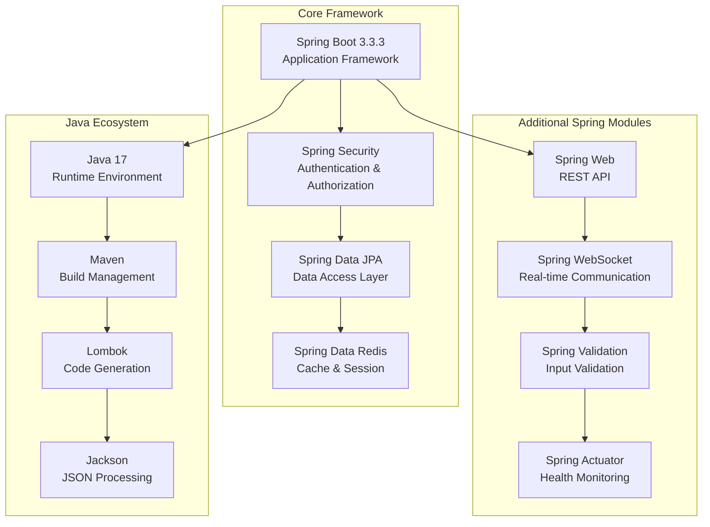

### 資料庫與快取技術棧

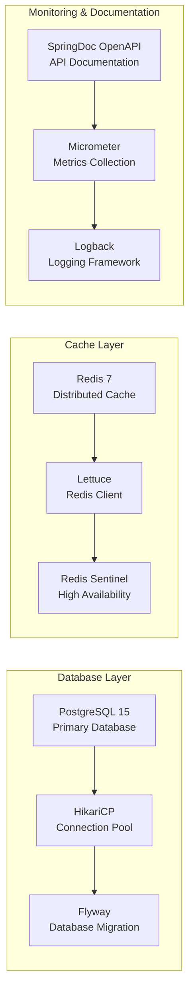

---

## 🏗️ 分層架構設計

### 整體分層架構

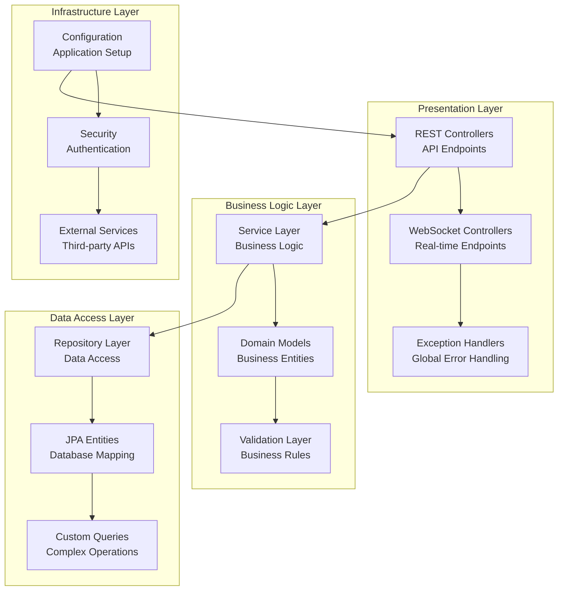

### MVC 架構模式

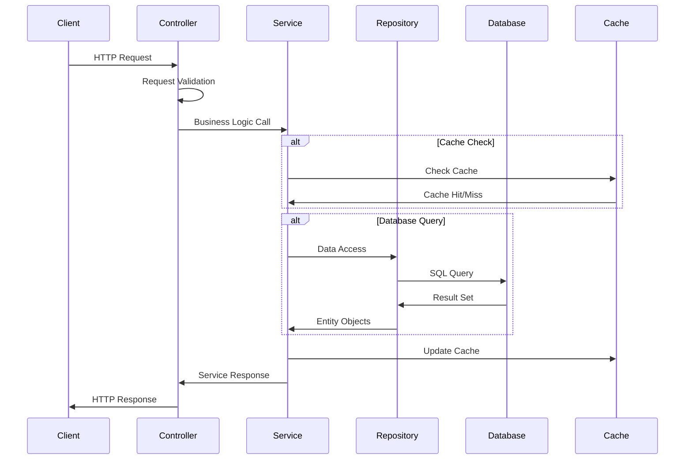

### 包結構設計

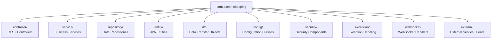

---

## 🔒 安全架構

### 安全架構總覽

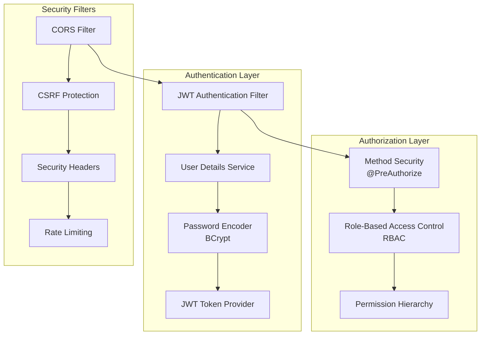

### JWT 認證流程

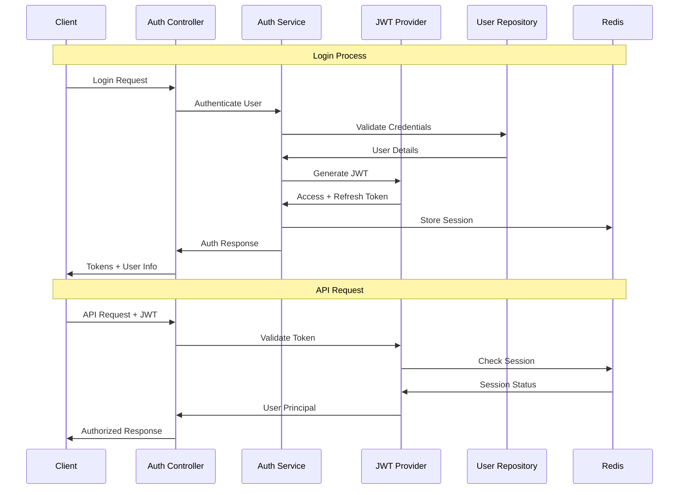

### 角色權限管理

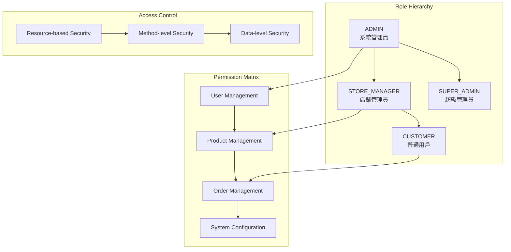

---

## 📊 資料存取層

### JPA 架構設計

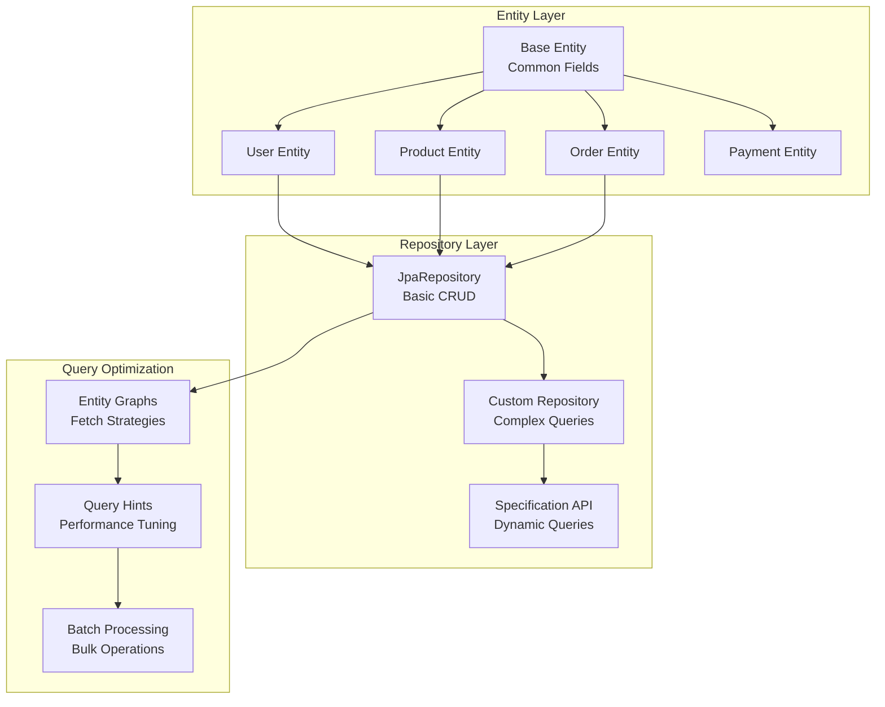

### 資料庫連接管理

```mermaid
graph LR
    subgraph "Connection Pool (HikariCP)"
        A[Pool Configuration<br/>Max: 20, Min: 5] --> B[Connection Validation<br/>Health Checks]
        B --> C[Leak Detection<br/>Connection Monitoring]
    end
    
    subgraph "Transaction Management"
        D[@Transactional<br/>Declarative Transactions] --> E[Isolation Levels<br/>Read Committed]
        E --> F[Rollback Rules<br/>Exception Handling]
    end
    
    subgraph "Performance Optimization"
        G[Query Caching<br/>Second Level Cache] --> H[Connection Caching<br/>Statement Reuse]
        H --> I[Batch Processing<br/>Batch Size: 25]
    end
```

### 實體關係設計

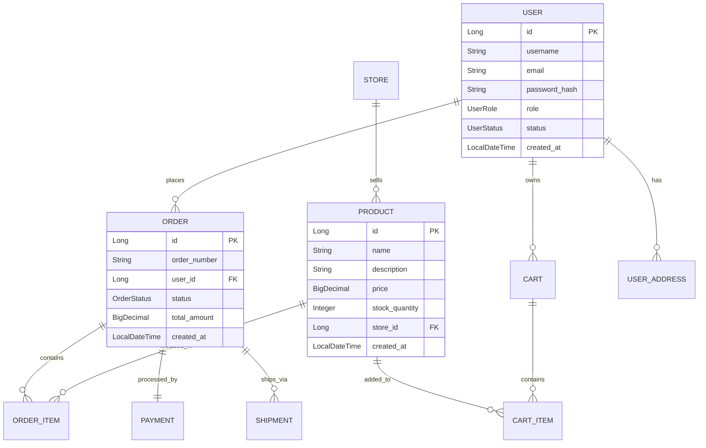

---

## ⚡ 快取架構

### Redis 快取策略

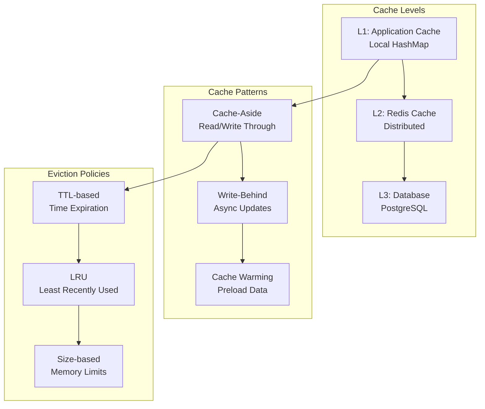

### 快取使用場景

```mermaid
graph TD
    subgraph "Session Management"
        A[User Sessions<br/>30 min TTL] --> B[JWT Blacklist<br/>Token Expiry]
    end
    
    subgraph "Business Data Caching"
        C[Product Catalog<br/>1 hour TTL] --> D[User Profiles<br/>15 min TTL]
        D --> E[Shopping Carts<br/>24 hour TTL]
    end
    
    subgraph "System Caching"
        F[Configuration<br/>No Expiry] --> G[Rate Limiting<br/>1 min TTL]
        G --> H[API Responses<br/>5 min TTL]
    end
    
    subgraph "Performance Caching"
        I[Database Query Results<br/>Variable TTL] --> J[Computed Values<br/>1 hour TTL]
        J --> K[Search Results<br/>10 min TTL]
    end
```

### Redis 集群架構

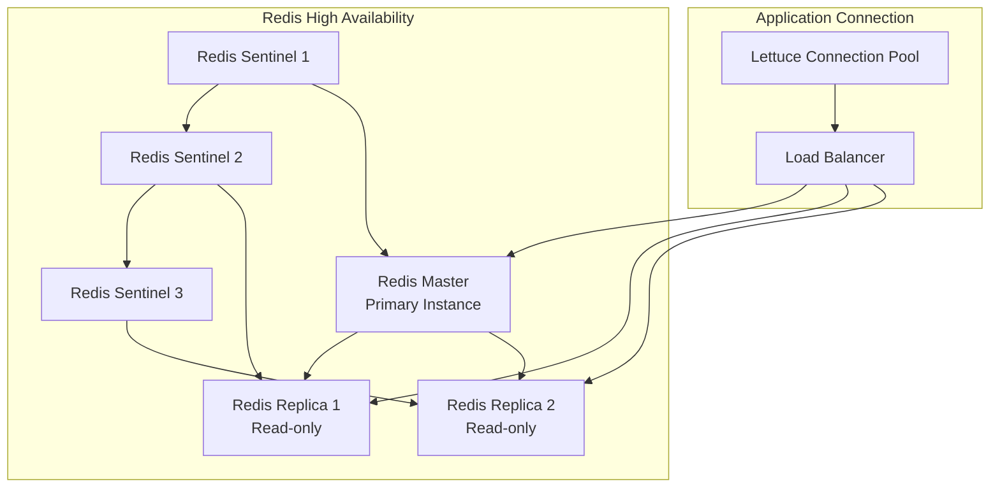

---

## 🔌 外部服務集成

### 外部服務架構

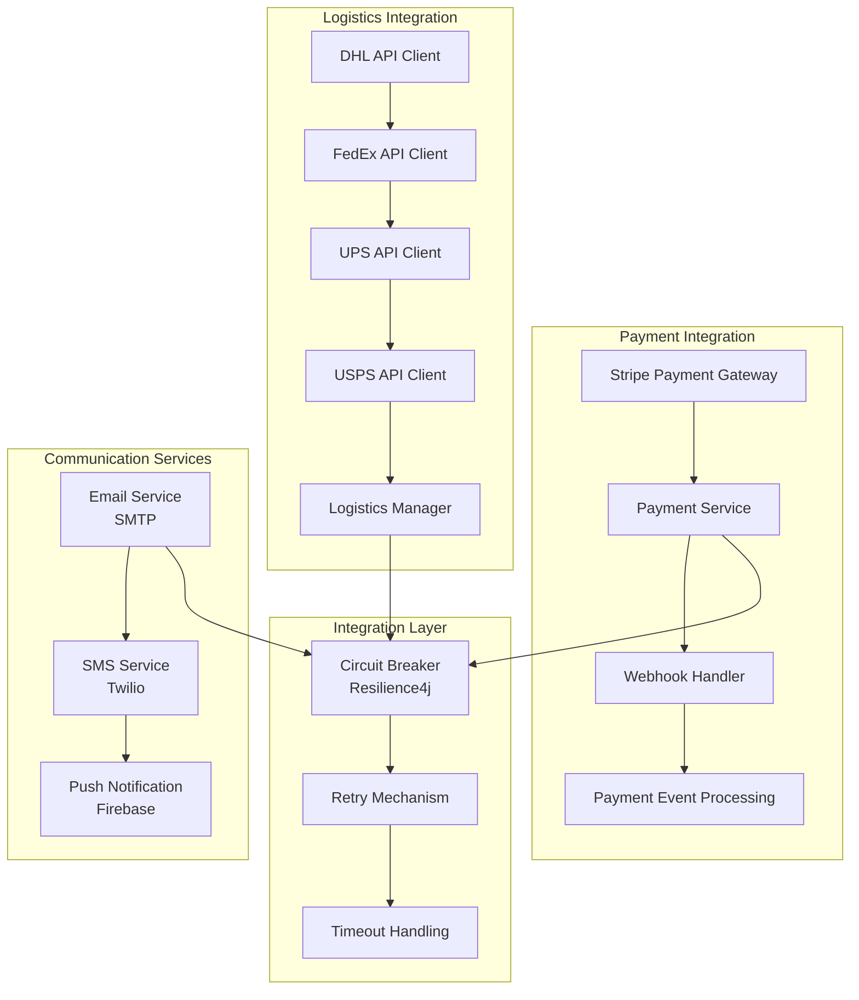

### 服務集成模式

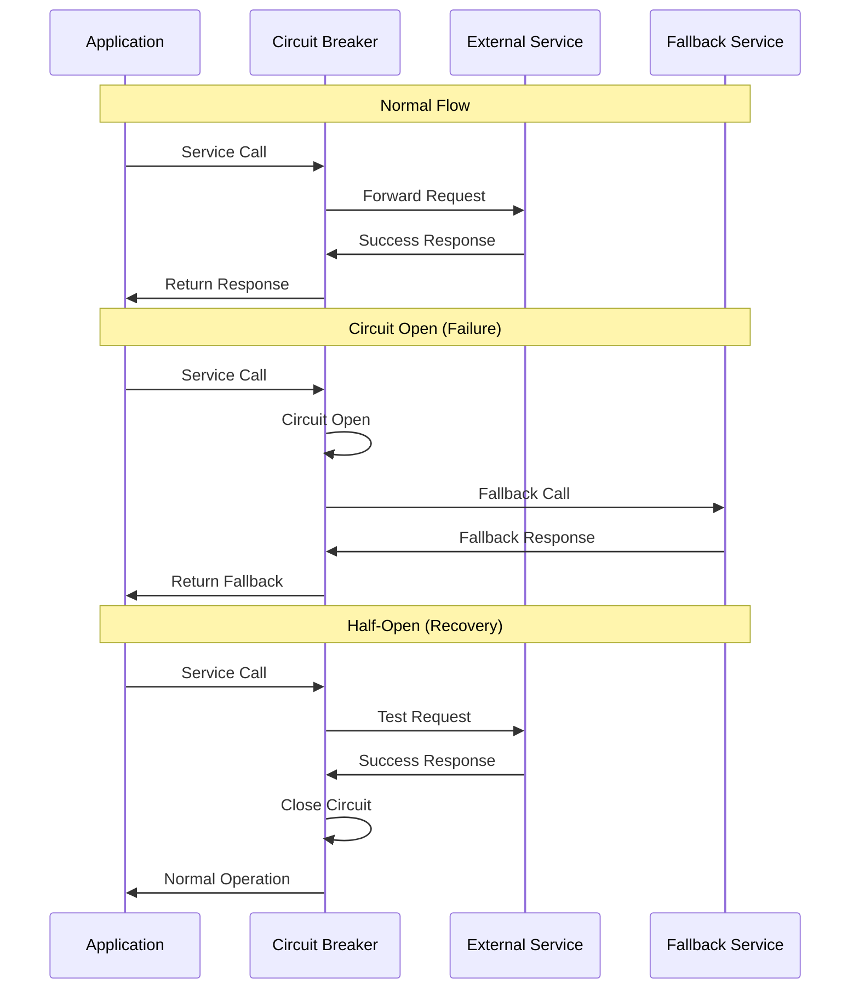

### API 客戶端配置

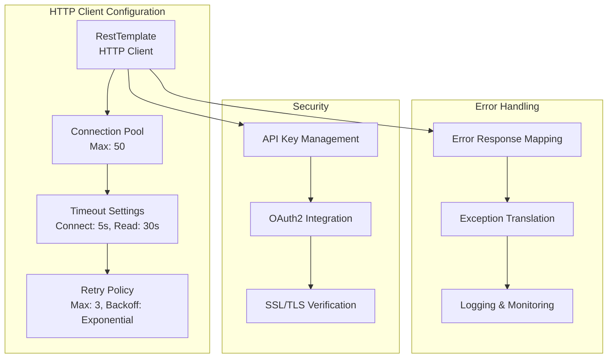

---

## ⚙️ 配置管理

### 配置架構設計

```mermaid
graph TD
    subgraph "Configuration Sources"
        A[application.yml<br/>Base Configuration] --> B[application-{profile}.yml<br/>Environment Specific]
        B --> C[Environment Variables<br/>Runtime Override]
        C --> D[Command Line Args<br/>Startup Parameters]
    end
    
    subgraph "Configuration Categories"
        E[Database Configuration] --> F[Redis Configuration]
        F --> G[Security Configuration]
        G --> H[External Service Configuration]
        H --> I[Monitoring Configuration]
    end
    
    subgraph "Profile Management"
        J[development<br/>Dev Environment] --> K[staging<br/>Staging Environment]
        K --> L[production<br/>Production Environment]
    end
    
    A --> E
    J --> A
```

### 環境配置管理

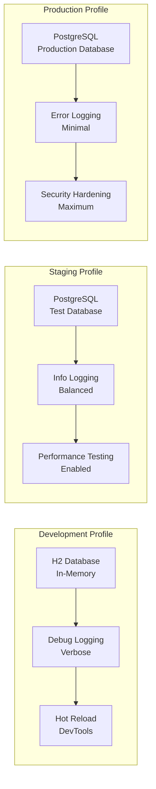

### 配置屬性映射

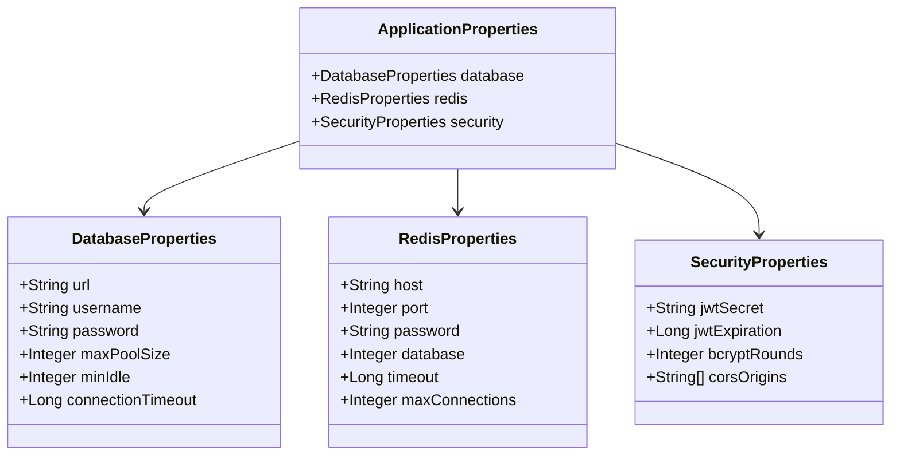

---

## 🔄 異步處理

### 異步架構設計

```mermaid
graph TD
    subgraph "Async Processing"
        A[@Async Methods<br/>Asynchronous Execution] --> B[Thread Pool<br/>Executor Configuration]
        B --> C[Task Scheduling<br/>@Scheduled Tasks]
    end
    
    subgraph "Event Handling"
        D[Application Events<br/>@EventListener] --> E[Message Queue<br/>Redis Pub/Sub]
        E --> F[WebSocket Broadcasting<br/>Real-time Updates]
    end
    
    subgraph "Background Jobs"
        G[Data Cleanup<br/>Scheduled Tasks] --> H[Report Generation<br/>Async Processing]
        H --> I[Email Notifications<br/>Queue Processing]
    end
    
    A --> D
    D --> G
```

### 異步執行流程

```mermaid
sequenceDiagram
    participant C as Controller
    participant S as Service
    participant A as Async Service
    participant Q as Message Queue
    participant W as WebSocket

    C->>S: Synchronous Request
    S->>A: @Async Method Call
    S->>C: Immediate Response
    
    Note over A,W: Background Processing
    A->>A: Long Running Task
    A->>Q: Publish Event
    Q->>W: Broadcast Update
    W->>C: Real-time Notification
    
    A->>A: Task Completion
    A->>Q: Publish Completion Event
```

### 線程池配置

```mermaid
graph TB
    subgraph "Thread Pool Configuration"
        A[Core Pool Size: 5<br/>Initial Threads] --> B[Max Pool Size: 20<br/>Maximum Threads]
        B --> C[Queue Capacity: 100<br/>Task Queue Size]
        C --> D[Keep Alive: 60s<br/>Thread Timeout]
    end
    
    subgraph "Task Categories"
        E[CPU-Intensive Tasks<br/>Calculation Pool] --> F[I/O-Intensive Tasks<br/>Network Pool]
        F --> G[Scheduled Tasks<br/>Timer Pool]
    end
    
    subgraph "Error Handling"
        H[Rejected Execution<br/>Fallback Strategy] --> I[Exception Handling<br/>Global Handler]
        I --> J[Monitoring<br/>Thread Metrics]
    end
```

---

## 📊 監控與日誌

### 監控架構

```mermaid
graph TD
    subgraph "Application Monitoring"
        A[Spring Boot Actuator<br/>Health Endpoints] --> B[Micrometer<br/>Metrics Collection]
        B --> C[Custom Metrics<br/>Business KPIs]
    end
    
    subgraph "Infrastructure Monitoring"
        D[JVM Metrics<br/>Heap, GC, Threads] --> E[Database Metrics<br/>Connection Pool]
        E --> F[Redis Metrics<br/>Cache Performance]
    end
    
    subgraph "External Monitoring"
        G[Prometheus<br/>Metrics Storage] --> H[Grafana<br/>Visualization]
        H --> I[AlertManager<br/>Alert Rules]
    end
    
    B --> G
    D --> G
```

### 日誌架構設計

```mermaid
graph LR
    subgraph "Log Levels"
        A[ERROR<br/>System Errors] --> B[WARN<br/>Warning Messages]
        B --> C[INFO<br/>General Information]
        C --> D[DEBUG<br/>Debug Information]
    end
    
    subgraph "Log Categories"
        E[Application Logs<br/>Business Logic] --> F[Security Logs<br/>Auth Events]
        F --> G[Performance Logs<br/>Slow Queries]
        G --> H[Audit Logs<br/>Data Changes]
    end
    
    subgraph "Log Processing"
        I[Logback<br/>Log Framework] --> J[JSON Format<br/>Structured Logs]
        J --> K[ELK Stack<br/>Centralized Logging]
    end
```

### 健康檢查端點

```mermaid
graph TB
    subgraph "Health Check Endpoints"
        A[/actuator/health<br/>Overall Health] --> B[/actuator/health/db<br/>Database Health]
        B --> C[/actuator/health/redis<br/>Redis Health]
        C --> D[/actuator/health/diskSpace<br/>Disk Usage]
    end
    
    subgraph "Metrics Endpoints"
        E[/actuator/metrics<br/>All Metrics] --> F[/actuator/metrics/jvm.memory<br/>Memory Usage]
        F --> G[/actuator/metrics/http.server.requests<br/>HTTP Metrics]
    end
    
    subgraph "Management Endpoints"
        H[/actuator/info<br/>Application Info] --> I[/actuator/env<br/>Environment Variables]
        I --> J[/actuator/loggers<br/>Logger Configuration]
    end
```

---

## ⚡ 性能優化

### JVM 性能調優

```mermaid
graph TD
    subgraph "Memory Management"
        A[Heap Size<br/>-Xms2g -Xmx4g] --> B[GC Algorithm<br/>G1GC]
        B --> C[GC Tuning<br/>-XX:MaxGCPauseMillis=200]
    end
    
    subgraph "JIT Optimization"
        D[Compiler Optimization<br/>-XX:+UseCompressedOops] --> E[Code Cache<br/>-XX:ReservedCodeCacheSize=256m]
        E --> F[Inline Methods<br/>Hot Spot Optimization]
    end
    
    subgraph "Monitoring"
        G[JVM Metrics<br/>Memory, GC, Threads] --> H[Performance Profiling<br/>Application Profiler]
        H --> I[Memory Leak Detection<br/>Heap Dump Analysis]
    end
```

### 資料庫性能優化

```mermaid
graph TB
    subgraph "Query Optimization"
        A[Index Strategy<br/>Composite Indexes] --> B[Query Plans<br/>Execution Analysis]
        B --> C[Batch Processing<br/>Bulk Operations]
    end
    
    subgraph "Connection Management"
        D[Connection Pooling<br/>HikariCP Tuning] --> E[Connection Validation<br/>Health Checks]
        E --> F[Statement Caching<br/>Prepared Statements]
    end
    
    subgraph "Caching Strategy"
        G[Entity Caching<br/>Second Level Cache] --> H[Query Caching<br/>Result Caching]
        H --> I[Redis Integration<br/>Distributed Cache]
    end
```

### API 性能優化

```mermaid
graph LR
    subgraph "Response Optimization"
        A[Data Pagination<br/>Limit Result Size] --> B[Field Selection<br/>Partial Responses]
        B --> C[Compression<br/>GZIP Encoding]
    end
    
    subgraph "Caching Strategy"
        D[Response Caching<br/>HTTP Cache Headers] --> E[Entity Caching<br/>Business Data]
        E --> F[Cache Warming<br/>Preload Popular Data]
    end
    
    subgraph "Async Processing"
        G[Non-blocking I/O<br/>Reactive Programming] --> H[Background Jobs<br/>Async Tasks]
        H --> I[Event-driven<br/>Message Processing]
    end
```

---

## 📊 性能指標與監控

### 後端性能目標

| 指標類型 | 目標值 | 監控方式 | 優化策略 |
|---------|--------|----------|----------|
| **API 響應時間** | P99 < 200ms | Micrometer + Prometheus | 查詢優化、快取 |
| **資料庫連接** | Pool < 80% | HikariCP Metrics | 連接池調優 |
| **JVM 堆記憶體** | < 70% | JVM Metrics | GC 調優 |
| **Redis 記憶體** | < 75% | Redis Info | 快取策略優化 |
| **錯誤率** | < 0.1% | HTTP Status Metrics | 異常處理優化 |
| **吞吐量** | > 1000 RPS | Request Metrics | 性能調優 |

### 關鍵監控指標

```mermaid
graph TB
    subgraph "Application Metrics"
        A[Request Rate<br/>RPS] --> B[Response Time<br/>Latency Distribution]
        B --> C[Error Rate<br/>4xx/5xx Errors]
        C --> D[Throughput<br/>Data Processing Rate]
    end
    
    subgraph "Infrastructure Metrics"
        E[CPU Utilization<br/>System Load] --> F[Memory Usage<br/>Heap + Non-heap]
        F --> G[Disk I/O<br/>Read/Write Operations]
        G --> H[Network I/O<br/>Bandwidth Usage]
    end
    
    subgraph "Business Metrics"
        I[User Sessions<br/>Active Users] --> J[Transaction Volume<br/>Orders/Payments]
        J --> K[Conversion Rate<br/>Business KPIs]
    end
```

---

## 🚀 未來擴展規劃

### 微服務架構演進

```mermaid
timeline
    title Backend Evolution Roadmap
    
    2025 Q1 : Modular Monolith
           : Service Boundaries Definition
           : Database Decomposition
           
    2025 Q2 : Service Extraction
           : API Gateway Integration  
           : Service Mesh Implementation
           
    2025 Q3 : Event-Driven Architecture
           : CQRS Pattern Implementation
           : Distributed Tracing
           
    2025 Q4 : Cloud Native Migration
           : Kubernetes Deployment
           : Serverless Functions
```

### 架構演進方向

1. **微服務拆分**: 依業務邊界拆分服務模組
2. **事件驅動**: CQRS + Event Sourcing 模式
3. **容器化部署**: Kubernetes + Docker 雲原生  
4. **服務網格**: Istio 服務治理
5. **分散式追蹤**: 全鏈路監控和診斷

---

## 📖 相關文檔

- [系統架構設計](system-architecture.md)
- [前端架構設計](frontend-architecture.md)
- [資料庫設計文檔](database-design.md)
- [API 接口文檔](../api/api-documentation.md)
- [部署運維指南](../deployment/production-deployment.md)

---

**最後更新**: 2025-09-05  
**版本**: 1.0  
**維護者**: Ocean Shopping Center Backend Team