# 🗃️ Ocean Shopping Center - 資料庫設計

## 📋 目錄

- [資料庫概覽](#資料庫概覽)
- [技術架構](#技術架構)
- [實體關係設計](#實體關係設計)
- [核心資料表設計](#核心資料表設計)
- [索引設計策略](#索引設計策略)
- [查詢優化](#查詢優化)
- [資料遷移](#資料遷移)
- [資料備份與恢復](#資料備份與恢復)
- [性能監控](#性能監控)
- [安全性設計](#安全性設計)

---

## 🎯 資料庫概覽

Ocean Shopping Center 採用 **PostgreSQL 15** 作為主要資料庫，支援完整的 ACID 事務特性和豐富的資料類型。資料庫設計遵循 **第三正規化（3NF）** 原則，並針對電商業務場景進行最佳化，支援高並發讀寫和複雜查詢。

### 核心特性
- **關係型設計**: 嚴格的資料完整性約束
- **分割槽策略**: 按時間和業務邏輯分割大表
- **索引優化**: 組合索引和部分索引策略
- **讀寫分離**: 主從複製架構
- **連接池管理**: HikariCP 高性能連接池
- **資料稽核**: 完整的異動記錄和日誌

---

## 🛠️ 技術架構

### 資料庫架構設計

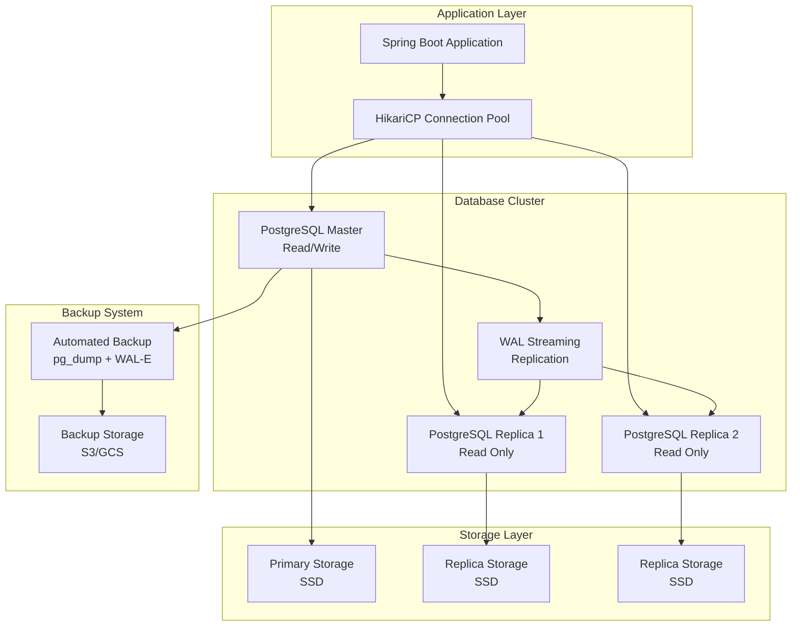

### 連接池架構

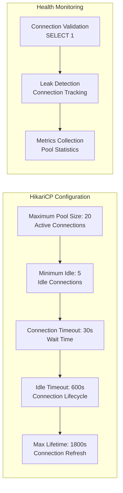

### 資料庫配置優化

```mermaid
graph TB
    subgraph "Memory Configuration"
        A[shared_buffers: 25% RAM<br/>Shared Memory] --> B[effective_cache_size: 75% RAM<br/>OS Cache]
        B --> C[work_mem: 4MB<br/>Sort Memory]
        C --> D[maintenance_work_mem: 64MB<br/>Maintenance Operations]
    end
    
    subgraph "Checkpoint Configuration"
        E[checkpoint_completion_target: 0.9<br/>Write Distribution] --> F[wal_buffers: 16MB<br/>WAL Buffer]
        F --> G[checkpoint_timeout: 5min<br/>Checkpoint Interval]
    end
    
    subgraph "Connection Configuration"
        H[max_connections: 100<br/>Connection Limit] --> I[listen_addresses: '*'<br/>Network Access]
        I --> J[shared_preload_libraries<br/>Extension Loading]
    end
```

---

## 🔗 實體關係設計

### 完整實體關係圖

```mermaid
erDiagram
    %% 核心實體
    USER ||--o{ ORDER : "places"
    USER ||--|| CART : "owns"
    USER ||--o{ USER_ADDRESS : "has"
    USER ||--o{ PAYMENT_METHOD : "uses"
    USER ||--o{ REVIEW : "writes"
    USER ||--o{ CHAT_MESSAGE : "sends"
    USER ||--o{ NOTIFICATION : "receives"
    
    %% 商店相關
    STORE ||--o{ PRODUCT : "sells"
    STORE ||--o{ ORDER : "receives"
    USER ||--o{ STORE : "manages"
    
    %% 產品相關  
    CATEGORY ||--o{ PRODUCT : "contains"
    PRODUCT ||--o{ PRODUCT_IMAGE : "has"
    PRODUCT ||--o{ PRODUCT_VARIANT : "includes"
    PRODUCT ||--o{ ORDER_ITEM : "ordered_as"
    PRODUCT ||--o{ CART_ITEM : "added_as"
    PRODUCT ||--o{ REVIEW : "reviewed_in"
    
    %% 購物車
    CART ||--o{ CART_ITEM : "contains"
    
    %% 訂單相關
    ORDER ||--o{ ORDER_ITEM : "contains"
    ORDER ||--|| PAYMENT : "paid_by"
    ORDER ||--o{ ORDER_COUPON : "uses"
    ORDER ||--|| SHIPMENT : "shipped_via"
    ORDER ||--|| INVOICE : "billed_as"
    
    %% 優惠券
    COUPON ||--o{ ORDER_COUPON : "applied_in"
    
    %% 物流
    SHIPMENT ||--o{ TRACKING_EVENT : "tracked_by"
    
    %% 實體定義
    USER {
        bigint id PK
        varchar username UK
        varchar email UK
        varchar password_hash
        varchar first_name
        varchar last_name
        varchar phone
        user_role role
        user_status status
        timestamp created_at
        timestamp updated_at
        timestamp deleted_at
    }
    
    STORE {
        bigint id PK
        varchar name
        text description
        varchar contact_email
        varchar contact_phone
        bigint owner_id FK
        store_status status
        timestamp created_at
        timestamp updated_at
    }
    
    CATEGORY {
        bigint id PK
        varchar name
        text description
        varchar slug UK
        bigint parent_id FK
        integer sort_order
        boolean is_active
        timestamp created_at
        timestamp updated_at
    }
    
    PRODUCT {
        bigint id PK
        varchar name
        text description
        text short_description
        decimal price
        decimal compare_price
        varchar sku UK
        integer stock_quantity
        integer min_stock_level
        bigint category_id FK
        bigint store_id FK
        boolean is_active
        boolean is_featured
        json metadata
        timestamp created_at
        timestamp updated_at
    }
    
    PRODUCT_VARIANT {
        bigint id PK
        bigint product_id FK
        varchar name
        varchar sku UK
        decimal price
        integer stock_quantity
        json attributes
        boolean is_active
        timestamp created_at
        timestamp updated_at
    }
    
    PRODUCT_IMAGE {
        bigint id PK
        bigint product_id FK
        varchar filename
        varchar alt_text
        integer sort_order
        boolean is_primary
        timestamp created_at
    }
    
    CART {
        bigint id PK
        bigint user_id FK
        timestamp created_at
        timestamp updated_at
    }
    
    CART_ITEM {
        bigint id PK
        bigint cart_id FK
        bigint product_id FK
        bigint variant_id FK
        integer quantity
        decimal unit_price
        timestamp created_at
        timestamp updated_at
    }
    
    ORDER {
        bigint id PK
        varchar order_number UK
        bigint user_id FK
        bigint store_id FK
        order_status status
        decimal subtotal
        decimal tax_amount
        decimal shipping_amount
        decimal discount_amount
        decimal total_amount
        varchar currency
        json billing_address
        json shipping_address
        text notes
        timestamp created_at
        timestamp updated_at
    }
    
    ORDER_ITEM {
        bigint id PK
        bigint order_id FK
        bigint product_id FK
        bigint variant_id FK
        varchar product_name
        varchar product_sku
        integer quantity
        decimal unit_price
        decimal total_price
        timestamp created_at
    }
    
    PAYMENT {
        bigint id PK
        bigint order_id FK
        varchar payment_intent_id
        payment_provider provider
        payment_method method
        payment_status status
        decimal amount
        varchar currency
        varchar gateway_response
        timestamp processed_at
        timestamp created_at
        timestamp updated_at
    }
    
    PAYMENT_METHOD {
        bigint id PK
        bigint user_id FK
        payment_type type
        varchar last_four
        varchar brand
        varchar gateway_id
        boolean is_default
        timestamp expires_at
        timestamp created_at
        timestamp updated_at
    }
    
    COUPON {
        bigint id PK
        varchar code UK
        varchar name
        text description
        coupon_type type
        decimal value
        decimal minimum_amount
        integer usage_limit
        integer used_count
        timestamp starts_at
        timestamp expires_at
        coupon_status status
        timestamp created_at
        timestamp updated_at
    }
    
    ORDER_COUPON {
        bigint id PK
        bigint order_id FK
        bigint coupon_id FK
        decimal discount_amount
        timestamp applied_at
    }
    
    USER_ADDRESS {
        bigint id PK
        bigint user_id FK
        varchar type
        varchar first_name
        varchar last_name
        varchar company
        varchar address_line_1
        varchar address_line_2
        varchar city
        varchar state
        varchar postal_code
        varchar country
        varchar phone
        boolean is_default
        timestamp created_at
        timestamp updated_at
    }
    
    SHIPMENT {
        bigint id PK
        bigint order_id FK
        varchar tracking_number UK
        carrier_type carrier
        service_type service_type
        shipment_status status
        json origin_address
        json destination_address
        decimal weight
        json dimensions
        decimal shipping_cost
        timestamp shipped_at
        timestamp delivered_at
        timestamp created_at
        timestamp updated_at
    }
    
    TRACKING_EVENT {
        bigint id PK
        bigint shipment_id FK
        varchar event_type
        varchar description
        varchar location
        timestamp event_time
        timestamp created_at
    }
    
    REVIEW {
        bigint id PK
        bigint product_id FK
        bigint user_id FK
        bigint order_id FK
        integer rating
        varchar title
        text content
        boolean is_verified
        boolean is_approved
        timestamp created_at
        timestamp updated_at
    }
    
    INVOICE {
        bigint id PK
        bigint order_id FK
        varchar invoice_number UK
        invoice_status status
        decimal subtotal
        decimal tax_amount
        decimal total_amount
        varchar currency
        json billing_address
        timestamp issued_at
        timestamp due_at
        timestamp paid_at
        timestamp created_at
        timestamp updated_at
    }
    
    CHAT_MESSAGE {
        bigint id PK
        bigint sender_id FK
        bigint receiver_id FK
        text message
        varchar message_type
        json metadata
        boolean is_read
        timestamp created_at
    }
    
    NOTIFICATION {
        bigint id PK
        bigint user_id FK
        varchar type
        varchar title
        text content
        json data
        boolean is_read
        timestamp read_at
        timestamp created_at
    }
```

---

## 🗂️ 核心資料表設計

### 用戶管理表

```sql
-- 用戶表
CREATE TABLE users (
    id BIGSERIAL PRIMARY KEY,
    username VARCHAR(50) UNIQUE NOT NULL,
    email VARCHAR(255) UNIQUE NOT NULL,
    password_hash VARCHAR(255) NOT NULL,
    first_name VARCHAR(100),
    last_name VARCHAR(100),
    phone VARCHAR(20),
    role user_role NOT NULL DEFAULT 'CUSTOMER',
    status user_status NOT NULL DEFAULT 'ACTIVE',
    email_verified_at TIMESTAMP,
    phone_verified_at TIMESTAMP,
    created_at TIMESTAMP DEFAULT CURRENT_TIMESTAMP,
    updated_at TIMESTAMP DEFAULT CURRENT_TIMESTAMP,
    deleted_at TIMESTAMP
);

-- 用戶角色枚舉
CREATE TYPE user_role AS ENUM (
    'CUSTOMER',
    'STORE_MANAGER', 
    'ADMIN',
    'SUPER_ADMIN'
);

-- 用戶狀態枚舉
CREATE TYPE user_status AS ENUM (
    'ACTIVE',
    'INACTIVE', 
    'SUSPENDED',
    'PENDING_VERIFICATION'
);

-- 用戶地址表
CREATE TABLE user_addresses (
    id BIGSERIAL PRIMARY KEY,
    user_id BIGINT NOT NULL REFERENCES users(id),
    type VARCHAR(20) DEFAULT 'BILLING',
    first_name VARCHAR(100),
    last_name VARCHAR(100),
    company VARCHAR(100),
    address_line_1 VARCHAR(255) NOT NULL,
    address_line_2 VARCHAR(255),
    city VARCHAR(100) NOT NULL,
    state VARCHAR(100),
    postal_code VARCHAR(20) NOT NULL,
    country VARCHAR(2) NOT NULL,
    phone VARCHAR(20),
    is_default BOOLEAN DEFAULT FALSE,
    created_at TIMESTAMP DEFAULT CURRENT_TIMESTAMP,
    updated_at TIMESTAMP DEFAULT CURRENT_TIMESTAMP
);
```

### 產品管理表

```sql
-- 商店表
CREATE TABLE stores (
    id BIGSERIAL PRIMARY KEY,
    name VARCHAR(255) NOT NULL,
    description TEXT,
    contact_email VARCHAR(255),
    contact_phone VARCHAR(20),
    owner_id BIGINT NOT NULL REFERENCES users(id),
    status store_status NOT NULL DEFAULT 'ACTIVE',
    settings JSONB DEFAULT '{}',
    created_at TIMESTAMP DEFAULT CURRENT_TIMESTAMP,
    updated_at TIMESTAMP DEFAULT CURRENT_TIMESTAMP
);

-- 商店狀態枚舉
CREATE TYPE store_status AS ENUM (
    'ACTIVE',
    'INACTIVE',
    'SUSPENDED', 
    'PENDING_APPROVAL'
);

-- 分類表
CREATE TABLE categories (
    id BIGSERIAL PRIMARY KEY,
    name VARCHAR(255) NOT NULL,
    description TEXT,
    slug VARCHAR(255) UNIQUE NOT NULL,
    parent_id BIGINT REFERENCES categories(id),
    sort_order INTEGER DEFAULT 0,
    is_active BOOLEAN DEFAULT TRUE,
    created_at TIMESTAMP DEFAULT CURRENT_TIMESTAMP,
    updated_at TIMESTAMP DEFAULT CURRENT_TIMESTAMP
);

-- 產品表
CREATE TABLE products (
    id BIGSERIAL PRIMARY KEY,
    name VARCHAR(255) NOT NULL,
    description TEXT,
    short_description TEXT,
    price DECIMAL(10,2) NOT NULL,
    compare_price DECIMAL(10,2),
    sku VARCHAR(100) UNIQUE NOT NULL,
    stock_quantity INTEGER NOT NULL DEFAULT 0,
    min_stock_level INTEGER DEFAULT 5,
    category_id BIGINT REFERENCES categories(id),
    store_id BIGINT NOT NULL REFERENCES stores(id),
    is_active BOOLEAN DEFAULT TRUE,
    is_featured BOOLEAN DEFAULT FALSE,
    metadata JSONB DEFAULT '{}',
    created_at TIMESTAMP DEFAULT CURRENT_TIMESTAMP,
    updated_at TIMESTAMP DEFAULT CURRENT_TIMESTAMP
);

-- 產品變體表
CREATE TABLE product_variants (
    id BIGSERIAL PRIMARY KEY,
    product_id BIGINT NOT NULL REFERENCES products(id),
    name VARCHAR(255),
    sku VARCHAR(100) UNIQUE NOT NULL,
    price DECIMAL(10,2),
    stock_quantity INTEGER NOT NULL DEFAULT 0,
    attributes JSONB DEFAULT '{}', -- 顏色、尺寸等屬性
    is_active BOOLEAN DEFAULT TRUE,
    created_at TIMESTAMP DEFAULT CURRENT_TIMESTAMP,
    updated_at TIMESTAMP DEFAULT CURRENT_TIMESTAMP
);

-- 產品圖片表
CREATE TABLE product_images (
    id BIGSERIAL PRIMARY KEY,
    product_id BIGINT NOT NULL REFERENCES products(id),
    filename VARCHAR(255) NOT NULL,
    alt_text VARCHAR(255),
    sort_order INTEGER DEFAULT 0,
    is_primary BOOLEAN DEFAULT FALSE,
    created_at TIMESTAMP DEFAULT CURRENT_TIMESTAMP
);
```

### 訂單管理表

```sql
-- 購物車表
CREATE TABLE carts (
    id BIGSERIAL PRIMARY KEY,
    user_id BIGINT NOT NULL REFERENCES users(id),
    created_at TIMESTAMP DEFAULT CURRENT_TIMESTAMP,
    updated_at TIMESTAMP DEFAULT CURRENT_TIMESTAMP
);

-- 購物車項目表
CREATE TABLE cart_items (
    id BIGSERIAL PRIMARY KEY,
    cart_id BIGINT NOT NULL REFERENCES carts(id),
    product_id BIGINT NOT NULL REFERENCES products(id),
    variant_id BIGINT REFERENCES product_variants(id),
    quantity INTEGER NOT NULL CHECK (quantity > 0),
    unit_price DECIMAL(10,2) NOT NULL,
    created_at TIMESTAMP DEFAULT CURRENT_TIMESTAMP,
    updated_at TIMESTAMP DEFAULT CURRENT_TIMESTAMP,
    UNIQUE(cart_id, product_id, variant_id)
);

-- 訂單狀態枚舉
CREATE TYPE order_status AS ENUM (
    'PENDING',
    'CONFIRMED',
    'PROCESSING',
    'SHIPPED',
    'DELIVERED',
    'CANCELLED',
    'REFUNDED',
    'RETURNED'
);

-- 訂單表
CREATE TABLE orders (
    id BIGSERIAL PRIMARY KEY,
    order_number VARCHAR(50) UNIQUE NOT NULL,
    user_id BIGINT NOT NULL REFERENCES users(id),
    store_id BIGINT NOT NULL REFERENCES stores(id),
    status order_status NOT NULL DEFAULT 'PENDING',
    subtotal DECIMAL(10,2) NOT NULL,
    tax_amount DECIMAL(10,2) DEFAULT 0,
    shipping_amount DECIMAL(10,2) DEFAULT 0,
    discount_amount DECIMAL(10,2) DEFAULT 0,
    total_amount DECIMAL(10,2) NOT NULL,
    currency VARCHAR(3) DEFAULT 'USD',
    billing_address JSONB NOT NULL,
    shipping_address JSONB NOT NULL,
    notes TEXT,
    created_at TIMESTAMP DEFAULT CURRENT_TIMESTAMP,
    updated_at TIMESTAMP DEFAULT CURRENT_TIMESTAMP
);

-- 訂單項目表
CREATE TABLE order_items (
    id BIGSERIAL PRIMARY KEY,
    order_id BIGINT NOT NULL REFERENCES orders(id),
    product_id BIGINT NOT NULL REFERENCES products(id),
    variant_id BIGINT REFERENCES product_variants(id),
    product_name VARCHAR(255) NOT NULL, -- 快照資料
    product_sku VARCHAR(100) NOT NULL,   -- 快照資料
    quantity INTEGER NOT NULL CHECK (quantity > 0),
    unit_price DECIMAL(10,2) NOT NULL,
    total_price DECIMAL(10,2) NOT NULL,
    created_at TIMESTAMP DEFAULT CURRENT_TIMESTAMP
);
```

### 支付管理表

```sql
-- 支付提供商枚舉
CREATE TYPE payment_provider AS ENUM (
    'STRIPE',
    'PAYPAL',
    'SQUARE',
    'MANUAL'
);

-- 支付方式枚舉
CREATE TYPE payment_method_enum AS ENUM (
    'CARD',
    'BANK_TRANSFER',
    'DIGITAL_WALLET',
    'CRYPTO',
    'CASH'
);

-- 支付狀態枚舉
CREATE TYPE payment_status AS ENUM (
    'PENDING',
    'PROCESSING',
    'SUCCESS',
    'FAILED',
    'CANCELLED',
    'REFUNDED',
    'PARTIALLY_REFUNDED'
);

-- 支付表
CREATE TABLE payments (
    id BIGSERIAL PRIMARY KEY,
    order_id BIGINT NOT NULL REFERENCES orders(id),
    payment_intent_id VARCHAR(255),
    provider payment_provider NOT NULL,
    method payment_method_enum NOT NULL,
    status payment_status NOT NULL DEFAULT 'PENDING',
    amount DECIMAL(10,2) NOT NULL,
    currency VARCHAR(3) NOT NULL,
    gateway_response JSONB,
    failure_reason TEXT,
    processed_at TIMESTAMP,
    created_at TIMESTAMP DEFAULT CURRENT_TIMESTAMP,
    updated_at TIMESTAMP DEFAULT CURRENT_TIMESTAMP
);

-- 用戶支付方式表
CREATE TABLE payment_methods (
    id BIGSERIAL PRIMARY KEY,
    user_id BIGINT NOT NULL REFERENCES users(id),
    type payment_method_enum NOT NULL,
    last_four VARCHAR(4),
    brand VARCHAR(20),
    gateway_id VARCHAR(255), -- Stripe customer_id, payment_method_id
    is_default BOOLEAN DEFAULT FALSE,
    expires_at DATE,
    created_at TIMESTAMP DEFAULT CURRENT_TIMESTAMP,
    updated_at TIMESTAMP DEFAULT CURRENT_TIMESTAMP
);
```

---

## 📊 索引設計策略

### 主要索引設計

```sql
-- 用戶相關索引
CREATE INDEX idx_users_email ON users(email);
CREATE INDEX idx_users_username ON users(username);
CREATE INDEX idx_users_status ON users(status) WHERE status != 'ACTIVE';
CREATE INDEX idx_users_role ON users(role);
CREATE INDEX idx_users_created_at ON users(created_at);

-- 產品相關索引  
CREATE INDEX idx_products_store_id ON products(store_id);
CREATE INDEX idx_products_category_id ON products(category_id);
CREATE INDEX idx_products_sku ON products(sku);
CREATE INDEX idx_products_active ON products(is_active) WHERE is_active = TRUE;
CREATE INDEX idx_products_featured ON products(is_featured) WHERE is_featured = TRUE;
CREATE INDEX idx_products_price ON products(price);
CREATE INDEX idx_products_stock ON products(stock_quantity);
CREATE INDEX idx_products_created_at ON products(created_at);

-- 複合索引
CREATE INDEX idx_products_store_category ON products(store_id, category_id);
CREATE INDEX idx_products_active_featured ON products(is_active, is_featured) 
    WHERE is_active = TRUE;
CREATE INDEX idx_products_search ON products USING gin(
    to_tsvector('english', name || ' ' || COALESCE(description, ''))
);

-- 訂單相關索引
CREATE INDEX idx_orders_user_id ON orders(user_id);
CREATE INDEX idx_orders_store_id ON orders(store_id);  
CREATE INDEX idx_orders_status ON orders(status);
CREATE INDEX idx_orders_created_at ON orders(created_at);
CREATE INDEX idx_orders_order_number ON orders(order_number);

-- 複合索引優化常用查詢
CREATE INDEX idx_orders_user_status ON orders(user_id, status);
CREATE INDEX idx_orders_store_status ON orders(store_id, status);
CREATE INDEX idx_orders_created_status ON orders(created_at, status);

-- 訂單項目索引
CREATE INDEX idx_order_items_order_id ON order_items(order_id);
CREATE INDEX idx_order_items_product_id ON order_items(product_id);

-- 購物車索引
CREATE INDEX idx_carts_user_id ON carts(user_id);
CREATE INDEX idx_cart_items_cart_id ON cart_items(cart_id);
CREATE INDEX idx_cart_items_product_id ON cart_items(product_id);

-- 支付索引
CREATE INDEX idx_payments_order_id ON payments(order_id);
CREATE INDEX idx_payments_status ON payments(status);
CREATE INDEX idx_payments_created_at ON payments(created_at);
CREATE INDEX idx_payments_provider ON payments(provider);

-- 分割槽索引（按月分割訂單表）
CREATE INDEX idx_orders_2025_01_created_at ON orders_2025_01(created_at);
CREATE INDEX idx_orders_2025_01_user_id ON orders_2025_01(user_id);
```

### 索引監控與優化

```mermaid
graph TD
    subgraph "Index Monitoring"
        A[pg_stat_user_indexes<br/>Index Usage Stats] --> B[Index Size Monitoring<br/>pg_indexes_size]
        B --> C[Unused Index Detection<br/>Zero scans]
        C --> D[Missing Index Analysis<br/>pg_stat_statements]
    end
    
    subgraph "Index Optimization"
        E[Partial Indexes<br/>Conditional Indexing] --> F[Composite Indexes<br/>Multi-column]
        F --> G[Expression Indexes<br/>Function-based]
        G --> H[GIN/GIST Indexes<br/>Full-text Search]
    end
    
    subgraph "Maintenance"
        I[REINDEX<br/>Index Rebuilding] --> J[VACUUM ANALYZE<br/>Statistics Update]
        J --> K[Index Bloat Monitoring<br/>Space Usage]
    end
```

---

## 🚀 查詢優化

### 查詢優化策略

```mermaid
graph TD
    subgraph "Query Analysis"
        A[EXPLAIN ANALYZE<br/>Execution Plans] --> B[pg_stat_statements<br/>Query Performance]
        B --> C[Slow Query Log<br/>Performance Issues]
    end
    
    subgraph "Optimization Techniques"
        D[Index Optimization<br/>Proper Indexing] --> E[Query Rewriting<br/>Efficient SQL]
        E --> F[Partitioning<br/>Data Distribution]
        F --> G[Connection Pooling<br/>Resource Management]
    end
    
    subgraph "Caching Strategy"
        H[Query Result Cache<br/>Application Level] --> I[Redis Caching<br/>Distributed Cache]
        I --> J[Materialized Views<br/>Pre-computed Results]
    end
```

### 常用查詢優化範例

```sql
-- 產品搜尋優化（使用全文搜尋）
CREATE INDEX idx_products_fts ON products 
USING gin(to_tsvector('english', name || ' ' || COALESCE(description, '')));

-- 優化的產品搜尋查詢
SELECT p.*, s.name as store_name
FROM products p
JOIN stores s ON p.store_id = s.id
WHERE p.is_active = TRUE
  AND to_tsvector('english', p.name || ' ' || COALESCE(p.description, '')) 
      @@ plainto_tsquery('english', :search_term)
ORDER BY ts_rank(to_tsvector('english', p.name || ' ' || COALESCE(p.description, '')), 
                 plainto_tsquery('english', :search_term)) DESC
LIMIT 20;

-- 用戶訂單歷史查詢優化
SELECT o.*, 
       COUNT(oi.id) as item_count,
       s.name as store_name
FROM orders o
JOIN order_items oi ON o.id = oi.order_id
JOIN stores s ON o.store_id = s.id
WHERE o.user_id = :user_id
  AND o.created_at >= :date_from
  AND o.created_at <= :date_to
GROUP BY o.id, s.name
ORDER BY o.created_at DESC
LIMIT 10 OFFSET :offset;

-- 店鋪銷售統計優化（使用分割槽）
SELECT 
    DATE_TRUNC('day', o.created_at) as date,
    COUNT(*) as order_count,
    SUM(o.total_amount) as total_sales,
    AVG(o.total_amount) as avg_order_value
FROM orders o
WHERE o.store_id = :store_id
  AND o.status IN ('DELIVERED', 'COMPLETED')
  AND o.created_at >= :start_date
  AND o.created_at <= :end_date
GROUP BY DATE_TRUNC('day', o.created_at)
ORDER BY date DESC;
```

### 查詢性能監控

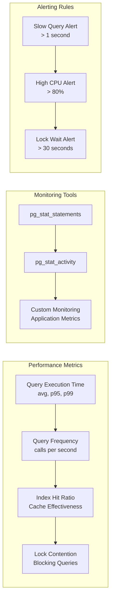

---

## 🔄 資料遷移

### 遷移策略架構

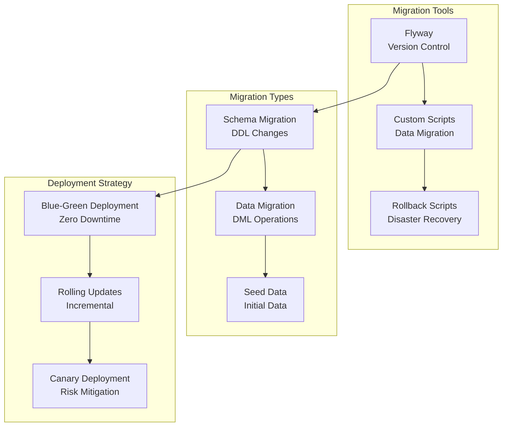

### 遷移腳本範例

```sql
-- V001__Initial_Schema.sql
-- 創建初始資料表結構

CREATE EXTENSION IF NOT EXISTS "uuid-ossp";
CREATE EXTENSION IF NOT EXISTS "pg_trgm";

-- 創建枚舉類型
CREATE TYPE user_role AS ENUM ('CUSTOMER', 'STORE_MANAGER', 'ADMIN', 'SUPER_ADMIN');
CREATE TYPE user_status AS ENUM ('ACTIVE', 'INACTIVE', 'SUSPENDED', 'PENDING_VERIFICATION');

-- V002__Add_Indexes.sql
-- 添加性能索引

CREATE INDEX CONCURRENTLY idx_products_store_id ON products(store_id);
CREATE INDEX CONCURRENTLY idx_orders_user_id ON orders(user_id);
CREATE INDEX CONCURRENTLY idx_orders_created_at ON orders(created_at);

-- V003__Partition_Orders.sql
-- 實現訂單表分割槽

-- 創建分割槽表
CREATE TABLE orders_partitioned (
    LIKE orders INCLUDING ALL
) PARTITION BY RANGE (created_at);

-- 創建月份分割槽
CREATE TABLE orders_2025_01 PARTITION OF orders_partitioned
FOR VALUES FROM ('2025-01-01') TO ('2025-02-01');

CREATE TABLE orders_2025_02 PARTITION OF orders_partitioned  
FOR VALUES FROM ('2025-02-01') TO ('2025-03-01');

-- V004__Data_Cleanup.sql
-- 資料清理和優化

-- 清理軟刪除的資料
DELETE FROM users WHERE deleted_at < CURRENT_DATE - INTERVAL '1 year';

-- 更新統計資訊
ANALYZE;

-- 重建索引
REINDEX INDEX CONCURRENTLY idx_products_search;
```

### 分割槽策略

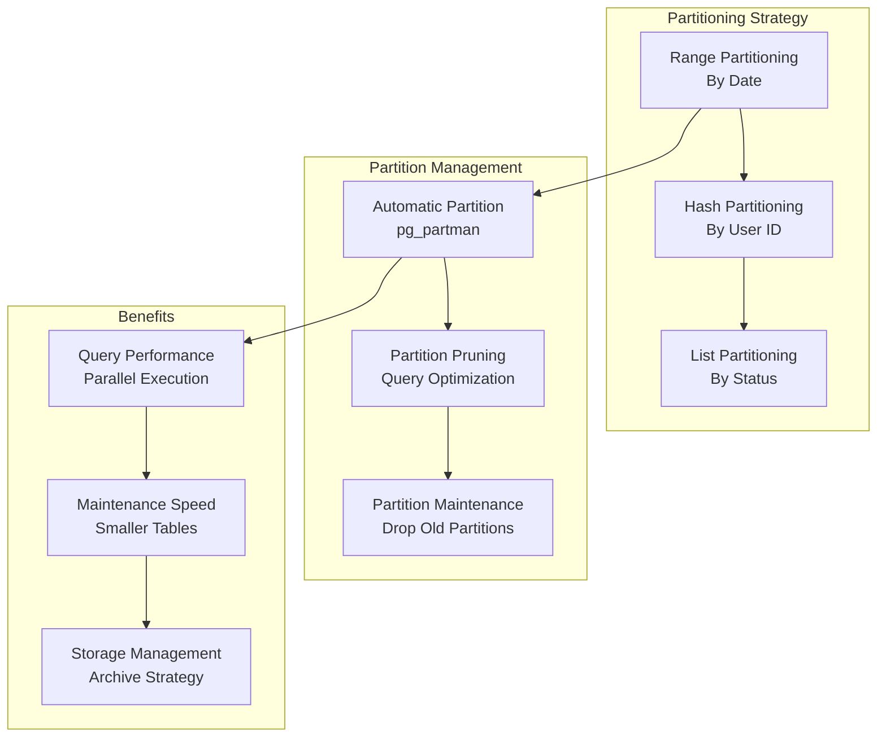

---

## 💾 資料備份與恢復

### 備份架構設計

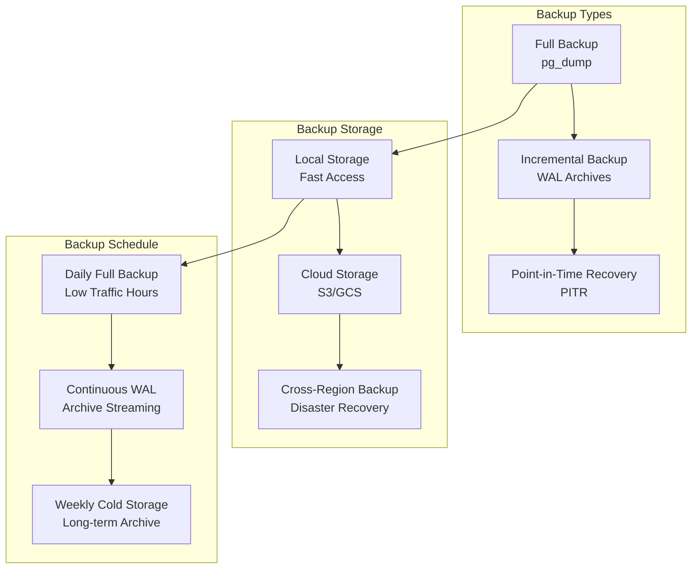

### 備份腳本

```bash
#!/bin/bash
# automated-backup.sh

# 配置
DB_NAME="ocean_shopping_center"
DB_USER="postgres"
BACKUP_DIR="/opt/backups"
S3_BUCKET="ocean-db-backups"
RETENTION_DAYS=30

# 創建備份目錄
mkdir -p $BACKUP_DIR

# 生成備份檔名
TIMESTAMP=$(date +%Y%m%d_%H%M%S)
BACKUP_FILE="$BACKUP_DIR/${DB_NAME}_${TIMESTAMP}.sql"

# 執行資料庫備份
echo "Starting database backup..."
pg_dump -h localhost -U $DB_USER -d $DB_NAME \
    --verbose --format=custom \
    --file=$BACKUP_FILE

# 壓縮備份檔案
gzip $BACKUP_FILE
BACKUP_FILE="${BACKUP_FILE}.gz"

# 上傳到雲端存儲
echo "Uploading backup to S3..."
aws s3 cp $BACKUP_FILE s3://$S3_BUCKET/daily/

# 清理舊備份
find $BACKUP_DIR -name "*.sql.gz" -mtime +$RETENTION_DAYS -delete

# 驗證備份完整性
echo "Verifying backup integrity..."
gunzip -t $BACKUP_FILE

if [ $? -eq 0 ]; then
    echo "Backup completed successfully: $BACKUP_FILE"
else
    echo "Backup verification failed!" >&2
    exit 1
fi
```

### 恢復程序

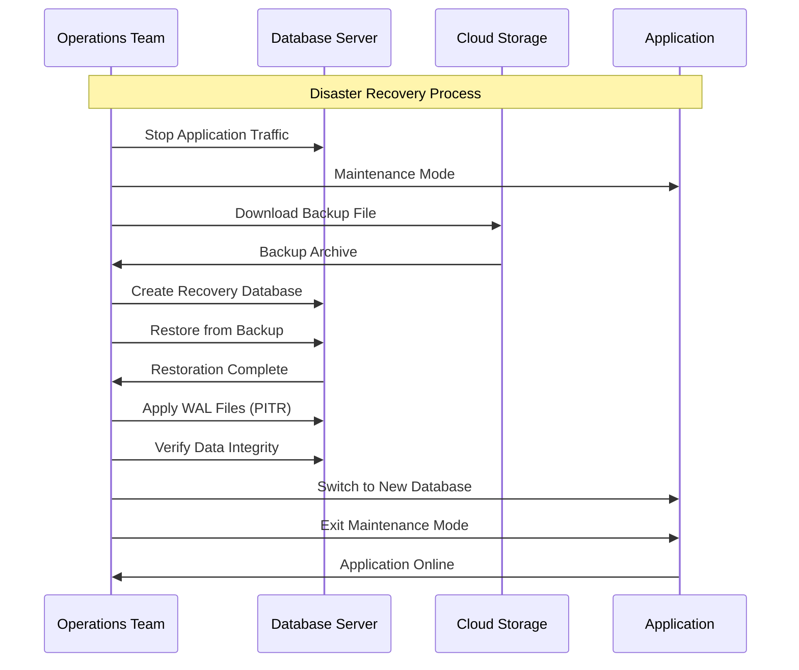

---

## 📊 性能監控

### 監控指標架構

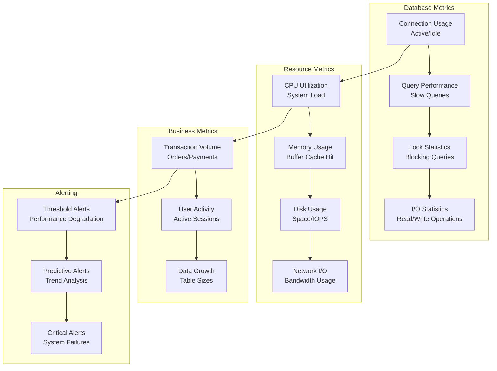

### 關鍵性能指標 (KPIs)

| 指標分類 | 監控項目 | 目標值 | 警告閾值 | 嚴重閾值 |
|---------|---------|--------|----------|----------|
| **查詢性能** | 平均查詢時間 | < 10ms | > 50ms | > 100ms |
| **連接管理** | 活躍連接數 | < 60% | > 80% | > 95% |
| **快取效率** | Buffer Cache Hit Rate | > 95% | < 90% | < 85% |
| **資源使用** | CPU 使用率 | < 70% | > 85% | > 95% |
| **資源使用** | Memory 使用率 | < 80% | > 90% | > 95% |
| **存儲空間** | 磁碟使用率 | < 75% | > 85% | > 95% |
| **鎖競爭** | 平均等待時間 | < 1ms | > 10ms | > 50ms |

### 監控查詢

```sql
-- 查詢最慢的 SQL 語句
SELECT 
    query,
    calls,
    total_time,
    mean_time,
    rows,
    100.0 * shared_blks_hit / nullif(shared_blks_hit + shared_blks_read, 0) AS hit_percent
FROM pg_stat_statements
ORDER BY mean_time DESC
LIMIT 10;

-- 監控連接狀態
SELECT 
    state,
    COUNT(*) as connection_count,
    MAX(now() - state_change) as max_duration
FROM pg_stat_activity
WHERE state IS NOT NULL
GROUP BY state;

-- 監控表大小和成長趨勢
SELECT 
    schemaname,
    tablename,
    pg_size_pretty(pg_total_relation_size(schemaname||'.'||tablename)) as size,
    pg_total_relation_size(schemaname||'.'||tablename) as bytes
FROM pg_tables
WHERE schemaname = 'public'
ORDER BY bytes DESC
LIMIT 10;

-- 監控索引使用情況
SELECT 
    schemaname,
    tablename,
    indexname,
    idx_tup_read,
    idx_tup_fetch,
    idx_scan,
    pg_size_pretty(pg_relation_size(indexrelid)) as size
FROM pg_stat_user_indexes
ORDER BY idx_scan ASC
LIMIT 10;
```

---

## 🔒 安全性設計

### 資料庫安全架構

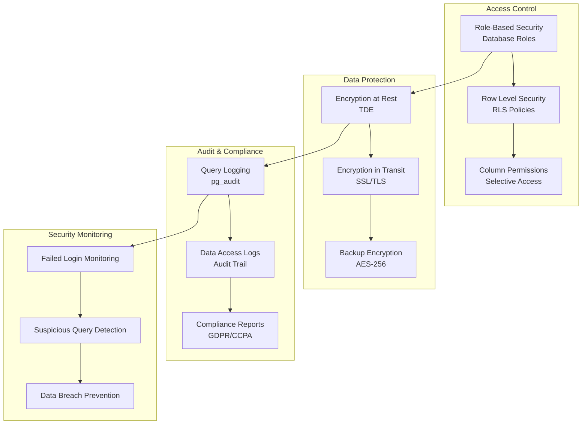

### 安全配置

```sql
-- 創建應用專用資料庫角色
CREATE ROLE app_read;
CREATE ROLE app_write;
CREATE ROLE app_admin;

-- 授予基本權限
GRANT CONNECT ON DATABASE ocean_shopping_center TO app_read;
GRANT USAGE ON SCHEMA public TO app_read;
GRANT SELECT ON ALL TABLES IN SCHEMA public TO app_read;

GRANT app_read TO app_write;
GRANT INSERT, UPDATE, DELETE ON ALL TABLES IN SCHEMA public TO app_write;

GRANT app_write TO app_admin;
GRANT CREATE ON SCHEMA public TO app_admin;

-- 啟用行級安全（RLS）
ALTER TABLE orders ENABLE ROW LEVEL SECURITY;

-- 創建 RLS 政策
CREATE POLICY user_orders_policy ON orders
    FOR ALL TO app_write
    USING (user_id = current_setting('app.current_user_id')::bigint);

-- 敏感資料加密
CREATE EXTENSION IF NOT EXISTS pgcrypto;

-- 創建加密函數
CREATE OR REPLACE FUNCTION encrypt_pii(data text)
RETURNS text AS $$
BEGIN
    RETURN encode(encrypt(data::bytea, 'encryption_key', 'aes'), 'base64');
END;
$$ LANGUAGE plpgsql;

-- 審計觸發器
CREATE OR REPLACE FUNCTION audit_trigger_function()
RETURNS trigger AS $$
BEGIN
    INSERT INTO audit_log (
        table_name,
        operation,
        old_data,
        new_data,
        user_name,
        timestamp
    ) VALUES (
        TG_TABLE_NAME,
        TG_OP,
        row_to_json(OLD),
        row_to_json(NEW),
        current_user,
        NOW()
    );
    RETURN NULL;
END;
$$ LANGUAGE plpgsql;

-- 在重要表上添加審計觸發器
CREATE TRIGGER users_audit_trigger
    AFTER INSERT OR UPDATE OR DELETE ON users
    FOR EACH ROW EXECUTE FUNCTION audit_trigger_function();
```

---

## 📈 未來擴展規劃

### 資料庫演進路線圖

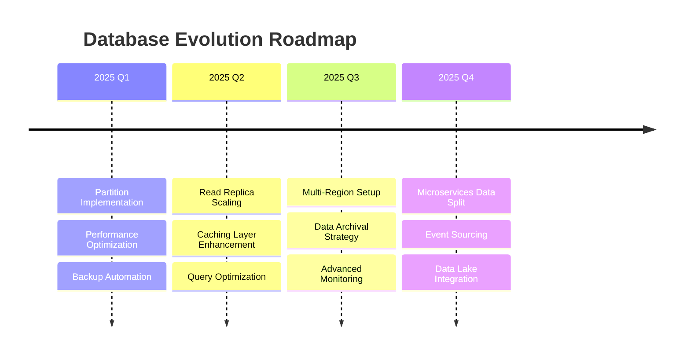

### 擴展策略

1. **垂直擴展**: 升級硬體配置，增加 CPU、記憶體、存儲
2. **水平擴展**: 讀寫分離、資料分片、多區域部署
3. **分散式架構**: 微服務資料庫拆分、事件驅動架構
4. **雲原生**: 雲資料庫服務、自動擴展、無伺服器架構
5. **資料湖整合**: 大資料分析、商業智能、機器學習

---

## 📖 相關文檔

- [系統架構設計](system-architecture.md)
- [後端架構設計](backend-architecture.md)
- [API 接口文檔](../api/api-documentation.md)
- [部署運維指南](../deployment/production-deployment.md)
- [性能監控指南](../monitoring/monitoring-alerting.md)

---

**最後更新**: 2025-09-05  
**版本**: 1.0  
**維護者**: Ocean Shopping Center Database Team