# 🎨 Ocean Shopping Center - 前端架構設計

## 📋 目錄

- [前端概覽](#前端概覽)
- [技術棧架構](#技術棧架構)
- [應用架構](#應用架構)
- [組件架構](#組件架構)
- [狀態管理](#狀態管理)
- [路由架構](#路由架構)
- [服務層架構](#服務層架構)
- [UI/UX 架構](#uiux-架構)
- [性能優化](#性能優化)
- [開發工具鏈](#開發工具鏈)

---

## 🎯 前端概覽

Ocean Shopping Center 前端採用 **React 19.1.1** 構建的現代化單頁應用（SPA），使用 TypeScript 提供類型安全，Tailwind CSS 實現響應式設計。架構遵循 **組件化、模塊化、可復用** 的設計原則，支持多租戶、多主題和國際化。

### 核心特性
- **現代化技術棧**: React 19 + TypeScript + Tailwind CSS
- **組件化設計**: 可復用的 UI 組件庫
- **狀態管理**: Context API + Custom Hooks 
- **實時通信**: Socket.IO 支持實時更新
- **響應式設計**: 支持桌面和移動設備
- **性能優化**: 懶加載、代碼分割、快取策略

---

## 🛠️ 技術棧架構

### 核心技術棧

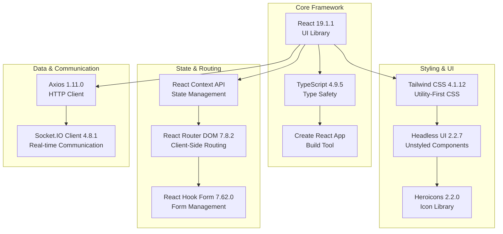

### 開發生態系統

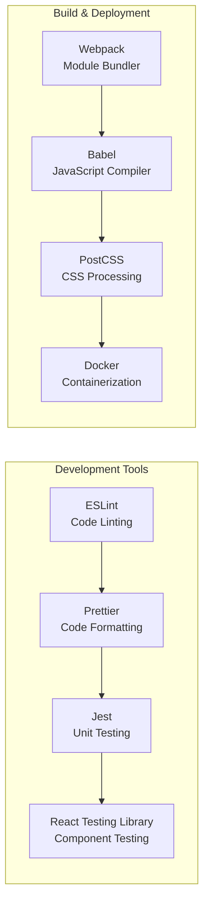

---

## 🏗️ 應用架構

### 整體應用架構

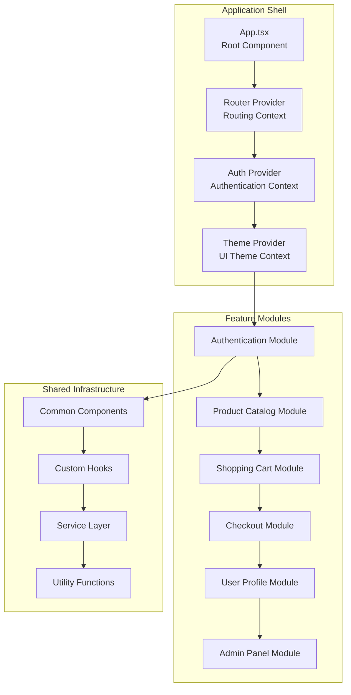

### 文件夾結構架構

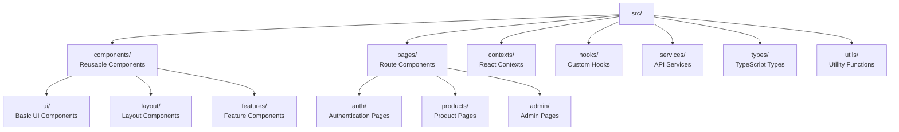

---

## 🧩 組件架構

### 組件層次結構

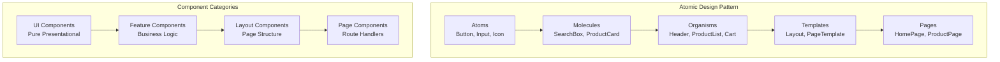

### 組件通信模式

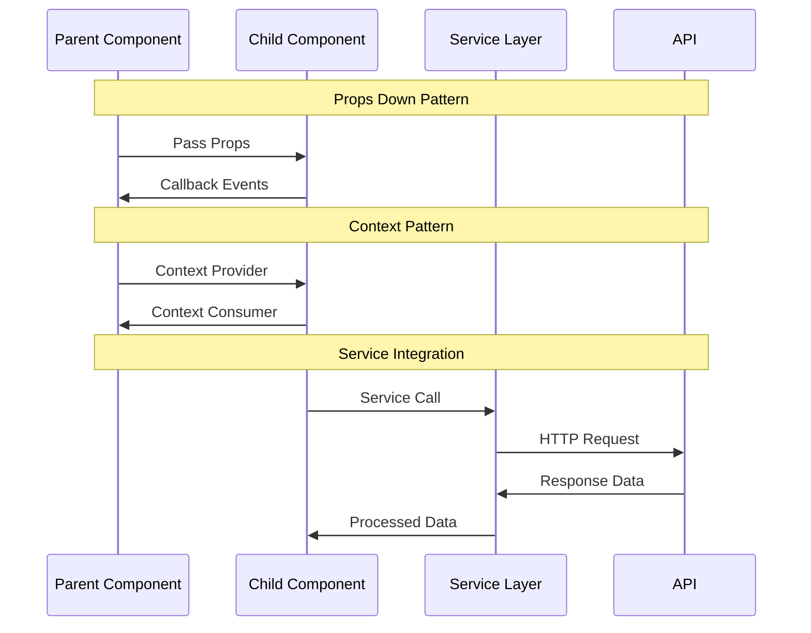

### 核心 UI 組件

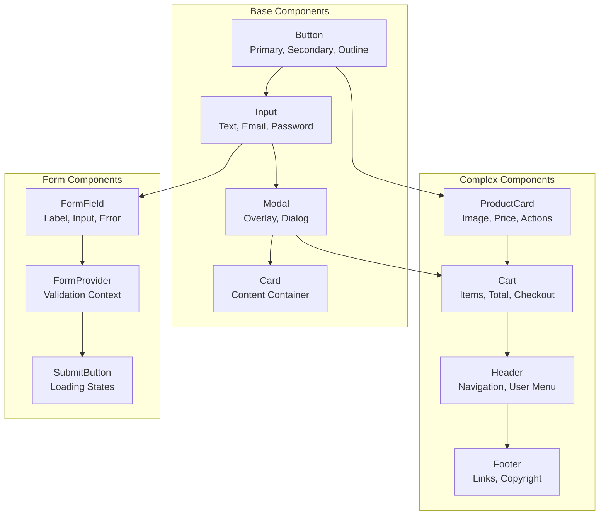

---

## 🗂️ 狀態管理

### 狀態管理架構

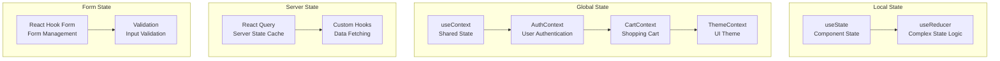

### Context 架構設計

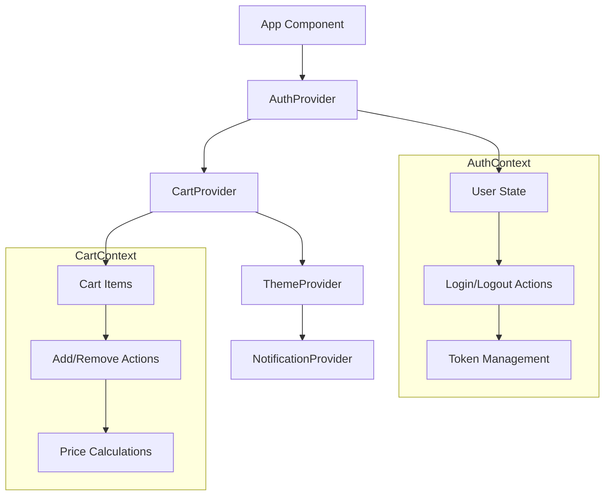

### 自定義 Hooks 架構

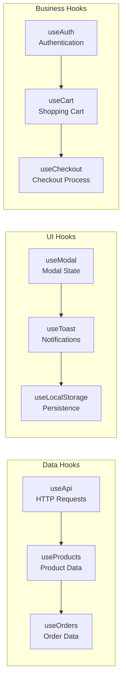

---

## 🛣️ 路由架構

### 路由層次結構

```mermaid
graph TD
    A[App Router] --> B[Public Routes]
    A --> C[Protected Routes]
    A --> D[Admin Routes]
    
    B --> B1[/<br/>Home Page]
    B --> B2[/login<br/>Login Page]
    B --> B3[/register<br/>Register Page]
    B --> B4[/products<br/>Product Catalog]
    B --> B5[/product/:id<br/>Product Detail]
    
    C --> C1[/profile<br/>User Profile]  
    C --> C2[/orders<br/>Order History]
    C --> C3[/checkout<br/>Checkout Process]
    
    D --> D1[/admin<br/>Admin Dashboard]
    D --> D2[/admin/products<br/>Product Management]
    D --> D3[/admin/orders<br/>Order Management]
```

### 路由守衛機制

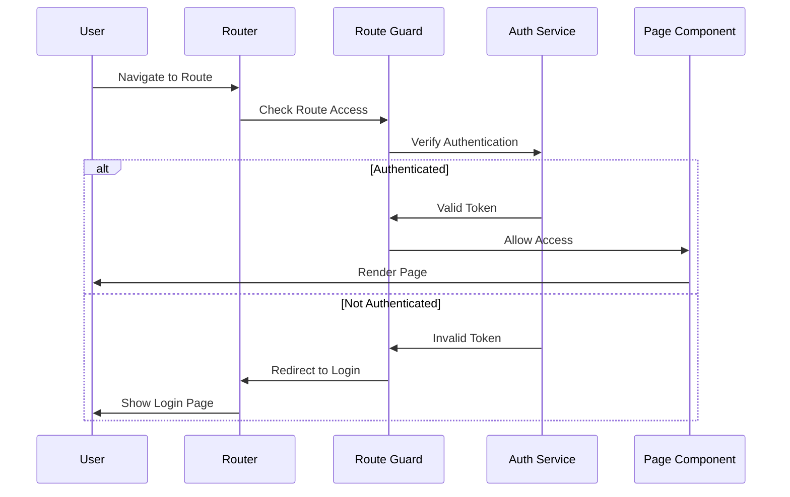

### 動態路由加載

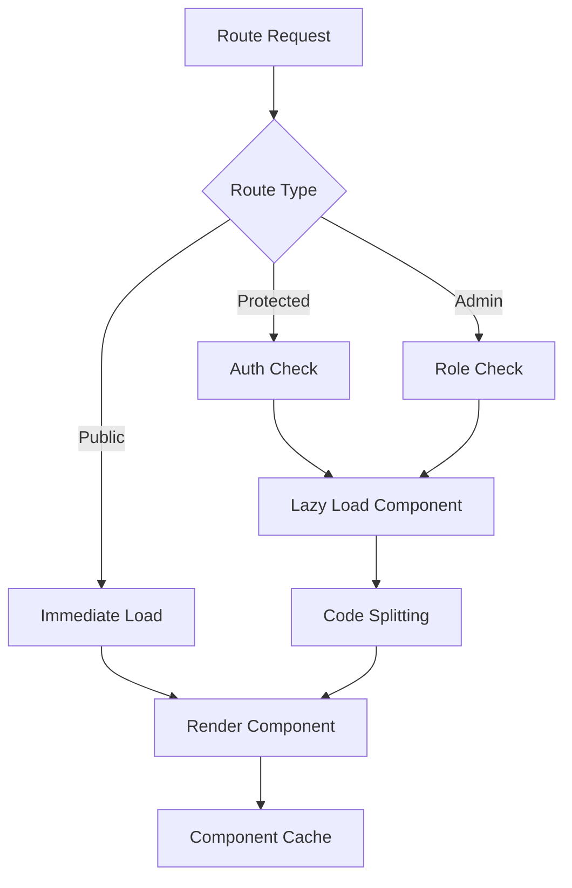

---

## 🔧 服務層架構

### API 服務架構

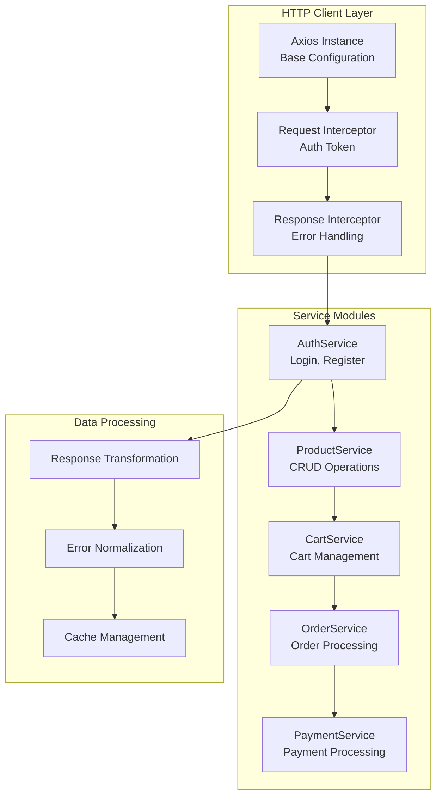

### API 集成模式

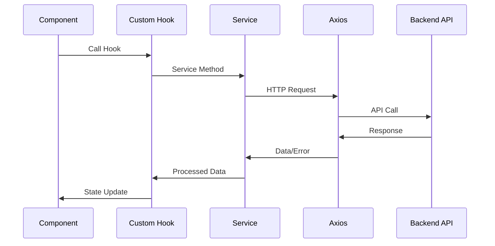

### WebSocket 架構

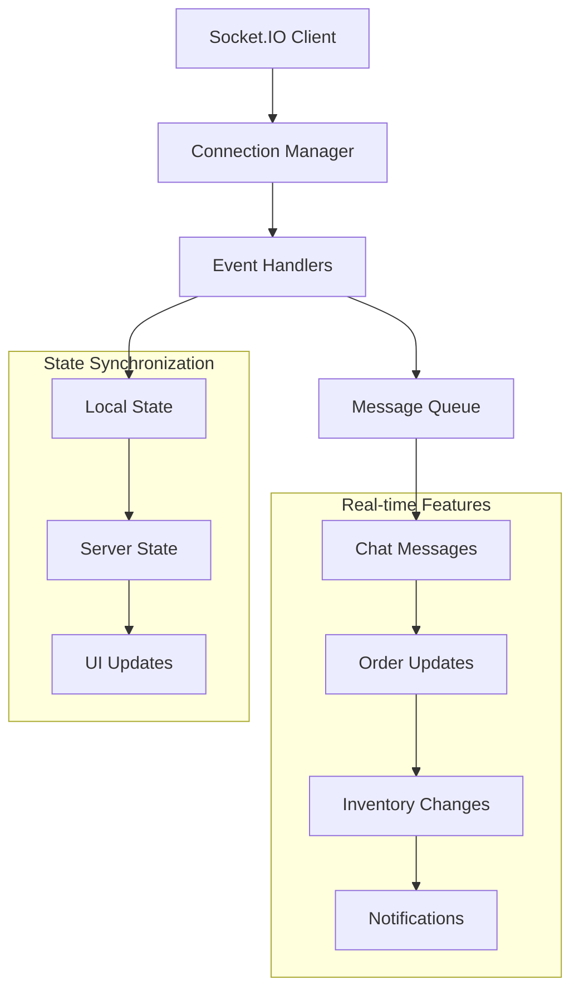

---

## 🎨 UI/UX 架構

### 設計系統架構

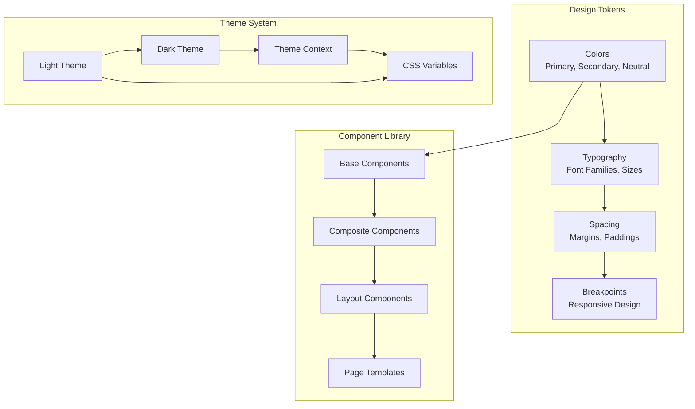

### 響應式設計架構

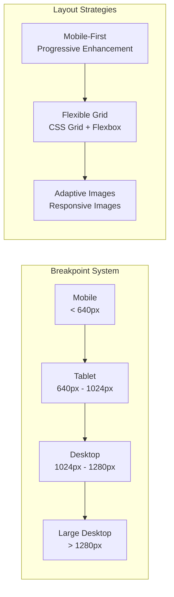

### 無障礙設計 (A11y)

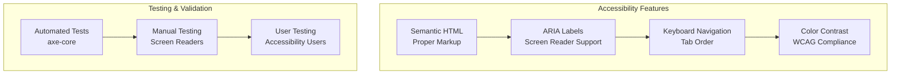

---

## ⚡ 性能優化

### 渲染優化策略

```mermaid
graph TD
    subgraph "Component Optimization"
        A[React.memo<br/>Prevent Re-renders] --> B[useMemo<br/>Expensive Calculations]
        B --> C[useCallback<br/>Function Memoization]
        C --> D[Code Splitting<br/>Route-based Splitting]
    end
    
    subgraph "Bundle Optimization"
        E[Tree Shaking<br/>Remove Unused Code] --> F[Lazy Loading<br/>Dynamic Imports]
        F --> G[Chunk Splitting<br/>Vendor Separation]
    end
    
    subgraph "Caching Strategies"
        H[Browser Cache<br/>Static Assets] --> I[Service Worker<br/>Offline Support]
        I --> J[Memory Cache<br/>Component Data]
    end
```

### 加載性能優化

```mermaid
sequenceDiagram
    participant B as Browser
    participant CDN as CDN/Cache
    participant App as React App
    participant API as Backend API

    Note over B,API: Initial Load Optimization
    B->>CDN: Request Static Assets
    CDN->>B: Cached Assets (Fast)
    B->>App: Load App Shell
    App->>API: Critical Data Request
    API->>App: Essential Data
    App->>B: Initial Render
    
    Note over B,API: Progressive Loading
    B->>App: User Interaction
    App->>App: Lazy Load Component
    App->>API: Additional Data
    API->>App: Non-critical Data
    App->>B: Enhanced UI
```

### 實時性能監控

```mermaid
graph TB
    subgraph "Performance Metrics"
        A[First Contentful Paint<br/>FCP] --> B[Largest Contentful Paint<br/>LCP]
        B --> C[Cumulative Layout Shift<br/>CLS]
        C --> D[First Input Delay<br/>FID]
    end
    
    subgraph "Monitoring Tools"
        E[Web Vitals API] --> F[Performance Observer]
        F --> G[Analytics Dashboard]
    end
    
    subgraph "Optimization Actions"
        H[Bundle Analysis] --> I[Performance Budget]
        I --> J[Automated Alerts]
    end
    
    D --> E
    E --> H
```

---

## 🔧 開發工具鏈

### 開發環境配置

```mermaid
graph TD
    subgraph "Development Server"
        A[React Scripts<br/>Development Server] --> B[Hot Module Replacement<br/>Live Reloading]
        B --> C[Source Maps<br/>Debug Support]
    end
    
    subgraph "Code Quality"
        D[ESLint<br/>Linting Rules] --> E[Prettier<br/>Code Formatting]
        E --> F[Husky<br/>Git Hooks]
        F --> G[lint-staged<br/>Pre-commit Checks]
    end
    
    subgraph "Testing Pipeline"
        H[Jest<br/>Unit Tests] --> I[React Testing Library<br/>Component Tests]
        I --> J[Cypress<br/>E2E Tests]
    end
```

### 建置流程

```mermaid
sequenceDiagram
    participant D as Developer
    participant Git as Git Repository
    participant CI as CI/CD Pipeline
    participant CDN as CDN/Hosting

    D->>Git: Push Code
    Git->>CI: Trigger Build
    CI->>CI: Run Tests
    CI->>CI: Build Production
    CI->>CI: Optimize Assets
    CI->>CDN: Deploy to CDN
    CDN->>D: Deployment Complete
```

### TypeScript 配置

```mermaid
graph TB
    subgraph "Type Safety"
        A[Strict Mode<br/>Maximum Safety] --> B[Interface Definitions<br/>API Types]
        B --> C[Component Props<br/>Type Checking]
        C --> D[Custom Types<br/>Business Logic]
    end
    
    subgraph "Development Experience"
        E[Auto Completion<br/>IDE Support] --> F[Error Detection<br/>Compile Time]
        F --> G[Refactoring Support<br/>Safe Changes]
    end
```

---

## 📊 性能指標與監控

### 前端性能目標

| 指標類型 | 目標值 | 監控方式 | 優化策略 |
|---------|--------|----------|----------|
| **First Contentful Paint** | < 1.5s | Web Vitals | 資源優化、CDN |
| **Largest Contentful Paint** | < 2.5s | Performance API | 圖片優化、代碼分割 |
| **Time to Interactive** | < 3.5s | Lighthouse | JavaScript 優化 |
| **Bundle Size** | < 500KB | Bundle Analyzer | Tree Shaking |
| **Cumulative Layout Shift** | < 0.1 | RUM Monitoring | Layout 穩定性 |

### 開發指標

```mermaid
graph TB
    subgraph "Code Quality Metrics"
        A[Test Coverage<br/>> 80%] --> B[TypeScript Coverage<br/>> 95%]
        B --> C[ESLint Score<br/>Zero Errors]
    end
    
    subgraph "Performance Metrics"  
        D[Bundle Size<br/>< 500KB] --> E[Lighthouse Score<br/>> 90]
        E --> F[Web Vitals<br/>All Green]
    end
    
    subgraph "User Experience"
        G[Error Rate<br/>< 0.1%] --> H[Page Load Time<br/>< 2s]
        H --> I[User Satisfaction<br/>> 4.5/5]
    end
```

---

## 🚀 未來擴展規劃

### 技術演進路線圖

```mermaid
timeline
    title Frontend Evolution Roadmap
    
    2025 Q1 : React 19 Migration
           : TypeScript 5.0
           : Performance Optimization
           
    2025 Q2 : Micro-frontend Architecture  
           : Advanced State Management
           : Enhanced A11y
           
    2025 Q3 : React Server Components
           : Edge Runtime
           : AI Integration
           
    2025 Q4 : WebAssembly Integration
           : Progressive Web App
           : Advanced Analytics
```

### 架構演進方向

1. **微前端架構**: 支援獨立部署的功能模組
2. **服務端渲染**: Next.js 或自定義 SSR 方案  
3. **邊緣計算**: CDN 邊緣節點部署
4. **PWA 支持**: 離線功能和原生體驗
5. **AI 集成**: 智能推薦和用戶體驗優化

---

## 📖 相關文檔

- [系統架構設計](system-architecture.md)
- [後端架構設計](backend-architecture.md)
- [UI 組件庫文檔](../api/ui-components.md)
- [開發環境設置](../deployment/development-setup.md)
- [性能優化指南](../deployment/performance-guide.md)

---

**最後更新**: 2025-09-05  
**版本**: 1.0  
**維護者**: Ocean Shopping Center Frontend Team