# 🌊 Ocean Shopping Center - 系統架構設計

## 📋 目錄

- [系統概覽](#系統概覽)
- [高級架構圖](#高級架構圖)  
- [技術棧架構](#技術棧架構)
- [系統組件](#系統組件)
- [數據流架構](#數據流架構)
- [部署架構](#部署架構)
- [安全架構](#安全架構)
- [性能架構](#性能架構)

---

## 🏗️ 系統概覽

Ocean Shopping Center 是一個現代化的多租戶電商平台，採用微服務架構設計理念，支持高並發、高可用性和橫向擴展。系統基於 **前後端分離架構**，使用容器化部署，並配備完整的監控、告警和運維體系。

### 核心特性
- **多租戶支持**: 支援多個商戶獨立運營
- **高性能**: Redis 快取 + 資料庫連接池優化  
- **高可用**: 負載均衡 + 健康檢查 + 故障轉移
- **安全性**: 多層安全防護 + JWT 認證 + SSL/TLS
- **可觀測性**: 完整的監控、日誌、追蹤體系

---

## 🏗️ 高級架構圖

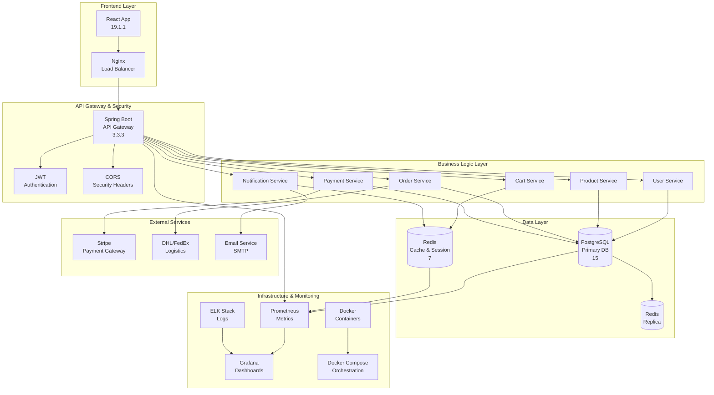

---

## 🛠️ 技術棧架構

### 前端技術棧

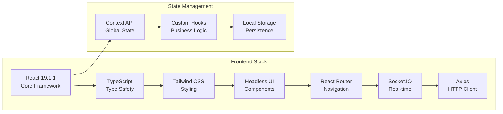

### 後端技術棧

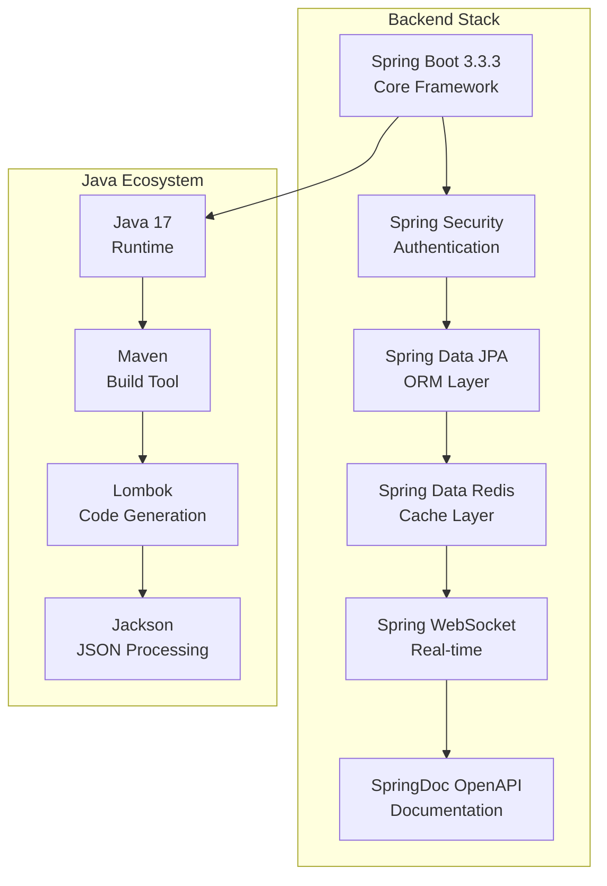

---

## 🔧 系統組件

### 核心業務組件

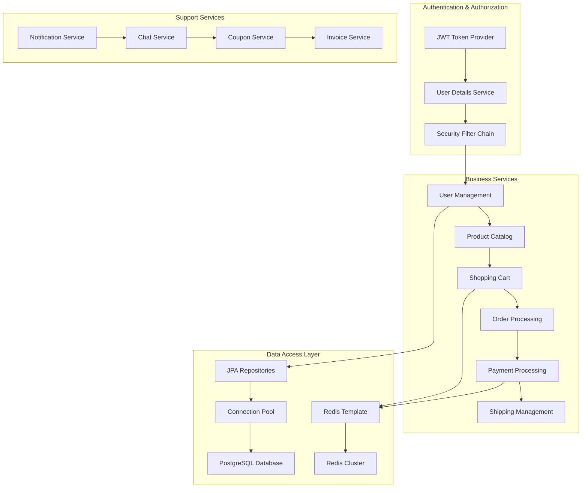

---

## 🔄 數據流架構

### 用戶請求處理流程

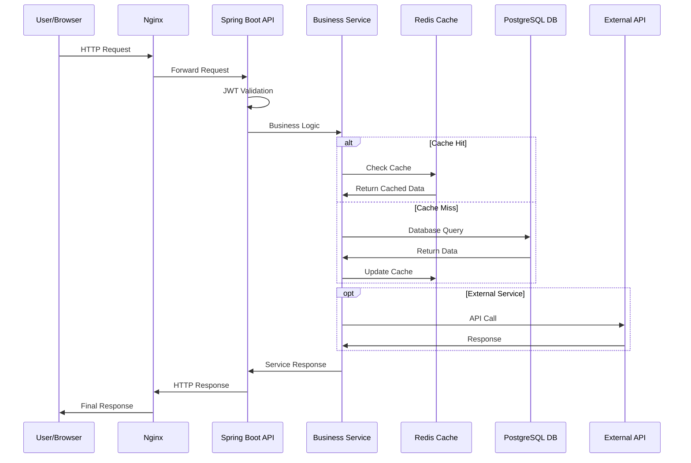

### 實時通信流程

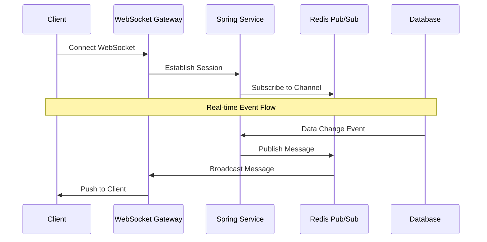

---

## 🚀 部署架構

### 開發環境架構

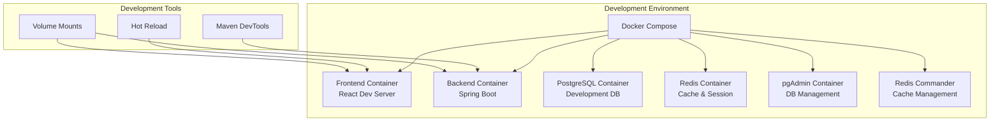

### 生產環境架構

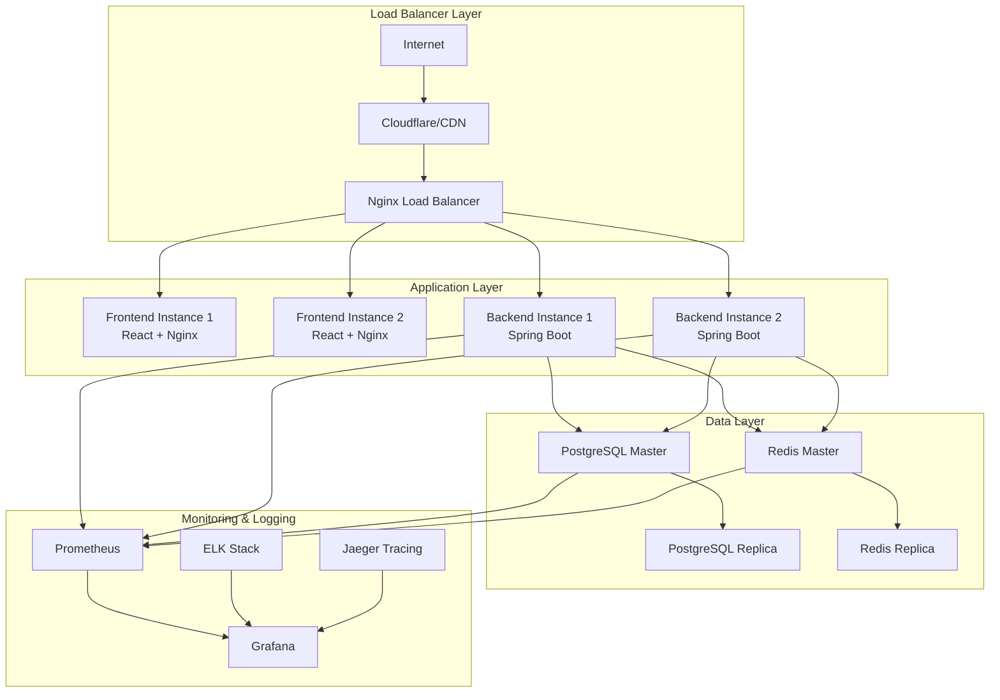

---

## 🔒 安全架構

### 多層安全防護

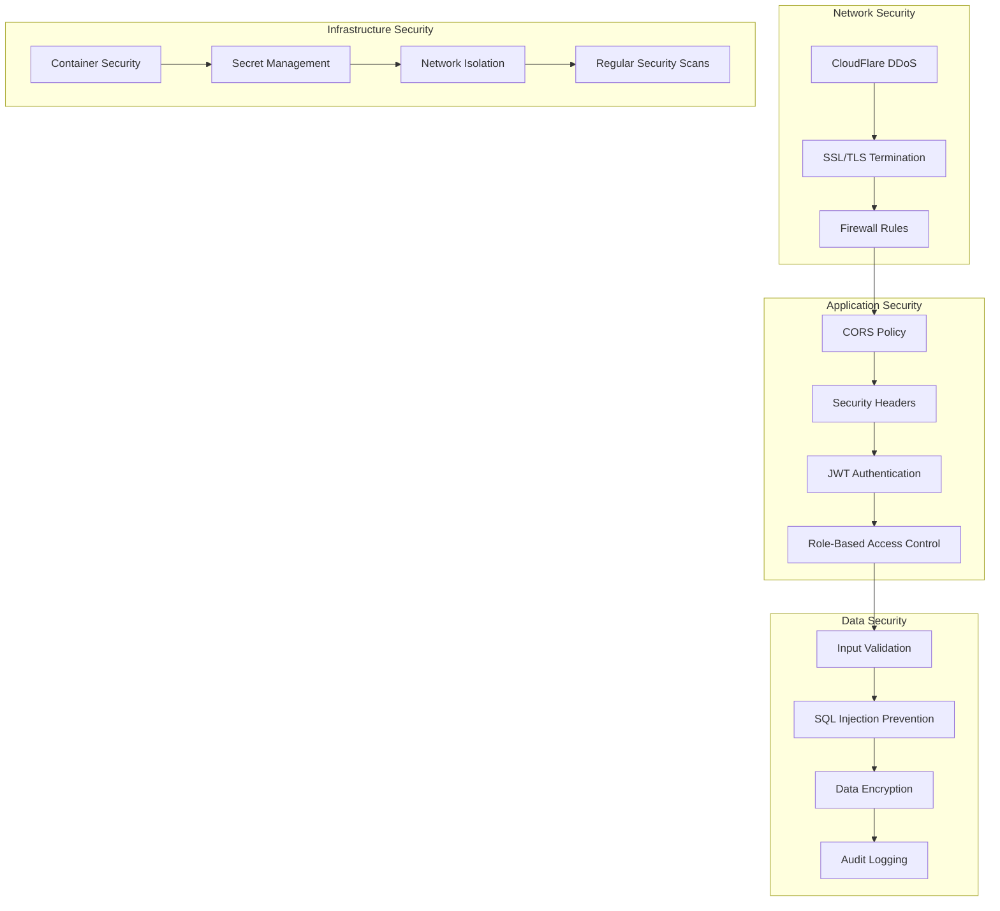

### 認證授權流程

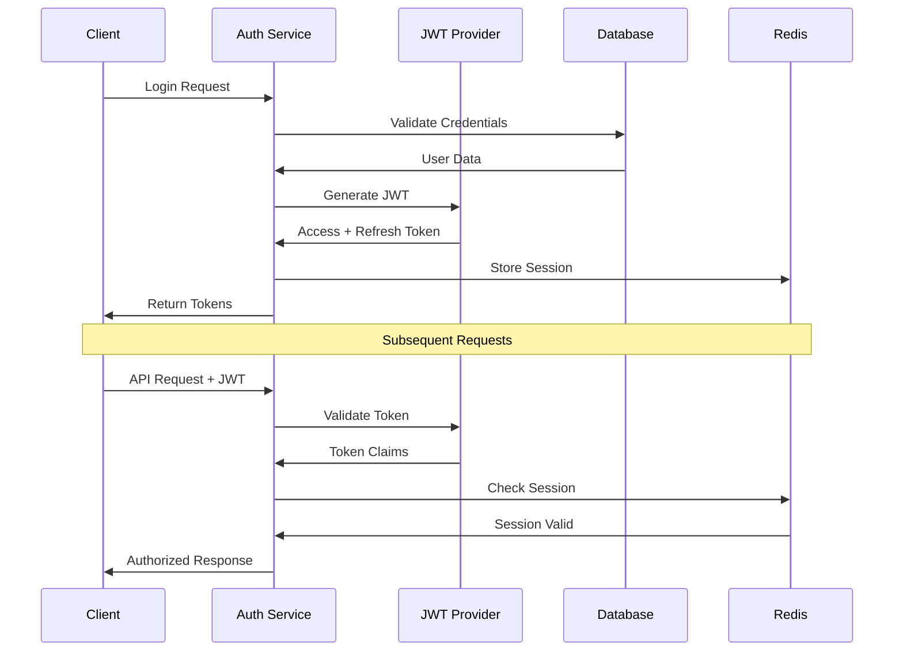

---

## ⚡ 性能架構

### 快取策略

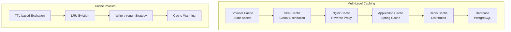

### 數據庫優化

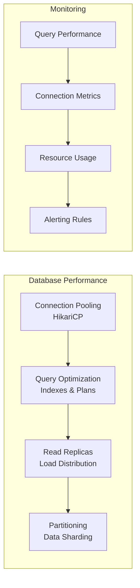

---

## 📊 監控指標

### 關鍵性能指標 (KPIs)

| 指標類型 | 監控項目 | 目標值 | 告警閾值 |
|---------|---------|--------|----------|
| **響應時間** | API P99 延遲 | < 200ms | > 500ms |
| **吞吐量** | 每秒請求數 | > 1000 RPS | < 500 RPS |
| **錯誤率** | HTTP 5xx 錯誤 | < 0.1% | > 1% |
| **可用性** | 服務正常運行時間 | > 99.9% | < 99.5% |
| **資源** | CPU 使用率 | < 70% | > 90% |
| **資源** | Memory 使用率 | < 80% | > 95% |
| **數據庫** | Connection Pool | < 80% | > 95% |
| **快取** | Redis 記憶體使用 | < 75% | > 90% |

---

## 🔧 技術債務與最佳實踐

### 架構原則
1. **單一職責**: 每個服務專注於單一業務領域
2. **依賴反轉**: 面向接口編程，降低耦合度
3. **配置外化**: 環境相關配置外部化管理
4. **故障隔離**: 服務間故障不相互影響
5. **可觀測性**: 全面的監控、日誌、追蹤

### 擴展性考慮
- **水平擴展**: 無狀態設計，支持實例擴展
- **數據分片**: 支持數據庫分片和讀寫分離
- **微服務拆分**: 為未來微服務化做準備
- **API 版本控制**: 支持 API 版本管理和向後兼容

---

## 📖 相關文檔

- [前端架構設計](frontend-architecture.md)
- [後端架構設計](backend-architecture.md)  
- [資料庫設計](database-design.md)
- [部署指南](../deployment/production-deployment.md)
- [監控告警](../monitoring/monitoring-alerting.md)

---

**最後更新**: 2025-09-05  
**版本**: 1.0  
**維護者**: Ocean Shopping Center Team