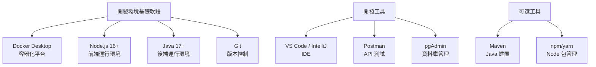
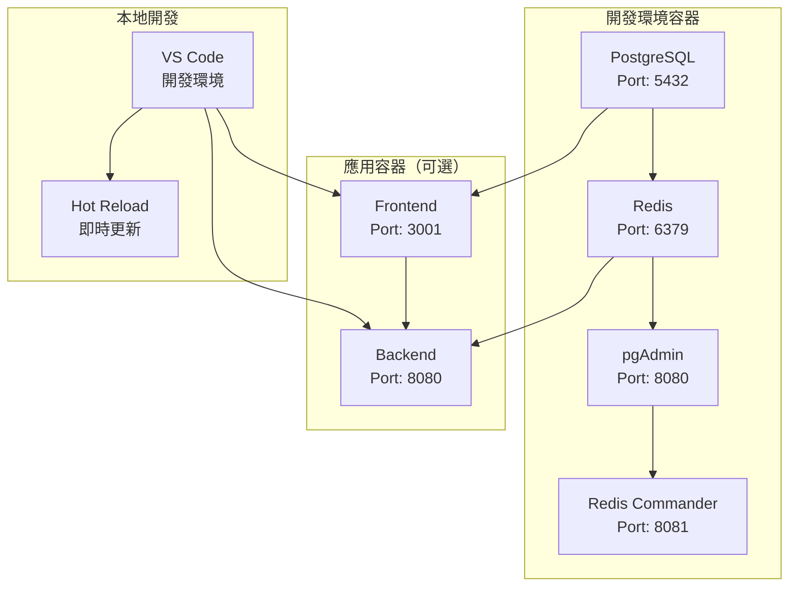
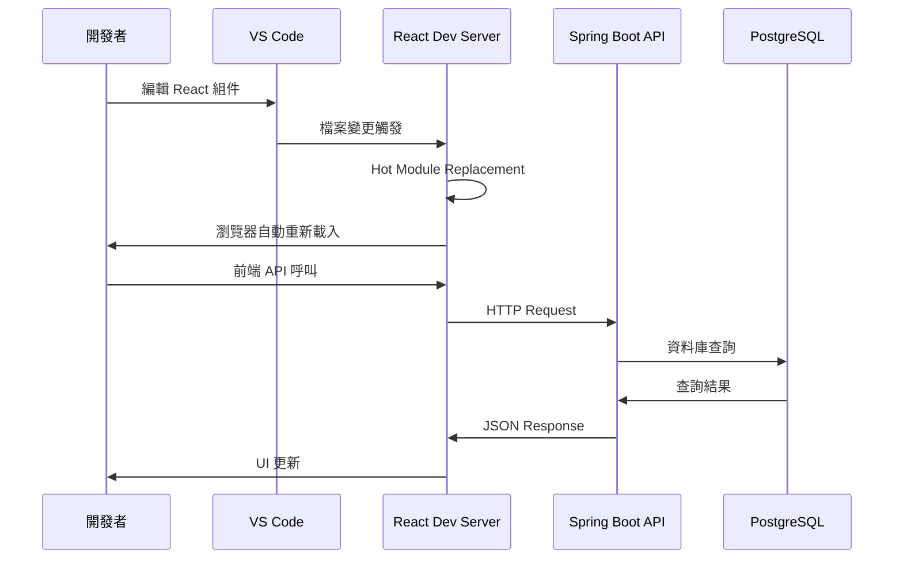
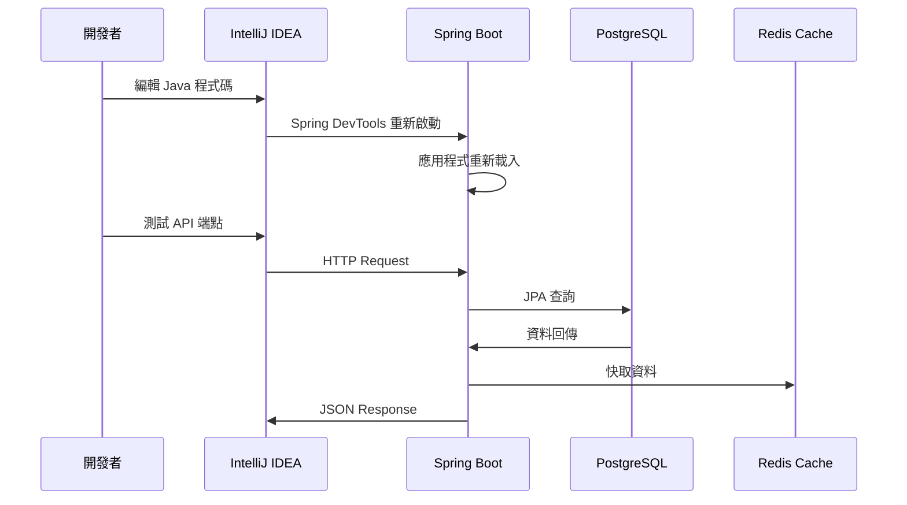
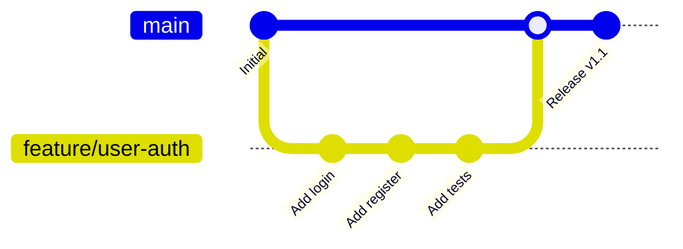

# 🛠️ Ocean Shopping Center - 開發環境設置指南

## 📋 目錄

- [系統要求](#系統要求)
- [快速開始](#快速開始)
- [Docker 環境設置](#docker-環境設置)
- [前端開發環境](#前端開發環境)
- [後端開發環境](#後端開發環境)
- [資料庫設置](#資料庫設置)
- [開發工具配置](#開發工具配置)
- [測試環境](#測試環境)
- [疑難排解](#疑難排解)

---

## 💻 系統要求

### 最低系統要求

| 組件 | 最低要求 | 推薦配置 |
|------|----------|----------|
| **作業系統** | Windows 10, macOS 10.15, Ubuntu 18.04 | Windows 11, macOS 12+, Ubuntu 20.04+ |
| **CPU** | 4 核心 2.0GHz | 8 核心 3.0GHz+ |
| **記憶體** | 8GB RAM | 16GB+ RAM |
| **存儲空間** | 10GB 可用空間 | 20GB+ SSD |
| **網路** | 寬頻網路連接 | 穩定的高速網路 |

### 必要軟體



---

## 🚀 快速開始

### 一鍵啟動開發環境

```bash
# 1. 克隆專案
git clone https://github.com/jaujye/ocean-shopping-center.git
cd ocean-shopping-center

# 2. 複製環境變數模板
cp .env.template .env

# 3. 啟動基礎服務（資料庫、快取）
docker-compose up postgres redis -d

# 4. 等待服務就緒（約30秒）
docker-compose ps

# 5. 啟動開發工具（可選）
docker-compose --profile dev up -d

# 6. 前端開發
cd frontend
npm install
npm start

# 7. 後端開發（另開終端）
cd backend
mvn spring-boot:run
```

### 驗證安裝

```bash
# 檢查服務狀態
curl http://localhost:3001  # 前端
curl http://localhost:8080/actuator/health  # 後端
curl http://localhost:5432  # PostgreSQL（會失敗但證明端口開放）
curl http://localhost:6379  # Redis（會失敗但證明端口開放）
```

---

## 🐳 Docker 環境設置

### Docker Compose 架構



### Docker 配置檔案解析

```yaml
# docker-compose.yml - 開發環境配置
version: '3.8'

services:
  # PostgreSQL 資料庫
  postgres:
    image: postgres:15-alpine
    container_name: ocean_postgres
    restart: unless-stopped
    environment:
      POSTGRES_DB: ocean_shopping_center
      POSTGRES_USER: postgres
      POSTGRES_PASSWORD: postgres
      POSTGRES_HOST_AUTH_METHOD: trust
    ports:
      - "5432:5432"
    volumes:
      - postgres_data:/var/lib/postgresql/data
      - ./backend/database/schemas:/docker-entrypoint-initdb.d
    healthcheck:
      test: ["CMD-SHELL", "pg_isready -U postgres"]
      interval: 10s
      timeout: 5s
      retries: 5

  # Redis 快取
  redis:
    image: redis:7-alpine
    container_name: ocean_redis
    restart: unless-stopped
    ports:
      - "6379:6379"
    volumes:
      - redis_data:/data
    healthcheck:
      test: ["CMD", "redis-cli", "ping"]
      interval: 10s
      timeout: 5s
      retries: 5
```

### Docker 管理指令

```bash
# 啟動所有服務
docker-compose up -d

# 啟動特定服務
docker-compose up postgres redis -d

# 查看服務狀態
docker-compose ps

# 查看日誌
docker-compose logs postgres
docker-compose logs -f redis  # 持續輸出

# 停止服務
docker-compose down

# 重建容器
docker-compose up --build

# 清理所有資料
docker-compose down -v  # 注意：會刪除資料庫資料
```

---

## 🎨 前端開發環境

### Node.js 環境設置

```bash
# 檢查 Node.js 版本
node --version  # 需要 >= 16.0.0
npm --version   # 需要 >= 8.0.0

# 如果版本過舊，安裝 nvm 管理 Node.js 版本
# Windows: 下載 nvm-windows
# macOS/Linux: curl -o- https://raw.githubusercontent.com/nvm-sh/nvm/v0.39.0/install.sh | bash

# 安裝推薦版本
nvm install 18
nvm use 18
```

### 前端專案設置

```bash
cd frontend

# 安裝依賴
npm install

# 或使用 yarn
yarn install

# 啟動開發伺服器
npm start

# 開發伺服器配置
# - 自動重新載入
# - 熱模組替換 (HMR)
# - TypeScript 編譯檢查
# - ESLint 程式碼檢查
```

### 前端開發工作流程



### 前端環境變數

```bash
# frontend/.env.local
REACT_APP_API_URL=http://localhost:8080
REACT_APP_WS_URL=ws://localhost:8080/ws
REACT_APP_STRIPE_PUBLIC_KEY=pk_test_your_stripe_key
REACT_APP_ENVIRONMENT=development
GENERATE_SOURCEMAP=true
```

### 前端開發指令

```bash
# 開發模式
npm start                    # 啟動開發伺服器
npm run build               # 建置生產版本
npm test                    # 執行測試
npm run test:coverage       # 測試覆蓋率報告
npm run lint                # ESLint 檢查
npm run lint:fix            # 自動修復 ESLint 錯誤
npm run format              # Prettier 格式化
npm run analyze             # Bundle 分析
npm run storybook           # 啟動 Storybook（如果有）
```

---

## ☕ 後端開發環境

### Java 開發環境設置

```bash
# 檢查 Java 版本
java --version  # 需要 Java 17+
javac --version

# 設置 JAVA_HOME（如需要）
# Windows: 
# set JAVA_HOME=C:\Program Files\Java\jdk-17
# macOS/Linux:
# export JAVA_HOME=/usr/lib/jvm/java-17-openjdk
```

### Maven 配置

```bash
# 檢查 Maven
mvn --version  # 需要 Maven 3.6+

# 設置 Maven 鏡像（加速下載，可選）
# 編輯 ~/.m2/settings.xml
```

```xml
<!-- ~/.m2/settings.xml -->
<settings>
  <mirrors>
    <mirror>
      <id>alimaven</id>
      <name>aliyun maven</name>
      <url>http://maven.aliyun.com/nexus/content/groups/public/</url>
      <mirrorOf>central</mirrorOf>
    </mirror>
  </mirrors>
</settings>
```

### 後端專案設置

```bash
cd backend

# 編譯專案
mvn compile

# 執行測試
mvn test

# 啟動應用（開發模式）
mvn spring-boot:run

# 或使用 IDE 啟動：執行 OceanShoppingCenterApplication.java
```

### Spring Boot 開發模式配置

```yaml
# backend/src/main/resources/application-dev.yml
spring:
  profiles:
    active: dev
  
  # 開發資料庫配置
  datasource:
    url: jdbc:postgresql://localhost:5432/ocean_shopping_center
    username: postgres
    password: postgres
    hikari:
      maximum-pool-size: 5  # 開發環境較小連接池
      
  # JPA 開發配置
  jpa:
    hibernate:
      ddl-auto: update  # 開發環境自動更新資料表
    show-sql: true      # 顯示 SQL 查詢
    properties:
      hibernate:
        format_sql: true  # 格式化 SQL 輸出
        
  # Redis 開發配置
  redis:
    host: localhost
    port: 6379
    database: 0
    timeout: 2000ms
    
  # DevTools 配置
  devtools:
    restart:
      enabled: true
    livereload:
      enabled: true

# 日誌配置
logging:
  level:
    com.ocean.shopping: DEBUG  # 應用程式除錯日誌
    org.hibernate.SQL: DEBUG   # SQL 查詢日誌
    org.springframework.security: DEBUG  # 安全日誌
```

### 後端開發工作流程



---

## 🗃️ 資料庫設置

### PostgreSQL 初始化

```bash
# 使用 Docker 啟動 PostgreSQL
docker-compose up postgres -d

# 等待資料庫啟動
docker-compose logs postgres

# 連接資料庫
docker exec -it ocean_postgres psql -U postgres -d ocean_shopping_center

# 或使用 pgAdmin（瀏覽器）
# http://localhost:8080
# Email: admin@oceanshoppingcenter.com
# Password: admin
```

### 資料庫初始化腳本

```sql
-- 檢查資料庫連接
SELECT version();

-- 查看已建立的表
\dt

-- 檢查資料庫大小
SELECT pg_size_pretty(pg_database_size('ocean_shopping_center'));

-- 查看活躍連接
SELECT count(*) FROM pg_stat_activity 
WHERE datname = 'ocean_shopping_center';
```

### 測試資料載入

```bash
# 載入測試資料（如果有）
cd backend/database
docker exec -i ocean_postgres psql -U postgres -d ocean_shopping_center < seed-data.sql

# 或使用應用程式內建的資料初始化
mvn spring-boot:run -Dspring-boot.run.arguments="--spring.profiles.active=dev,seed"
```

### Redis 設置驗證

```bash
# 連接 Redis
docker exec -it ocean_redis redis-cli

# 基本測試
SET test_key "Hello Ocean"
GET test_key
DEL test_key

# 查看 Redis 資訊
INFO memory
INFO stats

# 監控 Redis 指令（開發調試用）
MONITOR
```

---

## 🛠️ 開發工具配置

### VS Code 設置

**推薦擴充套件：**

```json
// .vscode/extensions.json
{
  "recommendations": [
    // 前端開發
    "bradlc.vscode-tailwindcss",
    "esbenp.prettier-vscode",
    "dbaeumer.vscode-eslint",
    "ms-vscode.vscode-typescript-next",
    
    // 後端開發
    "vscjava.vscode-java-pack",
    "vmware.vscode-spring-boot",
    "gabrielbb.vscode-lombok",
    
    // 資料庫
    "ms-ossdata.vscode-postgresql",
    
    // Docker
    "ms-azuretools.vscode-docker",
    
    // Git
    "eamodio.gitlens",
    
    // 通用
    "ms-vscode-remote.remote-containers"
  ]
}
```

**工作區設置：**

```json
// .vscode/settings.json
{
  "editor.formatOnSave": true,
  "editor.codeActionsOnSave": {
    "source.fixAll.eslint": true
  },
  "typescript.preferences.importModuleSpecifier": "relative",
  "java.configuration.runtimes": [
    {
      "name": "JavaSE-17",
      "path": "/usr/lib/jvm/java-17-openjdk"
    }
  ],
  "spring-boot.ls.problem.application-properties.unknown-property": "ignore"
}
```

### IntelliJ IDEA 設置

**必要外掛：**
- Lombok Plugin
- Spring Boot Plugin  
- Database Navigator
- GitToolBox
- Rainbow Brackets
- SonarLint

**專案配置：**
1. File → Project Structure → Project Settings → Project SDK: Java 17
2. File → Settings → Build → Build Tools → Maven → Maven home directory
3. File → Settings → Editor → Code Style → Java → Import 專案程式碼風格

### Git 配置

```bash
# 全域設置
git config --global user.name "Your Name"
git config --global user.email "your.email@example.com"

# 專案特定的 Git hooks（可選）
# 安裝 pre-commit
pip install pre-commit

# 設置 pre-commit hooks
pre-commit install
```

**Pre-commit 配置：**

```yaml
# .pre-commit-config.yaml
repos:
  - repo: https://github.com/pre-commit/pre-commit-hooks
    rev: v4.4.0
    hooks:
      - id: trailing-whitespace
      - id: end-of-file-fixer
      - id: check-yaml
      - id: check-json
      
  - repo: https://github.com/psf/black
    rev: 22.10.0
    hooks:
      - id: black
        
  - repo: https://github.com/eslint/eslint
    rev: v8.28.0
    hooks:
      - id: eslint
        files: \.(js|jsx|ts|tsx)$
        types: [file]
```

---

## 🧪 測試環境

### 前端測試設置

```bash
cd frontend

# 執行單元測試
npm test

# 執行測試並生成覆蓋率報告
npm run test:coverage

# 執行端到端測試（如果配置）
npm run test:e2e
```

### 後端測試設置

```bash
cd backend

# 執行單元測試
mvn test

# 執行整合測試
mvn verify

# 執行特定測試類
mvn test -Dtest=UserServiceTest

# 執行測試並生成報告
mvn test jacoco:report
```

### 測試資料庫設置

```yaml
# backend/src/test/resources/application-test.yml
spring:
  datasource:
    url: jdbc:h2:mem:testdb
    driver-class-name: org.h2.Driver
    username: sa
    password: password
    
  jpa:
    hibernate:
      ddl-auto: create-drop
    database-platform: org.hibernate.dialect.H2Dialect
    
  redis:
    host: localhost
    port: 6370  # 不同端口避免衝突
```

### API 測試

**Postman 集合匯入：**

```bash
# 匯入 API 測試集合（如果有）
# File → Import → ocean-shopping-center-api.postman_collection.json
```

**cURL 測試範例：**

```bash
# 健康檢查
curl http://localhost:8080/actuator/health

# 用戶註冊
curl -X POST http://localhost:8080/api/auth/register \
  -H "Content-Type: application/json" \
  -d '{
    "username": "testuser",
    "email": "test@example.com",
    "password": "password123",
    "firstName": "Test",
    "lastName": "User"
  }'

# 用戶登入
curl -X POST http://localhost:8080/api/auth/login \
  -H "Content-Type: application/json" \
  -d '{
    "email": "test@example.com",
    "password": "password123"
  }'
```

---

## 🚨 疑難排解

### 常見問題與解決方案

#### Docker 相關問題

**問題：Docker 容器啟動失敗**

```bash
# 檢查 Docker 狀態
docker ps -a

# 查看詳細錯誤日誌
docker-compose logs postgres

# 常見解決方案：
# 1. 檢查端口是否被佔用
netstat -an | grep 5432

# 2. 清理並重新建置
docker-compose down -v
docker-compose up --build
```

**問題：資料庫連接失敗**

```bash
# 檢查資料庫是否啟動
docker-compose ps postgres

# 測試資料庫連接
docker exec ocean_postgres pg_isready -U postgres

# 檢查網路連接
docker network ls
docker network inspect ocean-shopping-center_ocean_network
```

#### 前端開發問題

**問題：npm install 失敗**

```bash
# 清理 npm 快取
npm cache clean --force

# 刪除 node_modules 重新安裝
rm -rf node_modules package-lock.json
npm install

# 使用 yarn 替代（如需要）
yarn install
```

**問題：熱重載不工作**

```bash
# 檢查檔案監控限制（Linux/macOS）
echo fs.inotify.max_user_watches=524288 | sudo tee -a /etc/sysctl.conf
sudo sysctl -p

# Windows 可能需要重啟開發伺服器
```

#### 後端開發問題

**問題：Spring Boot 啟動失敗**

```bash
# 檢查 Java 版本
java --version

# 檢查 Maven 依賴
mvn dependency:tree

# 清理並重新編譯
mvn clean compile

# 檢查應用程式日誌
tail -f backend/logs/spring.log
```

**問題：資料庫遷移失敗**

```sql
-- 檢查 Flyway 狀態
SELECT * FROM flyway_schema_history ORDER BY installed_rank;

-- 修復失敗的遷移
-- 方法1: 手動修復並標記為成功
UPDATE flyway_schema_history SET success = true WHERE version = '1.1';

-- 方法2: 重置 Flyway
DROP TABLE flyway_schema_history;
-- 然後重新啟動應用程式
```

### 效能問題診斷

```bash
# 檢查 Docker 容器資源使用
docker stats

# 檢查資料庫性能
docker exec ocean_postgres psql -U postgres -d ocean_shopping_center -c "
SELECT query, calls, total_time, mean_time 
FROM pg_stat_statements 
ORDER BY mean_time DESC 
LIMIT 5;"

# 檢查 Redis 記憶體使用
docker exec ocean_redis redis-cli info memory
```

### 日誌查看

```bash
# 應用程式日誌
tail -f backend/logs/spring.log

# Docker 容器日誌
docker-compose logs -f postgres
docker-compose logs -f redis

# 前端開發伺服器日誌
# 通常直接在終端輸出，檢查 npm start 的輸出
```

---

## 📚 開發最佳實踐

### 程式碼品質

1. **程式碼格式化**: 使用 Prettier (前端) 和 Google Java Style (後端)
2. **程式碼檢查**: ESLint (前端) 和 SpotBugs (後端)
3. **測試覆蓋率**: 維持 > 80% 的測試覆蓋率
4. **程式碼審查**: 所有變更必須經過 Code Review

### Git 工作流程



### 分支策略

- `main`: 主分支，隨時可部署到生產環境
- `develop`: 開發分支，整合新功能
- `feature/*`: 功能分支，開發新功能
- `bugfix/*`: 修復分支，修復 Bug
- `hotfix/*`: 熱修復分支，緊急修復生產問題

---

## 📖 相關資源

- [系統架構文檔](../architecture/system-architecture.md)
- [API 接口文檔](../api/api-documentation.md)  
- [生產環境部署](production-deployment.md)
- [監控告警配置](../monitoring/monitoring-alerting.md)

---

## 📞 技術支援

如有開發環境問題，請：

1. **查看日誌**: 檢查相關服務的日誌輸出
2. **搜尋文檔**: 查看本文檔的疑難排解章節
3. **團隊協助**: 聯繫團隊技術負責人
4. **GitHub Issues**: 在專案倉庫建立 Issue

---

**最後更新**: 2025-09-05  
**版本**: 1.0  
**維護者**: Ocean Shopping Center DevOps Team