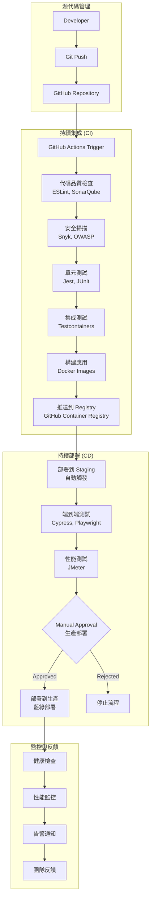
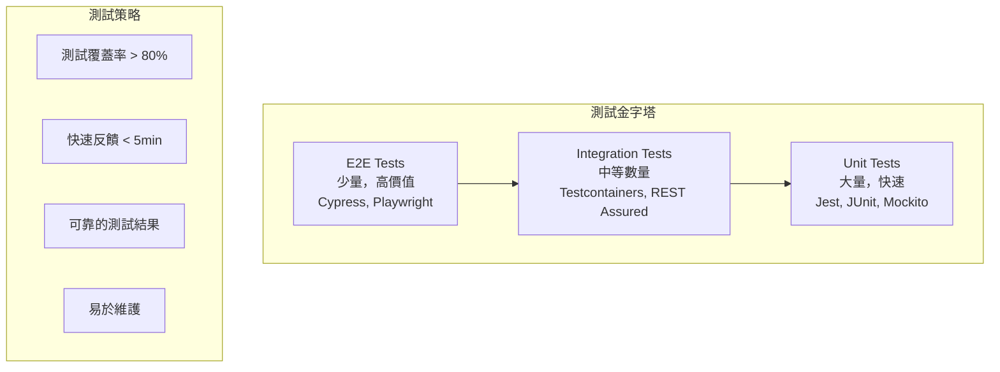
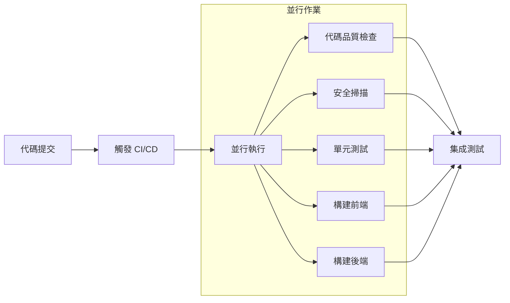
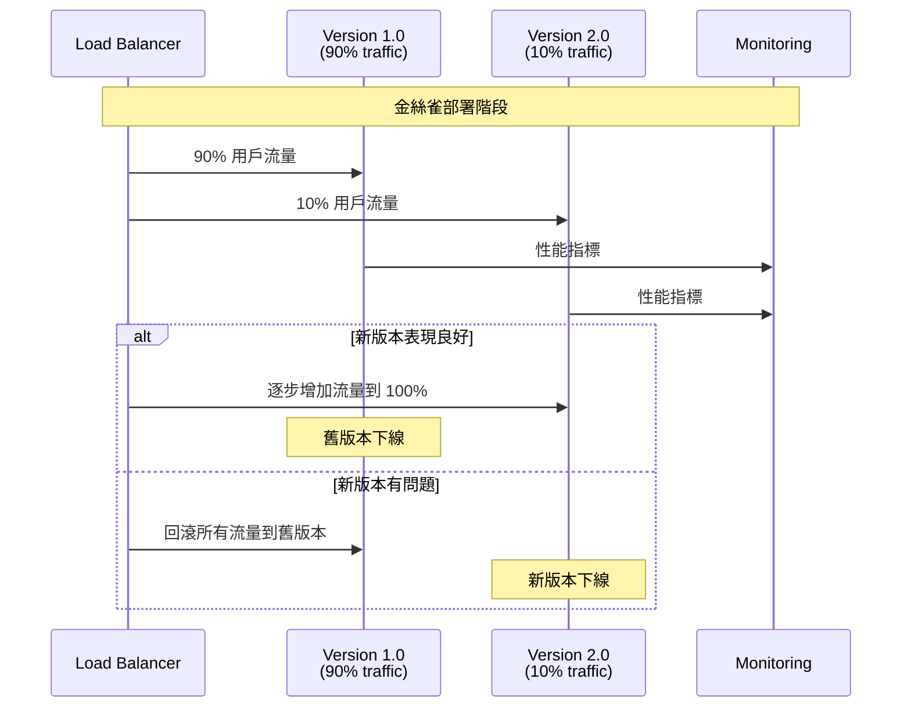

# 🔄 Ocean Shopping Center - DevOps 流水線文檔

## 📋 目錄

- [DevOps 概覽](#devops-概覽)
- [CI/CD 架構](#cicd-架構)
- [GitHub Actions 流水線](#github-actions-流水線)
- [自動化測試](#自動化測試)
- [部署管道](#部署管道)
- [監控集成](#監控集成)
- [安全掃描](#安全掃描)
- [最佳實踐](#最佳實踐)

---

## 🚀 DevOps 概覽

Ocean Shopping Center 採用現代化 DevOps 實踐，實現從代碼提交到生產部署的全自動化流水線。我們的 DevOps 策略專注於**持續集成**、**持續部署**、**品質保證**和**安全性**。

### DevOps 核心原則
- **自動化優先**: 最大化自動化，減少人工干預
- **快速反饋**: 提供即時的構建和測試反饋
- **安全左移**: 在開發早期集成安全檢查
- **可觀測性**: 全面的監控和日誌記錄
- **可靠性**: 確保部署的一致性和可重複性

### 技術棧
- **版本控制**: Git + GitHub
- **CI/CD**: GitHub Actions
- **容器化**: Docker + Docker Compose
- **註冊表**: Docker Hub / GitHub Container Registry
- **監控**: Prometheus + Grafana + ELK Stack
- **安全**: Snyk + OWASP + SonarQube

---

## 🏗️ CI/CD 架構

### 整體流水線架構



### 分支策略


---

## ⚙️ GitHub Actions 流水線

### 主工作流程配置

```yaml
# .github/workflows/ci-cd.yml
name: CI/CD Pipeline

on:
  push:
    branches: [ main, develop ]
  pull_request:
    branches: [ main, develop ]
  release:
    types: [ published ]

env:
  REGISTRY: ghcr.io
  IMAGE_NAME: ${{ github.repository }}

jobs:
  # 代碼品質檢查
  code-quality:
    runs-on: ubuntu-latest
    
    steps:
      - name: Checkout code
        uses: actions/checkout@v4
        with:
          fetch-depth: 0  # 需要完整歷史記錄用於 SonarQube
      
      - name: Setup Node.js
        uses: actions/setup-node@v4
        with:
          node-version: '18'
          cache: 'npm'
          cache-dependency-path: frontend/package-lock.json
      
      - name: Setup Java
        uses: actions/setup-java@v4
        with:
          java-version: '17'
          distribution: 'temurin'
          cache: maven
          cache-dependency-path: backend/pom.xml
      
      # 前端代碼品質檢查
      - name: Install frontend dependencies
        working-directory: ./frontend
        run: npm ci
      
      - name: Run ESLint
        working-directory: ./frontend
        run: npm run lint
      
      - name: Run Prettier check
        working-directory: ./frontend
        run: npm run format:check
      
      # 後端代碼品質檢查
      - name: Run Maven checkstyle
        working-directory: ./backend
        run: mvn checkstyle:check
      
      - name: Run SpotBugs
        working-directory: ./backend
        run: mvn spotbugs:check
      
      # SonarQube 分析
      - name: SonarQube Scan
        uses: sonarqube-quality-gate-action@master
        env:
          GITHUB_TOKEN: ${{ secrets.GITHUB_TOKEN }}
          SONAR_TOKEN: ${{ secrets.SONAR_TOKEN }}
        with:
          projectBaseDir: .
          args: >
            -Dsonar.projectKey=ocean-shopping-center
            -Dsonar.organization=your-org
            -Dsonar.host.url=https://sonarcloud.io

  # 安全掃描
  security-scan:
    runs-on: ubuntu-latest
    
    steps:
      - name: Checkout code
        uses: actions/checkout@v4
      
      # 前端依賴安全掃描
      - name: Run Snyk to check for vulnerabilities (Frontend)
        uses: snyk/actions/node@master
        env:
          SNYK_TOKEN: ${{ secrets.SNYK_TOKEN }}
        with:
          args: --project-name=ocean-shopping-center-frontend
          command: test
          json: true
        continue-on-error: true
      
      # 後端依賴安全掃描
      - name: Run Snyk to check for vulnerabilities (Backend)
        uses: snyk/actions/maven@master
        env:
          SNYK_TOKEN: ${{ secrets.SNYK_TOKEN }}
        with:
          args: --project-name=ocean-shopping-center-backend
          command: test
          json: true
        continue-on-error: true
      
      # OWASP 依賴檢查
      - name: Run OWASP Dependency Check
        uses: dependency-check/Dependency-Check_Action@main
        with:
          project: 'ocean-shopping-center'
          path: '.'
          format: 'HTML'
        env:
          JAVA_HOME: /opt/jdk
      
      # 上傳安全報告
      - name: Upload security reports
        uses: actions/upload-artifact@v4
        with:
          name: security-reports
          path: reports/

  # 單元測試
  unit-tests:
    runs-on: ubuntu-latest
    
    services:
      postgres:
        image: postgres:15
        env:
          POSTGRES_PASSWORD: test
          POSTGRES_DB: testdb
        options: >-
          --health-cmd pg_isready
          --health-interval 10s
          --health-timeout 5s
          --health-retries 5
        ports:
          - 5432:5432
      
      redis:
        image: redis:7
        options: >-
          --health-cmd "redis-cli ping"
          --health-interval 10s
          --health-timeout 5s
          --health-retries 5
        ports:
          - 6379:6379
    
    steps:
      - name: Checkout code
        uses: actions/checkout@v4
      
      - name: Setup Node.js
        uses: actions/setup-node@v4
        with:
          node-version: '18'
          cache: 'npm'
          cache-dependency-path: frontend/package-lock.json
      
      - name: Setup Java
        uses: actions/setup-java@v4
        with:
          java-version: '17'
          distribution: 'temurin'
          cache: maven
          cache-dependency-path: backend/pom.xml
      
      # 前端單元測試
      - name: Install frontend dependencies
        working-directory: ./frontend
        run: npm ci
      
      - name: Run frontend unit tests
        working-directory: ./frontend
        run: npm run test:ci
        env:
          CI: true
      
      # 後端單元測試
      - name: Run backend unit tests
        working-directory: ./backend
        run: mvn test
        env:
          SPRING_DATASOURCE_URL: jdbc:postgresql://localhost:5432/testdb
          SPRING_DATASOURCE_USERNAME: postgres
          SPRING_DATASOURCE_PASSWORD: test
          SPRING_REDIS_HOST: localhost
          SPRING_REDIS_PORT: 6379
      
      # 測試覆蓋率報告
      - name: Generate test coverage report
        working-directory: ./backend
        run: mvn jacoco:report
      
      - name: Upload coverage to Codecov
        uses: codecov/codecov-action@v3
        with:
          file: ./backend/target/site/jacoco/jacoco.xml
          flags: unittests
          name: codecov-umbrella

  # 集成測試
  integration-tests:
    runs-on: ubuntu-latest
    needs: [code-quality, security-scan, unit-tests]
    
    steps:
      - name: Checkout code
        uses: actions/checkout@v4
      
      - name: Setup Java
        uses: actions/setup-java@v4
        with:
          java-version: '17'
          distribution: 'temurin'
          cache: maven
      
      - name: Run integration tests
        working-directory: ./backend
        run: mvn integration-test -P integration-tests
        env:
          TESTCONTAINERS_RYUK_DISABLED: true
      
      - name: Upload test results
        uses: actions/upload-artifact@v4
        if: always()
        with:
          name: integration-test-results
          path: backend/target/failsafe-reports/

  # 構建和推送映像檔
  build-and-push:
    runs-on: ubuntu-latest
    needs: [integration-tests]
    if: github.event_name == 'push' || github.event_name == 'release'
    
    outputs:
      frontend-image: ${{ steps.frontend-meta.outputs.tags }}
      backend-image: ${{ steps.backend-meta.outputs.tags }}
    
    steps:
      - name: Checkout code
        uses: actions/checkout@v4
      
      - name: Log in to Container Registry
        uses: docker/login-action@v3
        with:
          registry: ${{ env.REGISTRY }}
          username: ${{ github.actor }}
          password: ${{ secrets.GITHUB_TOKEN }}
      
      - name: Extract metadata (Frontend)
        id: frontend-meta
        uses: docker/metadata-action@v5
        with:
          images: ${{ env.REGISTRY }}/${{ env.IMAGE_NAME }}/frontend
          tags: |
            type=ref,event=branch
            type=ref,event=pr
            type=semver,pattern={{version}}
            type=sha,prefix={{branch}}-,suffix=-{{date 'YYYYMMDD-HHmmss'}}
      
      - name: Extract metadata (Backend)
        id: backend-meta
        uses: docker/metadata-action@v5
        with:
          images: ${{ env.REGISTRY }}/${{ env.IMAGE_NAME }}/backend
          tags: |
            type=ref,event=branch
            type=ref,event=pr
            type=semver,pattern={{version}}
            type=sha,prefix={{branch}}-,suffix=-{{date 'YYYYMMDD-HHmmss'}}
      
      - name: Build and push frontend image
        uses: docker/build-push-action@v5
        with:
          context: ./frontend
          push: true
          tags: ${{ steps.frontend-meta.outputs.tags }}
          labels: ${{ steps.frontend-meta.outputs.labels }}
          cache-from: type=gha
          cache-to: type=gha,mode=max
      
      - name: Build and push backend image
        uses: docker/build-push-action@v5
        with:
          context: ./backend
          push: true
          tags: ${{ steps.backend-meta.outputs.tags }}
          labels: ${{ steps.backend-meta.outputs.labels }}
          cache-from: type=gha
          cache-to: type=gha,mode=max

  # 部署到 Staging 環境
  deploy-staging:
    runs-on: ubuntu-latest
    needs: [build-and-push]
    if: github.ref == 'refs/heads/develop'
    environment: staging
    
    steps:
      - name: Checkout code
        uses: actions/checkout@v4
      
      - name: Deploy to staging
        uses: ./.github/actions/deploy
        with:
          environment: staging
          frontend-image: ${{ needs.build-and-push.outputs.frontend-image }}
          backend-image: ${{ needs.build-and-push.outputs.backend-image }}
          deploy-key: ${{ secrets.STAGING_DEPLOY_KEY }}

  # 端到端測試
  e2e-tests:
    runs-on: ubuntu-latest
    needs: [deploy-staging]
    if: github.ref == 'refs/heads/develop'
    
    steps:
      - name: Checkout code
        uses: actions/checkout@v4
      
      - name: Setup Node.js
        uses: actions/setup-node@v4
        with:
          node-version: '18'
          cache: 'npm'
          cache-dependency-path: e2e/package-lock.json
      
      - name: Install E2E dependencies
        working-directory: ./e2e
        run: npm ci
      
      - name: Run Cypress E2E tests
        working-directory: ./e2e
        run: npx cypress run
        env:
          CYPRESS_BASE_URL: https://staging.ocean-shopping-center.com
          CYPRESS_API_URL: https://staging-api.ocean-shopping-center.com
      
      - name: Upload E2E artifacts
        uses: actions/upload-artifact@v4
        if: failure()
        with:
          name: cypress-videos
          path: e2e/cypress/videos/

  # 部署到生產環境
  deploy-production:
    runs-on: ubuntu-latest
    needs: [build-and-push, e2e-tests]
    if: github.event_name == 'release'
    environment: production
    
    steps:
      - name: Checkout code
        uses: actions/checkout@v4
      
      - name: Deploy to production
        uses: ./.github/actions/deploy
        with:
          environment: production
          frontend-image: ${{ needs.build-and-push.outputs.frontend-image }}
          backend-image: ${{ needs.build-and-push.outputs.backend-image }}
          deploy-key: ${{ secrets.PRODUCTION_DEPLOY_KEY }}
      
      - name: Run smoke tests
        run: |
          curl -f https://ocean-shopping-center.com/health || exit 1
          curl -f https://api.ocean-shopping-center.com/actuator/health || exit 1
      
      - name: Notify deployment success
        uses: 8398a7/action-slack@v3
        with:
          status: success
          channel: '#deployments'
          message: '🚀 Production deployment successful for version ${{ github.event.release.tag_name }}'
        env:
          SLACK_WEBHOOK_URL: ${{ secrets.SLACK_WEBHOOK_URL }}
```

### 自定義部署 Action

```yaml
# .github/actions/deploy/action.yml
name: 'Deploy Application'
description: 'Deploy Ocean Shopping Center to specified environment'

inputs:
  environment:
    description: 'Target environment (staging/production)'
    required: true
  frontend-image:
    description: 'Frontend Docker image tag'
    required: true
  backend-image:
    description: 'Backend Docker image tag'
    required: true
  deploy-key:
    description: 'SSH deploy key'
    required: true

runs:
  using: 'composite'
  steps:
    - name: Setup SSH
      shell: bash
      run: |
        mkdir -p ~/.ssh
        echo "${{ inputs.deploy-key }}" > ~/.ssh/deploy_key
        chmod 600 ~/.ssh/deploy_key
        ssh-keyscan -H ${{ inputs.environment }}.ocean-shopping-center.com >> ~/.ssh/known_hosts
    
    - name: Deploy application
      shell: bash
      run: |
        ssh -i ~/.ssh/deploy_key deploy@${{ inputs.environment }}.ocean-shopping-center.com \
          "cd /opt/ocean-shopping-center && \
           export FRONTEND_IMAGE=${{ inputs.frontend-image }} && \
           export BACKEND_IMAGE=${{ inputs.backend-image }} && \
           ./deploy.sh ${{ inputs.environment }}"
    
    - name: Wait for health check
      shell: bash
      run: |
        for i in {1..30}; do
          if curl -f https://${{ inputs.environment }}.ocean-shopping-center.com/health; then
            echo "✅ Health check passed"
            break
          fi
          if [ $i -eq 30 ]; then
            echo "❌ Health check failed"
            exit 1
          fi
          sleep 10
        done
```

---

## 🧪 自動化測試

### 測試金字塔



### 前端測試配置

```json
// frontend/package.json
{
  "scripts": {
    "test": "jest",
    "test:watch": "jest --watch",
    "test:ci": "jest --ci --coverage --watchAll=false",
    "test:e2e": "cypress run",
    "test:e2e:open": "cypress open"
  },
  "jest": {
    "testEnvironment": "jsdom",
    "setupFilesAfterEnv": ["<rootDir>/src/setupTests.ts"],
    "collectCoverageFrom": [
      "src/**/*.{ts,tsx}",
      "!src/**/*.d.ts",
      "!src/index.tsx",
      "!src/reportWebVitals.ts"
    ],
    "coverageThreshold": {
      "global": {
        "branches": 80,
        "functions": 80,
        "lines": 80,
        "statements": 80
      }
    }
  }
}
```

### 後端測試配置

```xml
<!-- backend/pom.xml -->
<plugin>
    <groupId>org.jacoco</groupId>
    <artifactId>jacoco-maven-plugin</artifactId>
    <version>0.8.8</version>
    <executions>
        <execution>
            <goals>
                <goal>prepare-agent</goal>
            </goals>
        </execution>
        <execution>
            <id>report</id>
            <phase>test</phase>
            <goals>
                <goal>report</goal>
            </goals>
        </execution>
        <execution>
            <id>check</id>
            <goals>
                <goal>check</goal>
            </goals>
            <configuration>
                <rules>
                    <rule>
                        <element>CLASS</element>
                        <limits>
                            <limit>
                                <counter>LINE</counter>
                                <value>COVEREDRATIO</value>
                                <minimum>0.80</minimum>
                            </limit>
                        </limits>
                    </rule>
                </rules>
            </configuration>
        </execution>
    </executions>
</plugin>
```

### Cypress E2E 測試

```typescript
// e2e/cypress/e2e/user-journey.cy.ts
describe('User Journey', () => {
  beforeEach(() => {
    cy.visit('/')
    cy.clearCookies()
    cy.clearLocalStorage()
  })

  it('完整用戶購物流程', () => {
    // 1. 用戶註冊
    cy.get('[data-cy="register-button"]').click()
    cy.get('[data-cy="email"]').type('test@example.com')
    cy.get('[data-cy="password"]').type('password123')
    cy.get('[data-cy="register-submit"]').click()
    
    // 2. 瀏覽產品
    cy.get('[data-cy="product-grid"]').should('be.visible')
    cy.get('[data-cy="product-card"]').first().click()
    
    // 3. 加入購物車
    cy.get('[data-cy="add-to-cart"]').click()
    cy.get('[data-cy="cart-counter"]').should('contain', '1')
    
    // 4. 結帳流程
    cy.get('[data-cy="cart-icon"]').click()
    cy.get('[data-cy="checkout-button"]').click()
    
    // 5. 填寫配送資訊
    cy.get('[data-cy="shipping-form"]').within(() => {
      cy.get('[data-cy="address"]').type('123 Test Street')
      cy.get('[data-cy="city"]').type('Test City')
      cy.get('[data-cy="postal-code"]').type('12345')
    })
    
    // 6. 選擇付款方式
    cy.get('[data-cy="payment-method-credit-card"]').click()
    cy.get('[data-cy="credit-card-form"]').within(() => {
      cy.get('[data-cy="card-number"]').type('4242424242424242')
      cy.get('[data-cy="expiry"]').type('12/25')
      cy.get('[data-cy="cvc"]').type('123')
    })
    
    // 7. 完成訂單
    cy.get('[data-cy="place-order"]').click()
    cy.get('[data-cy="order-success"]').should('be.visible')
    cy.get('[data-cy="order-number"]').should('exist')
  })

  it('性能測試', () => {
    // 頁面載入時間測試
    cy.visit('/', {
      onBeforeLoad: (win) => {
        win.performance.mark('start')
      },
      onLoad: (win) => {
        win.performance.mark('end')
        win.performance.measure('pageLoad', 'start', 'end')
        const measure = win.performance.getEntriesByName('pageLoad')[0]
        expect(measure.duration).to.be.lessThan(3000) // 3秒內載入
      }
    })
  })
})
```

---

## 📊 監控集成

### GitHub Actions 監控儀表板

```yaml
# .github/workflows/monitoring.yml
name: Pipeline Monitoring

on:
  schedule:
    - cron: '0 */6 * * *'  # 每 6 小時執行一次
  workflow_run:
    workflows: ["CI/CD Pipeline"]
    types: [completed]

jobs:
  pipeline-metrics:
    runs-on: ubuntu-latest
    
    steps:
      - name: Collect pipeline metrics
        uses: actions/github-script@v7
        with:
          script: |
            // 收集最近的工作流程執行數據
            const { data: runs } = await github.rest.actions.listWorkflowRuns({
              owner: context.repo.owner,
              repo: context.repo.repo,
              workflow_id: 'ci-cd.yml',
              per_page: 100
            });
            
            // 計算成功率和平均執行時間
            const metrics = runs.workflow_runs.reduce((acc, run) => {
              if (run.conclusion === 'success') acc.successes++;
              if (run.conclusion === 'failure') acc.failures++;
              acc.totalDuration += new Date(run.updated_at) - new Date(run.created_at);
              return acc;
            }, { successes: 0, failures: 0, totalDuration: 0 });
            
            const successRate = (metrics.successes / runs.workflow_runs.length) * 100;
            const avgDuration = metrics.totalDuration / runs.workflow_runs.length / 1000 / 60; // 分鐘
            
            // 發送到 Prometheus
            const prometheusMetrics = `
            # HELP github_actions_success_rate GitHub Actions success rate percentage
            # TYPE github_actions_success_rate gauge
            github_actions_success_rate ${successRate}
            
            # HELP github_actions_avg_duration_minutes Average pipeline duration in minutes
            # TYPE github_actions_avg_duration_minutes gauge
            github_actions_avg_duration_minutes ${avgDuration}
            `;
            
            console.log('Pipeline Metrics:', { successRate, avgDuration });
      
      - name: Send metrics to monitoring
        run: |
          curl -X POST http://pushgateway:9091/metrics/job/github_actions \
            -H "Content-Type: text/plain" \
            --data-binary @metrics.txt
```

### 部署監控 Webhook

```typescript
// monitoring/deployment-webhook.ts
import express from 'express';
import crypto from 'crypto';

const app = express();
app.use(express.json());

app.post('/webhook/deployment', (req, res) => {
  // 驗證 GitHub webhook 簽名
  const signature = req.headers['x-hub-signature-256'];
  const payload = JSON.stringify(req.body);
  const expectedSignature = 'sha256=' + crypto
    .createHmac('sha256', process.env.WEBHOOK_SECRET!)
    .update(payload)
    .digest('hex');

  if (!crypto.timingSafeEqual(Buffer.from(signature), Buffer.from(expectedSignature))) {
    return res.status(401).send('Unauthorized');
  }

  const { deployment, deployment_status } = req.body;
  
  // 記錄部署事件
  if (deployment_status) {
    const metric = {
      name: 'deployment_status',
      labels: {
        environment: deployment.environment,
        state: deployment_status.state,
        repository: deployment.repository.name
      },
      value: deployment_status.state === 'success' ? 1 : 0,
      timestamp: new Date().toISOString()
    };
    
    // 發送到 Prometheus
    sendToPrometheus(metric);
    
    // 發送到 Slack
    if (deployment_status.state === 'failure') {
      sendSlackAlert(`❌ 部署失敗: ${deployment.environment} 環境`);
    } else if (deployment_status.state === 'success') {
      sendSlackNotification(`✅ 部署成功: ${deployment.environment} 環境`);
    }
  }

  res.status(200).send('OK');
});

function sendToPrometheus(metric: any) {
  // Prometheus metrics 發送邏輯
  const prometheusMetric = `${metric.name}{${Object.entries(metric.labels)
    .map(([k, v]) => `${k}="${v}"`)
    .join(',')}} ${metric.value} ${Date.now()}`;
  
  // 推送到 Pushgateway
  fetch('http://pushgateway:9091/metrics/job/deployments', {
    method: 'POST',
    body: prometheusMetric,
    headers: { 'Content-Type': 'text/plain' }
  });
}

function sendSlackAlert(message: string) {
  // Slack 通知邏輯
  fetch(process.env.SLACK_WEBHOOK_URL!, {
    method: 'POST',
    body: JSON.stringify({
      channel: '#alerts',
      text: message,
      username: 'DeployBot',
      icon_emoji: ':warning:'
    }),
    headers: { 'Content-Type': 'application/json' }
  });
}
```

---

## 🔒 安全掃描

### SAST (靜態應用程式安全測試)

```yaml
# .github/workflows/security.yml
name: Security Scanning

on:
  push:
    branches: [ main, develop ]
  pull_request:
    branches: [ main ]
  schedule:
    - cron: '0 2 * * 1'  # 每週一凌晨 2 點

jobs:
  sast-scan:
    runs-on: ubuntu-latest
    
    steps:
      - name: Checkout code
        uses: actions/checkout@v4
        with:
          fetch-depth: 0
      
      # CodeQL 分析
      - name: Initialize CodeQL
        uses: github/codeql-action/init@v2
        with:
          languages: javascript, java
          queries: security-extended
      
      - name: Autobuild
        uses: github/codeql-action/autobuild@v2
      
      - name: Perform CodeQL Analysis
        uses: github/codeql-action/analyze@v2
        with:
          category: "/language:javascript,java"
      
      # Semgrep 掃描
      - name: Run Semgrep
        uses: returntocorp/semgrep-action@v1
        with:
          config: >-
            p/security-audit
            p/secrets
            p/owasp-top-ten
        env:
          SEMGREP_APP_TOKEN: ${{ secrets.SEMGREP_APP_TOKEN }}

  dependency-scan:
    runs-on: ubuntu-latest
    
    steps:
      - name: Checkout code
        uses: actions/checkout@v4
      
      # npm audit
      - name: Run npm audit (Frontend)
        working-directory: ./frontend
        run: |
          npm audit --audit-level=moderate
          npm audit --json > npm-audit-results.json
        continue-on-error: true
      
      # Maven dependency check
      - name: Run OWASP Dependency Check (Backend)
        uses: dependency-check/Dependency-Check_Action@main
        with:
          project: 'ocean-shopping-center-backend'
          path: './backend'
          format: 'JSON'
          args: >
            --enableRetired
            --enableExperimental
            --out reports
            --suppression owasp-suppressions.xml
      
      # 上傳掃描結果
      - name: Upload scan results
        uses: actions/upload-artifact@v4
        with:
          name: security-scan-results
          path: |
            frontend/npm-audit-results.json
            reports/

  container-scan:
    runs-on: ubuntu-latest
    needs: build
    
    steps:
      - name: Run Trivy vulnerability scanner
        uses: aquasecurity/trivy-action@master
        with:
          image-ref: '${{ needs.build.outputs.frontend-image }}'
          format: 'sarif'
          output: 'trivy-frontend-results.sarif'
      
      - name: Upload Trivy scan results
        uses: github/codeql-action/upload-sarif@v2
        with:
          sarif_file: 'trivy-frontend-results.sarif'
```

### 密鑰掃描配置

```yaml
# .gitleaks.toml
title = "Ocean Shopping Center GitLeaks Configuration"

[extend]
useDefault = true

[[rules]]
description = "AWS Access Key"
regex = '''AKIA[0-9A-Z]{16}'''
tags = ["key", "AWS"]

[[rules]]
description = "JWT Secret"
regex = '''jwt[._-]?secret[._-]?[:=]\s*['""]?([a-zA-Z0-9+/]{40,})['""]?'''
tags = ["secret", "JWT"]

[[rules]]
description = "Database Password"
regex = '''(db|database)[._-]?pass(word)?[._-]?[:=]\s*['""]?([^\s'""\n]{8,})['""]?'''
tags = ["secret", "database"]

[allowlist]
description = "Allowlist for test files"
files = [
    '''.*test.*''',
    '''.*spec.*''',
    '''.*example.*'''
]

paths = [
    '''(.*?)(jpg|gif|doc|pdf|bin)$'''
]
```

---

## 🎯 最佳實踐

### 流水線優化策略

#### 1. 並行執行



#### 2. 快取策略

```yaml
# 快取最佳實踐
- name: Cache Node modules
  uses: actions/cache@v3
  with:
    path: ~/.npm
    key: ${{ runner.os }}-node-${{ hashFiles('**/package-lock.json') }}
    restore-keys: |
      ${{ runner.os }}-node-

- name: Cache Maven dependencies
  uses: actions/cache@v3
  with:
    path: ~/.m2
    key: ${{ runner.os }}-m2-${{ hashFiles('**/pom.xml') }}
    restore-keys: ${{ runner.os }}-m2
```

#### 3. 條件執行

```yaml
# 根據變更檔案決定執行內容
- name: Check for frontend changes
  uses: dorny/paths-filter@v2
  id: changes
  with:
    filters: |
      frontend:
        - 'frontend/**'
      backend:
        - 'backend/**'
      docs:
        - 'documentation/**'

- name: Run frontend tests
  if: steps.changes.outputs.frontend == 'true'
  working-directory: ./frontend
  run: npm run test:ci
```

### 環境管理

#### 環境配置矩陣

| 環境 | 目的 | 部署觸發 | 資源配置 | 監控等級 |
|------|------|----------|----------|----------|
| **Development** | 本地開發 | 手動 | 最小配置 | 基礎日誌 |
| **Staging** | 測試驗證 | develop 分支 | 生產等級 | 完整監控 |
| **Production** | 正式服務 | 手動批准 | 高可用配置 | 7x24 監控 |

#### 配置管理

```yaml
# environments/staging.yml
environment: staging
database:
  host: staging-db.ocean-shopping-center.com
  name: staging_ocean_shopping
  pool_size: 10

redis:
  host: staging-redis.ocean-shopping-center.com
  max_connections: 50

features:
  new_checkout_flow: true
  beta_features: true
  debug_mode: true

monitoring:
  log_level: DEBUG
  metrics_enabled: true
  tracing_enabled: true
```

### 部署策略

#### 金絲雀部署



### 故障排除

#### 常見流水線問題

| 問題 | 症狀 | 解決方案 |
|------|------|----------|
| **測試不穩定** | 間歇性失敗 | 1. 增加重試機制<br/>2. 修復 flaky tests<br/>3. 改善測試隔離 |
| **建構時間過長** | 超過 30 分鐘 | 1. 啟用快取<br/>2. 並行執行<br/>3. 優化 Dockerfile |
| **部署失敗** | 健康檢查失敗 | 1. 檢查配置<br/>2. 驗證依賴服務<br/>3. 查看應用日誌 |
| **安全掃描誤報** | 假陽性告警 | 1. 建立白名單<br/>2. 更新掃描規則<br/>3. 手動驗證結果 |

### 度量指標

#### DevOps 關鍵指標 (DORA Metrics)

```yaml
# monitoring/dora-metrics.yml
metrics:
  deployment_frequency:
    description: "部署頻率"
    target: "每天多次部署"
    current: "每天 2-3 次"
  
  lead_time_for_changes:
    description: "變更前置時間"
    target: "< 1 天"
    current: "4-6 小時"
  
  change_failure_rate:
    description: "變更失敗率"
    target: "< 15%"
    current: "8-12%"
  
  time_to_restore_service:
    description: "服務恢復時間"
    target: "< 1 小時"
    current: "15-30 分鐘"
```

---

## 📖 相關文檔

- [系統架構設計](../architecture/system-architecture.md)
- [生產環境部署](production-deployment.md)
- [開發環境設置](development-setup.md)
- [監控告警](../monitoring/monitoring-alerting.md)

---

**最後更新**: 2025-09-05  
**版本**: 1.0  
**維護者**: Ocean Shopping Center DevOps Team