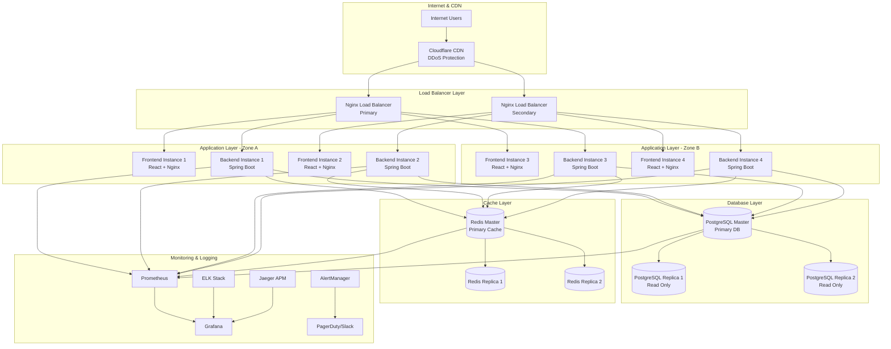
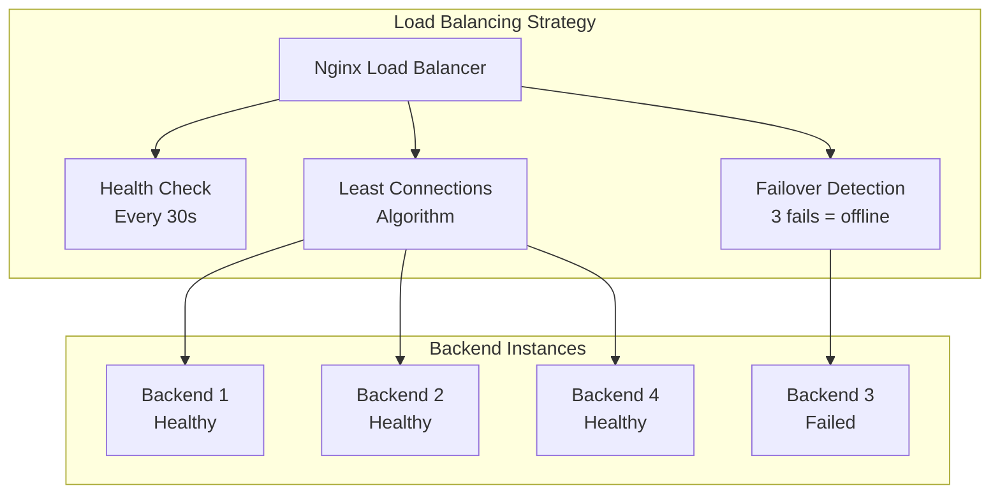
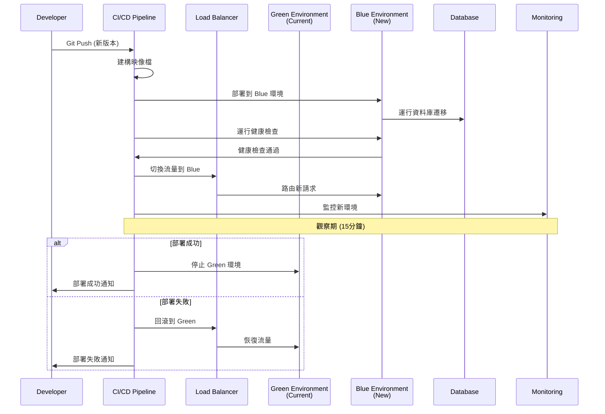

# 🚀 Ocean Shopping Center - 生產環境部署指南

## 📋 目錄

- [部署概覽](#部署概覽)
- [生產環境架構](#生產環境架構)  
- [容器化部署](#容器化部署)
- [數據庫部署](#數據庫部署)
- [負載均衡配置](#負載均衡配置)
- [安全配置](#安全配置)
- [監控告警](#監控告警)
- [部署流程](#部署流程)
- [維護操作](#維護操作)

---

## 🏗️ 部署概覽

Ocean Shopping Center 生產環境採用**容器化微服務架構**，支持高可用性、自動擴展和藍綠部署。生產環境包含多個實例以確保服務可用性和容錯能力。

### 生產環境特性
- **高可用性**: 多實例部署 + 負載均衡
- **自動擴展**: 基於 CPU/Memory 指標的水平擴展
- **零停機部署**: 藍綠部署策略
- **災難恢復**: 數據備份 + 快速恢復機制
- **安全加固**: SSL/TLS + 防火牆 + 入侵檢測

---

## 🏗️ 生產環境架構

### 整體架構圖



### 部署規模配置

| 組件 | 實例數量 | CPU | Memory | 存儲 | 備註 |
|------|---------|-----|--------|------|------|
| **Frontend** | 4 | 2 Core | 4GB | 50GB | Nginx + React 靜態文件 |
| **Backend** | 4 | 4 Core | 8GB | 100GB | Spring Boot 應用 |
| **PostgreSQL Master** | 1 | 8 Core | 32GB | 1TB SSD | 主數據庫 |
| **PostgreSQL Replica** | 2 | 4 Core | 16GB | 1TB SSD | 讀取副本 |
| **Redis Master** | 1 | 4 Core | 16GB | 200GB SSD | 主快取 |
| **Redis Replica** | 2 | 2 Core | 8GB | 200GB SSD | 快取副本 |
| **Load Balancer** | 2 | 2 Core | 4GB | 50GB | Nginx 負載均衡 |

---

## 🐳 容器化部署

### 生產環境 Docker Compose

```yaml
# docker-compose.prod.yml
version: '3.8'

services:
  # 前端應用
  frontend:
    image: ocean-shopping-center/frontend:${VERSION}
    deploy:
      replicas: 4
      restart_policy:
        condition: on-failure
        max_attempts: 3
      resources:
        limits:
          cpus: '2'
          memory: 4G
        reservations:
          cpus: '1'
          memory: 2G
    networks:
      - frontend-network
    environment:
      - NODE_ENV=production
      - REACT_APP_API_URL=${API_URL}
      - REACT_APP_WEBSOCKET_URL=${WEBSOCKET_URL}
    healthcheck:
      test: ["CMD", "curl", "-f", "http://localhost:3000/health"]
      interval: 30s
      timeout: 10s
      retries: 3
      start_period: 60s

  # 後端應用
  backend:
    image: ocean-shopping-center/backend:${VERSION}
    deploy:
      replicas: 4
      restart_policy:
        condition: on-failure
        max_attempts: 3
      resources:
        limits:
          cpus: '4'
          memory: 8G
        reservations:
          cpus: '2'
          memory: 4G
    networks:
      - backend-network
      - database-network
    environment:
      - SPRING_PROFILES_ACTIVE=production
      - DATABASE_URL=${DATABASE_URL}
      - REDIS_URL=${REDIS_URL}
      - JWT_SECRET=${JWT_SECRET}
      - STRIPE_SECRET_KEY=${STRIPE_SECRET_KEY}
    healthcheck:
      test: ["CMD", "curl", "-f", "http://localhost:8080/actuator/health"]
      interval: 30s
      timeout: 10s
      retries: 3
      start_period: 120s
    depends_on:
      - postgres-master
      - redis-master

  # PostgreSQL 主數據庫
  postgres-master:
    image: postgres:15-alpine
    environment:
      - POSTGRES_DB=${POSTGRES_DB}
      - POSTGRES_USER=${POSTGRES_USER}
      - POSTGRES_PASSWORD=${POSTGRES_PASSWORD}
      - POSTGRES_REPLICATION_USER=${POSTGRES_REPLICATION_USER}
      - POSTGRES_REPLICATION_PASSWORD=${POSTGRES_REPLICATION_PASSWORD}
    volumes:
      - postgres-master-data:/var/lib/postgresql/data
      - ./postgres/postgresql.conf:/etc/postgresql/postgresql.conf
      - ./postgres/pg_hba.conf:/etc/postgresql/pg_hba.conf
    networks:
      - database-network
    ports:
      - "5432:5432"
    command: >
      postgres
      -c config_file=/etc/postgresql/postgresql.conf
    healthcheck:
      test: ["CMD-SHELL", "pg_isready -U ${POSTGRES_USER} -d ${POSTGRES_DB}"]
      interval: 10s
      timeout: 5s
      retries: 5

  # PostgreSQL 讀取副本 1
  postgres-replica1:
    image: postgres:15-alpine
    environment:
      - PGUSER=${POSTGRES_REPLICATION_USER}
      - POSTGRES_PASSWORD=${POSTGRES_REPLICATION_PASSWORD}
      - POSTGRES_MASTER_SERVICE=postgres-master
    volumes:
      - postgres-replica1-data:/var/lib/postgresql/data
    networks:
      - database-network
    depends_on:
      - postgres-master
    command: |
      bash -c '
      until pg_basebackup --pgdata=/var/lib/postgresql/data -R --slot=replication_slot_1 --host=postgres-master --port=5432
      do
        echo "Waiting for master to connect..."
        sleep 1s
      done
      echo "Backup done, starting replica..."
      chmod 0700 /var/lib/postgresql/data
      postgres
      '

  # Redis 主快取
  redis-master:
    image: redis:7-alpine
    networks:
      - database-network
    volumes:
      - redis-master-data:/data
      - ./redis/redis.conf:/etc/redis/redis.conf
    command: redis-server /etc/redis/redis.conf
    healthcheck:
      test: ["CMD", "redis-cli", "ping"]
      interval: 10s
      timeout: 5s
      retries: 5

  # Redis 副本
  redis-replica1:
    image: redis:7-alpine
    networks:
      - database-network
    volumes:
      - redis-replica1-data:/data
    command: redis-server --slaveof redis-master 6379
    depends_on:
      - redis-master

  # Nginx 負載均衡器
  nginx-lb:
    image: nginx:alpine
    ports:
      - "80:80"
      - "443:443"
    volumes:
      - ./nginx/nginx.conf:/etc/nginx/nginx.conf
      - ./nginx/ssl:/etc/nginx/ssl
      - ./nginx/logs:/var/log/nginx
    networks:
      - frontend-network
      - backend-network
    depends_on:
      - frontend
      - backend
    healthcheck:
      test: ["CMD", "wget", "--quiet", "--tries=1", "--spider", "http://localhost/health"]
      interval: 30s
      timeout: 10s
      retries: 3

  # Prometheus 監控
  prometheus:
    image: prom/prometheus:latest
    ports:
      - "9090:9090"
    volumes:
      - ./monitoring/prometheus.yml:/etc/prometheus/prometheus.yml
      - prometheus-data:/prometheus
    networks:
      - monitoring-network

  # Grafana 儀表板
  grafana:
    image: grafana/grafana:latest
    ports:
      - "3001:3000"
    volumes:
      - grafana-data:/var/lib/grafana
      - ./monitoring/grafana:/etc/grafana/provisioning
    networks:
      - monitoring-network
    environment:
      - GF_SECURITY_ADMIN_PASSWORD=${GRAFANA_PASSWORD}

networks:
  frontend-network:
    driver: bridge
  backend-network:
    driver: bridge
  database-network:
    driver: bridge
    internal: true
  monitoring-network:
    driver: bridge

volumes:
  postgres-master-data:
  postgres-replica1-data:
  postgres-replica2-data:
  redis-master-data:
  redis-replica1-data:
  redis-replica2-data:
  prometheus-data:
  grafana-data:
```

### 生產環境配置檔案

#### Nginx 負載均衡配置

```nginx
# nginx/nginx.conf
events {
    worker_connections 1024;
}

http {
    upstream frontend {
        least_conn;
        server frontend:3000 max_fails=3 fail_timeout=30s;
        keepalive 32;
    }
    
    upstream backend {
        least_conn;
        server backend:8080 max_fails=3 fail_timeout=30s;
        keepalive 32;
    }
    
    # 限速配置
    limit_req_zone $binary_remote_addr zone=api:10m rate=10r/s;
    limit_req_zone $binary_remote_addr zone=login:10m rate=5r/m;
    
    server {
        listen 80;
        server_name your-domain.com;
        
        # HTTPS 重定向
        return 301 https://$server_name$request_uri;
    }
    
    server {
        listen 443 ssl http2;
        server_name your-domain.com;
        
        # SSL 配置
        ssl_certificate /etc/nginx/ssl/cert.pem;
        ssl_certificate_key /etc/nginx/ssl/key.pem;
        ssl_protocols TLSv1.2 TLSv1.3;
        ssl_ciphers ECDHE-RSA-AES256-GCM-SHA384:ECDHE-RSA-AES128-GCM-SHA256;
        
        # 安全標頭
        add_header Strict-Transport-Security "max-age=31536000; includeSubDomains" always;
        add_header X-Frame-Options DENY always;
        add_header X-Content-Type-Options nosniff always;
        add_header X-XSS-Protection "1; mode=block" always;
        
        # 前端靜態資源
        location / {
            proxy_pass http://frontend;
            proxy_set_header Host $host;
            proxy_set_header X-Real-IP $remote_addr;
            proxy_set_header X-Forwarded-For $proxy_add_x_forwarded_for;
            proxy_set_header X-Forwarded-Proto $scheme;
            
            # 快取配置
            expires 1d;
            add_header Cache-Control "public, immutable";
        }
        
        # API 路由
        location /api/ {
            limit_req zone=api burst=20 nodelay;
            
            proxy_pass http://backend;
            proxy_set_header Host $host;
            proxy_set_header X-Real-IP $remote_addr;
            proxy_set_header X-Forwarded-For $proxy_add_x_forwarded_for;
            proxy_set_header X-Forwarded-Proto $scheme;
            
            # 超時配置
            proxy_connect_timeout 60s;
            proxy_send_timeout 60s;
            proxy_read_timeout 60s;
        }
        
        # 登入 API 特殊限速
        location /api/auth/login {
            limit_req zone=login burst=5 nodelay;
            
            proxy_pass http://backend;
            proxy_set_header Host $host;
            proxy_set_header X-Real-IP $remote_addr;
            proxy_set_header X-Forwarded-For $proxy_add_x_forwarded_for;
            proxy_set_header X-Forwarded-Proto $scheme;
        }
        
        # WebSocket 支持
        location /ws/ {
            proxy_pass http://backend;
            proxy_http_version 1.1;
            proxy_set_header Upgrade $http_upgrade;
            proxy_set_header Connection "upgrade";
            proxy_set_header Host $host;
            proxy_set_header X-Real-IP $remote_addr;
            proxy_set_header X-Forwarded-For $proxy_add_x_forwarded_for;
            proxy_set_header X-Forwarded-Proto $scheme;
        }
        
        # 健康檢查
        location /health {
            access_log off;
            return 200 "OK\n";
            add_header Content-Type text/plain;
        }
    }
}
```

---

## 🗄️ 數據庫部署

### PostgreSQL 主從配置

#### 主數據庫配置 (postgresql.conf)

```ini
# postgresql.conf
listen_addresses = '*'
port = 5432
max_connections = 200
shared_buffers = 8GB
effective_cache_size = 24GB
maintenance_work_mem = 2GB
checkpoint_completion_target = 0.9
wal_buffers = 16MB
default_statistics_target = 100
random_page_cost = 1.1
effective_io_concurrency = 200

# 複製配置
wal_level = replica
archive_mode = on
archive_command = 'cp %p /var/lib/postgresql/archive/%f'
max_wal_senders = 3
max_replication_slots = 3
hot_standby = on
hot_standby_feedback = on

# 日誌配置
logging_collector = on
log_directory = 'log'
log_filename = 'postgresql-%Y-%m-%d_%H%M%S.log'
log_statement = 'mod'
log_min_duration_statement = 1000
log_checkpoints = on
log_connections = on
log_disconnections = on
log_lock_waits = on
```

#### 複製用戶配置 (pg_hba.conf)

```conf
# pg_hba.conf
local   all             postgres                                peer
local   all             all                                     peer
host    all             all             0.0.0.0/0              md5
host    replication     replicator      0.0.0.0/0              md5
```

### Redis 集群配置

```conf
# redis/redis.conf
bind 0.0.0.0
port 6379
protected-mode yes
requirepass your_redis_password

# 持久化配置
save 900 1
save 300 10
save 60 10000

# 記憶體配置
maxmemory 12gb
maxmemory-policy allkeys-lru

# 日誌配置
loglevel notice
logfile /var/log/redis/redis-server.log

# 安全配置
rename-command FLUSHALL ""
rename-command FLUSHDB ""
rename-command KEYS ""
```

---

## ⚖️ 負載均衡配置

### 負載均衡策略



### 會話保持配置

```nginx
# 會話保持 (如需要)
upstream backend {
    ip_hash;  # 基於 IP 的會話保持
    server backend1:8080;
    server backend2:8080;
    server backend3:8080;
    server backend4:8080;
}
```

---

## 🔒 安全配置

### SSL/TLS 配置

#### 申請和配置 SSL 證書

```bash
# 使用 Let's Encrypt 申請免費 SSL
sudo certbot --nginx -d your-domain.com -d www.your-domain.com

# 設置自動續約
sudo crontab -e
# 添加以下行
0 12 * * * /usr/bin/certbot renew --quiet
```

### 防火牆配置

```bash
# UFW 防火牆規則
sudo ufw default deny incoming
sudo ufw default allow outgoing

# 允許必要端口
sudo ufw allow ssh
sudo ufw allow 80/tcp
sudo ufw allow 443/tcp

# 限制數據庫訪問
sudo ufw allow from 10.0.0.0/8 to any port 5432
sudo ufw allow from 10.0.0.0/8 to any port 6379

# 啟用防火牆
sudo ufw enable
```

### 應用程式安全配置

```yaml
# application-production.yml
spring:
  security:
    cors:
      allowed-origins:
        - "https://your-domain.com"
        - "https://www.your-domain.com"
      allowed-methods:
        - GET
        - POST
        - PUT
        - DELETE
        - OPTIONS
      allowed-headers: "*"
      allow-credentials: true
      max-age: 3600

  datasource:
    hikari:
      maximum-pool-size: 20
      minimum-idle: 5
      connection-timeout: 30000
      idle-timeout: 600000
      max-lifetime: 1800000

jwt:
  secret: ${JWT_SECRET}
  expiration: 3600000  # 1 hour
  refresh-expiration: 2592000000  # 30 days

logging:
  level:
    org.springframework.security: INFO
    org.hibernate.SQL: WARN
    org.hibernate.type.descriptor.sql.BasicBinder: WARN
```

---

## 📊 監控告警

### Prometheus 配置

```yaml
# monitoring/prometheus.yml
global:
  scrape_interval: 15s
  evaluation_interval: 15s

rule_files:
  - "alert_rules.yml"

scrape_configs:
  - job_name: 'spring-boot-app'
    static_configs:
      - targets: ['backend:8080']
    metrics_path: '/actuator/prometheus'
    scrape_interval: 10s

  - job_name: 'postgres'
    static_configs:
      - targets: ['postgres-exporter:9187']
    scrape_interval: 10s

  - job_name: 'redis'
    static_configs:
      - targets: ['redis-exporter:9121']
    scrape_interval: 10s

  - job_name: 'nginx'
    static_configs:
      - targets: ['nginx-exporter:9113']
    scrape_interval: 10s

alerting:
  alertmanagers:
    - static_configs:
        - targets:
          - alertmanager:9093
```

### 告警規則配置

```yaml
# monitoring/alert_rules.yml
groups:
  - name: application_alerts
    rules:
      - alert: HighCPUUsage
        expr: cpu_usage_percent > 90
        for: 5m
        labels:
          severity: warning
        annotations:
          summary: "High CPU usage detected"
          description: "CPU usage is above 90% for more than 5 minutes"

      - alert: HighMemoryUsage
        expr: memory_usage_percent > 95
        for: 5m
        labels:
          severity: critical
        annotations:
          summary: "High memory usage detected"
          description: "Memory usage is above 95% for more than 5 minutes"

      - alert: DatabaseConnectionPoolHigh
        expr: hikari_connections_active / hikari_connections_max > 0.9
        for: 2m
        labels:
          severity: warning
        annotations:
          summary: "Database connection pool usage high"
          description: "Connection pool usage is above 90%"

      - alert: ApplicationDown
        expr: up{job="spring-boot-app"} == 0
        for: 1m
        labels:
          severity: critical
        annotations:
          summary: "Application instance down"
          description: "Application instance has been down for more than 1 minute"

      - alert: HighErrorRate
        expr: rate(http_requests_total{status=~"5.."}[5m]) / rate(http_requests_total[5m]) > 0.01
        for: 5m
        labels:
          severity: warning
        annotations:
          summary: "High error rate detected"
          description: "HTTP 5xx error rate is above 1% for more than 5 minutes"
```

---

## 🚀 部署流程

### 藍綠部署策略



### 部署腳本

```bash
#!/bin/bash
# deploy.sh

set -e  # 遇到錯誤立即退出

# 環境變數
ENVIRONMENT=${1:-production}
VERSION=${2:-latest}
BLUE_GREEN=${3:-blue}

echo "🚀 開始部署 Ocean Shopping Center"
echo "環境: $ENVIRONMENT"
echo "版本: $VERSION" 
echo "環境: $BLUE_GREEN"

# 1. 檢查先決條件
echo "✅ 檢查部署環境..."
if ! command -v docker &> /dev/null; then
    echo "❌ Docker 未安裝"
    exit 1
fi

if ! command -v docker-compose &> /dev/null; then
    echo "❌ Docker Compose 未安裝"
    exit 1
fi

# 2. 載入環境配置
echo "📋 載入環境配置..."
source .env.$ENVIRONMENT

# 3. 建構應用映像檔
echo "🏗️ 建構應用映像檔..."
docker build -t ocean-shopping-center/frontend:$VERSION ./frontend
docker build -t ocean-shopping-center/backend:$VERSION ./backend

# 4. 資料庫備份
echo "💾 備份資料庫..."
docker-compose -f docker-compose.$ENVIRONMENT.yml exec -T postgres-master \
    pg_dump -U $POSTGRES_USER $POSTGRES_DB > backup-$(date +%Y%m%d-%H%M%S).sql

# 5. 部署到藍綠環境
echo "🔄 部署到 $BLUE_GREEN 環境..."
export VERSION=$VERSION
export ENVIRONMENT=$BLUE_GREEN

docker-compose -f docker-compose.$ENVIRONMENT.yml up -d

# 6. 健康檢查
echo "🏥 等待服務健康檢查..."
sleep 60

# 檢查前端健康
for i in {1..30}; do
    if curl -f http://localhost:3000/health > /dev/null 2>&1; then
        echo "✅ 前端服務健康"
        break
    fi
    if [ $i -eq 30 ]; then
        echo "❌ 前端健康檢查失敗"
        exit 1
    fi
    sleep 10
done

# 檢查後端健康
for i in {1..30}; do
    if curl -f http://localhost:8080/actuator/health > /dev/null 2>&1; then
        echo "✅ 後端服務健康"
        break
    fi
    if [ $i -eq 30 ]; then
        echo "❌ 後端健康檢查失敗"
        exit 1
    fi
    sleep 10
done

# 7. 流量切換 (需要手動確認)
echo "⚠️ 準備切換流量到新環境"
echo "請確認新環境運行正常，然後執行:"
echo "  ./switch-traffic.sh $BLUE_GREEN"

# 8. 清理舊映像檔
echo "🧹 清理舊映像檔..."
docker image prune -a -f --filter "until=24h"

echo "✅ 部署完成！"
echo "📊 監控面板: http://your-domain.com:3001"
echo "📊 API 文檔: https://your-domain.com/api/swagger-ui.html"
```

### 流量切換腳本

```bash
#!/bin/bash
# switch-traffic.sh

ENVIRONMENT=${1:-blue}

echo "🔄 切換流量到 $ENVIRONMENT 環境..."

# 更新 Nginx 配置
if [ "$ENVIRONMENT" = "blue" ]; then
    cp nginx/nginx-blue.conf nginx/nginx.conf
else
    cp nginx/nginx-green.conf nginx/nginx.conf
fi

# 重新載入 Nginx 配置
docker-compose -f docker-compose.prod.yml exec nginx-lb nginx -s reload

echo "✅ 流量已切換到 $ENVIRONMENT 環境"

# 監控新環境 15 分鐘
echo "📊 監控新環境 15 分鐘..."
for i in {1..15}; do
    echo "監控中... ($i/15 分鐘)"
    
    # 檢查錯誤率
    ERROR_RATE=$(curl -s 'http://prometheus:9090/api/v1/query?query=rate(http_requests_total{status=~"5.."}[5m])' | jq '.data.result[0].value[1]' | sed 's/"//g')
    
    if (( $(echo "$ERROR_RATE > 0.01" | bc -l) )); then
        echo "❌ 錯誤率過高，準備回滾"
        ./rollback.sh
        exit 1
    fi
    
    sleep 60
done

echo "✅ 部署成功，新環境運行穩定"
```

### 回滾腳本

```bash
#!/bin/bash
# rollback.sh

echo "🔄 開始回滾部署..."

# 確定當前環境
CURRENT_ENV=$(docker-compose -f docker-compose.prod.yml ps | grep "Up" | grep -q "blue" && echo "blue" || echo "green")
ROLLBACK_ENV=$([ "$CURRENT_ENV" = "blue" ] && echo "green" || echo "blue")

echo "當前環境: $CURRENT_ENV"
echo "回滾到環境: $ROLLBACK_ENV"

# 切換流量
./switch-traffic.sh $ROLLBACK_ENV

# 停止有問題的環境
echo "🛑 停止有問題的環境..."
docker-compose -f docker-compose.$CURRENT_ENV.yml down

echo "✅ 回滾完成"
```

---

## 🔧 維護操作

### 日常維護檢查清單

#### 每日檢查
- [ ] 檢查應用程式健康狀態
- [ ] 檢查系統資源使用率 (CPU, Memory, Disk)
- [ ] 檢查數據庫連接池狀態
- [ ] 檢查快取命中率
- [ ] 檢查錯誤日誌

#### 每週檢查  
- [ ] 數據庫效能分析
- [ ] 安全日誌審查
- [ ] 備份恢復測試
- [ ] 依賴項安全掃描
- [ ] 監控告警規則檢查

#### 每月檢查
- [ ] 系統安全更新
- [ ] 容量規劃評估
- [ ] 災難恢復演練
- [ ] 效能基準測試
- [ ] 文檔更新

### 備份與恢復

#### 數據庫備份腳本

```bash
#!/bin/bash
# backup-database.sh

BACKUP_DIR="/var/backups/postgresql"
DATE=$(date +%Y%m%d_%H%M%S)
BACKUP_FILE="$BACKUP_DIR/ocean-shopping-center-$DATE.sql"

# 創建備份目錄
mkdir -p $BACKUP_DIR

# 執行備份
docker-compose -f docker-compose.prod.yml exec -T postgres-master \
    pg_dump -U $POSTGRES_USER $POSTGRES_DB > $BACKUP_FILE

# 壓縮備份
gzip $BACKUP_FILE

# 清理舊備份 (保留 30 天)
find $BACKUP_DIR -name "*.gz" -mtime +30 -delete

echo "✅ 數據庫備份完成: $BACKUP_FILE.gz"
```

#### 數據恢復腳本

```bash
#!/bin/bash
# restore-database.sh

BACKUP_FILE=${1}

if [ -z "$BACKUP_FILE" ]; then
    echo "❌ 請指定備份文件"
    echo "用法: ./restore-database.sh /path/to/backup.sql.gz"
    exit 1
fi

# 確認恢復操作
read -p "⚠️ 這將覆蓋當前數據庫，確定要繼續嗎？ (y/N): " -n 1 -r
echo
if [[ ! $REPLY =~ ^[Yy]$ ]]; then
    exit 1
fi

# 解壓備份文件
echo "📦 解壓備份文件..."
if [[ $BACKUP_FILE == *.gz ]]; then
    gunzip -c $BACKUP_FILE > temp_restore.sql
    RESTORE_FILE=temp_restore.sql
else
    RESTORE_FILE=$BACKUP_FILE
fi

# 停止應用程式
echo "🛑 停止應用程式..."
docker-compose -f docker-compose.prod.yml stop backend

# 恢復數據庫
echo "🔄 恢復數據庫..."
docker-compose -f docker-compose.prod.yml exec -T postgres-master \
    psql -U $POSTGRES_USER -d $POSTGRES_DB < $RESTORE_FILE

# 清理臨時文件
if [ "$RESTORE_FILE" = "temp_restore.sql" ]; then
    rm temp_restore.sql
fi

# 重啟應用程式
echo "🚀 重啟應用程式..."
docker-compose -f docker-compose.prod.yml start backend

echo "✅ 數據庫恢復完成"
```

### 日誌管理

#### 日誌收集配置

```yaml
# docker-compose.logging.yml
version: '3.8'

services:
  elasticsearch:
    image: docker.elastic.co/elasticsearch/elasticsearch:8.8.0
    environment:
      - discovery.type=single-node
      - "ES_JAVA_OPTS=-Xms2g -Xmx2g"
    volumes:
      - elasticsearch-data:/usr/share/elasticsearch/data
    networks:
      - logging-network

  logstash:
    image: docker.elastic.co/logstash/logstash:8.8.0
    volumes:
      - ./logging/logstash.conf:/usr/share/logstash/pipeline/logstash.conf
      - ./logs:/var/log/app
    networks:
      - logging-network
    depends_on:
      - elasticsearch

  kibana:
    image: docker.elastic.co/kibana/kibana:8.8.0
    ports:
      - "5601:5601"
    networks:
      - logging-network
    depends_on:
      - elasticsearch

networks:
  logging-network:
    driver: bridge

volumes:
  elasticsearch-data:
```

### 性能調優

#### JVM 調優

```yaml
# backend service environment variables
environment:
  - JAVA_OPTS=-Xms4g -Xmx6g -XX:+UseG1GC -XX:MaxGCPauseMillis=200 -XX:+PrintGCDetails
```

#### 數據庫調優

```sql
-- 常用查詢優化
EXPLAIN (ANALYZE, BUFFERS) 
SELECT * FROM orders 
WHERE user_id = 123 AND created_at >= '2023-01-01';

-- 建立索引
CREATE INDEX CONCURRENTLY idx_orders_user_id_created_at 
ON orders(user_id, created_at);

-- 分析表統計信息
ANALYZE orders;
```

---

## 🔧 故障排除

### 常見問題與解決方案

| 問題 | 症狀 | 解決方案 |
|------|------|----------|
| **高 CPU 使用率** | 響應緩慢 | 1. 檢查慢查詢<br/>2. 增加實例數量<br/>3. 調優 JVM 參數 |
| **記憶體不足** | OOMKilled | 1. 增加記憶體限制<br/>2. 檢查記憶體洩漏<br/>3. 調整 JVM heap size |
| **資料庫連接耗盡** | Connection timeout | 1. 增加連接池大小<br/>2. 檢查連接洩漏<br/>3. 減少連接超時時間 |
| **快取未命中** | 查詢緩慢 | 1. 檢查快取配置<br/>2. 預熱快取<br/>3. 調整 TTL 設置 |

### 緊急聯絡資訊

- **系統管理員**: admin@ocean-shopping.com
- **開發團隊**: dev-team@ocean-shopping.com
- **業務聯絡人**: business@ocean-shopping.com
- **24/7 支援**: +886-xxx-xxx-xxx

---

## 📖 相關文檔

- [系統架構設計](../architecture/system-architecture.md)
- [開發環境設置](development-setup.md)
- [API 文檔](../api/api-documentation.md)
- [監控告警](../monitoring/monitoring-alerting.md)

---

**最後更新**: 2025-09-05  
**版本**: 1.0  
**維護者**: Ocean Shopping Center Team