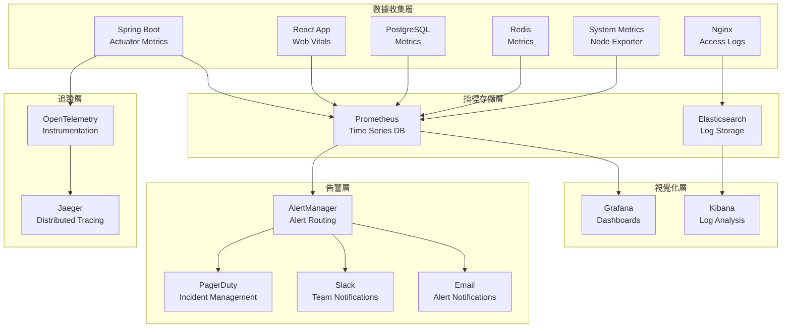
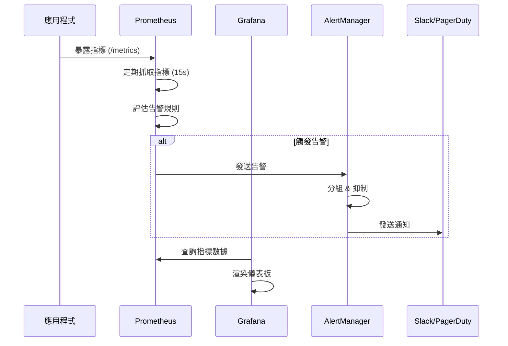

# 📊 Ocean Shopping Center - 監控告警系統

## 📋 目錄

- [監控概覽](#監控概覽)
- [監控架構](#監控架構)
- [Prometheus 配置](#prometheus-配置)
- [Grafana 儀表板](#grafana-儀表板)
- [告警規則](#告警規則)
- [日誌系統](#日誌系統)
- [APM 追蹤](#apm-追蹤)
- [健康檢查](#健康檢查)
- [故障排除](#故障排除)

---

## 🎯 監控概覽

Ocean Shopping Center 監控告警系統提供**全棧可觀測性**，包含指標收集、日誌聚合、分佈式追蹤和實時告警。系統採用業界標準工具構建，確保高可用性和可擴展性。

### 監控目標
- **服務可用性**: 99.9% SLA 監控
- **性能指標**: 響應時間、吞吐量、錯誤率
- **資源使用**: CPU、記憶體、磁碟、網路
- **業務指標**: 訂單量、收入、用戶活躍度
- **安全監控**: 異常登入、API 濫用、系統入侵

### 核心組件
- **Prometheus**: 指標收集與存儲
- **Grafana**: 儀表板與視覺化
- **AlertManager**: 告警路由與通知
- **ELK Stack**: 日誌收集與分析
- **Jaeger**: 分佈式追蹤
- **Uptime Kuma**: 服務可用性監控

---

## 🏗️ 監控架構

### 整體架構圖



### 數據流程



---

## 📈 Prometheus 配置

### 主配置檔案

```yaml
# prometheus/prometheus.yml
global:
  scrape_interval: 15s
  evaluation_interval: 15s
  external_labels:
    cluster: 'ocean-shopping-center'
    environment: 'production'

rule_files:
  - "alert_rules/*.yml"
  - "recording_rules/*.yml"

alerting:
  alertmanagers:
    - static_configs:
        - targets:
          - alertmanager:9093

scrape_configs:
  # Spring Boot 應用程式
  - job_name: 'spring-boot-backend'
    static_configs:
      - targets: 
        - 'backend-1:8080'
        - 'backend-2:8080'
        - 'backend-3:8080'
        - 'backend-4:8080'
    metrics_path: '/actuator/prometheus'
    scrape_interval: 10s
    scrape_timeout: 5s

  # Node Exporter (系統指標)
  - job_name: 'node-exporter'
    static_configs:
      - targets:
        - 'node-exporter-1:9100'
        - 'node-exporter-2:9100'
    scrape_interval: 15s

  # PostgreSQL 指標
  - job_name: 'postgres-exporter'
    static_configs:
      - targets: ['postgres-exporter:9187']
    scrape_interval: 15s

  # Redis 指標
  - job_name: 'redis-exporter'
    static_configs:
      - targets: ['redis-exporter:9121']
    scrape_interval: 15s

  # Nginx 指標
  - job_name: 'nginx-exporter'
    static_configs:
      - targets: ['nginx-exporter:9113']
    scrape_interval: 15s

  # JVM 指標 (JMX)
  - job_name: 'jmx-exporter'
    static_configs:
      - targets: ['jmx-exporter:9404']
    scrape_interval: 30s

  # 應用程式自定義指標
  - job_name: 'custom-metrics'
    static_configs:
      - targets: ['backend:8080']
    metrics_path: '/actuator/prometheus'
    scrape_interval: 10s

  # Blackbox Exporter (端點監控)
  - job_name: 'blackbox-http'
    metrics_path: /probe
    params:
      module: [http_2xx]
    static_configs:
      - targets:
        - https://ocean-shopping-center.com
        - https://api.ocean-shopping-center.com/health
    relabel_configs:
      - source_labels: [__address__]
        target_label: __param_target
      - source_labels: [__param_target]
        target_label: instance
      - target_label: __address__
        replacement: blackbox-exporter:9115
```

### 記錄規則 (Recording Rules)

```yaml
# prometheus/recording_rules/business_metrics.yml
groups:
  - name: business_metrics
    interval: 60s
    rules:
      # 每分鐘訂單數
      - record: business:orders_per_minute
        expr: rate(orders_total[1m]) * 60

      # 平均訂單價值
      - record: business:average_order_value
        expr: increase(order_total_amount[5m]) / increase(orders_total[5m])

      # 購物車轉換率
      - record: business:cart_conversion_rate
        expr: increase(orders_total[5m]) / increase(cart_created_total[5m]) * 100

      # API 錯誤率
      - record: api:error_rate_5m
        expr: |
          (
            sum(rate(http_requests_total{status=~"5.."}[5m])) /
            sum(rate(http_requests_total[5m]))
          ) * 100

      # 數據庫連接池使用率
      - record: db:connection_pool_usage
        expr: |
          (
            hikari_connections_active / hikari_connections_max
          ) * 100

  - name: performance_metrics
    interval: 30s
    rules:
      # API 響應時間百分位數
      - record: api:response_time_p95
        expr: histogram_quantile(0.95, rate(http_request_duration_seconds_bucket[5m]))

      - record: api:response_time_p99
        expr: histogram_quantile(0.99, rate(http_request_duration_seconds_bucket[5m]))

      # 系統負載平均
      - record: system:load_average_5m
        expr: avg(node_load5)

      # 記憶體使用率
      - record: system:memory_usage_percent
        expr: |
          (
            1 - (node_memory_MemAvailable_bytes / node_memory_MemTotal_bytes)
          ) * 100
```

---

## 📊 Grafana 儀表板

### 主要儀表板配置

#### 1. 系統概覽儀表板

```json
{
  "dashboard": {
    "title": "Ocean Shopping Center - 系統概覽",
    "tags": ["overview", "production"],
    "refresh": "30s",
    "panels": [
      {
        "title": "服務狀態",
        "type": "stat",
        "targets": [
          {
            "expr": "up{job=\"spring-boot-backend\"}",
            "legendFormat": "Backend {{instance}}"
          }
        ],
        "fieldConfig": {
          "defaults": {
            "thresholds": {
              "steps": [
                {"color": "red", "value": 0},
                {"color": "green", "value": 1}
              ]
            }
          }
        }
      },
      {
        "title": "請求量 (RPS)",
        "type": "graph",
        "targets": [
          {
            "expr": "sum(rate(http_requests_total[5m]))",
            "legendFormat": "總請求量"
          }
        ]
      },
      {
        "title": "響應時間分佈",
        "type": "heatmap",
        "targets": [
          {
            "expr": "rate(http_request_duration_seconds_bucket[5m])",
            "format": "heatmap"
          }
        ]
      }
    ]
  }
}
```

#### 2. 業務指標儀表板

```json
{
  "dashboard": {
    "title": "Ocean Shopping Center - 業務指標",
    "panels": [
      {
        "title": "即時訂單量",
        "type": "stat",
        "targets": [
          {
            "expr": "business:orders_per_minute",
            "legendFormat": "每分鐘訂單數"
          }
        ]
      },
      {
        "title": "平均訂單價值",
        "type": "stat",
        "targets": [
          {
            "expr": "business:average_order_value",
            "legendFormat": "平均訂單價值 (TWD)"
          }
        ]
      },
      {
        "title": "購物車轉換率",
        "type": "graph",
        "targets": [
          {
            "expr": "business:cart_conversion_rate",
            "legendFormat": "轉換率 (%)"
          }
        ]
      },
      {
        "title": "支付成功率",
        "type": "gauge",
        "targets": [
          {
            "expr": "increase(payment_success_total[5m]) / increase(payment_attempts_total[5m]) * 100",
            "legendFormat": "支付成功率"
          }
        ],
        "fieldConfig": {
          "defaults": {
            "min": 0,
            "max": 100,
            "thresholds": {
              "steps": [
                {"color": "red", "value": 0},
                {"color": "yellow", "value": 95},
                {"color": "green", "value": 99}
              ]
            }
          }
        }
      }
    ]
  }
}
```

### 儀表板自動化部署

```yaml
# grafana/provisioning/dashboards/dashboard.yml
apiVersion: 1

providers:
  - name: 'Ocean Shopping Center'
    orgId: 1
    folder: 'Production'
    type: file
    disableDeletion: false
    updateIntervalSeconds: 10
    allowUiUpdates: true
    options:
      path: /var/lib/grafana/dashboards
```

---

## 🚨 告警規則

### 核心告警規則

```yaml
# prometheus/alert_rules/critical_alerts.yml
groups:
  - name: critical_alerts
    rules:
      # 服務下線告警
      - alert: ServiceDown
        expr: up == 0
        for: 1m
        labels:
          severity: critical
          team: infrastructure
        annotations:
          summary: "服務 {{ $labels.instance }} 已下線"
          description: "服務 {{ $labels.job }}/{{ $labels.instance }} 已經下線超過 1 分鐘"
          runbook_url: "https://wiki.ocean-shopping-center.com/runbooks/service-down"

      # 高錯誤率告警
      - alert: HighErrorRate
        expr: api:error_rate_5m > 5
        for: 5m
        labels:
          severity: warning
          team: backend
        annotations:
          summary: "API 錯誤率過高"
          description: "5xx 錯誤率為 {{ $value }}%，持續 5 分鐘"

      # 響應時間過長告警
      - alert: HighResponseTime
        expr: api:response_time_p95 > 1
        for: 5m
        labels:
          severity: warning
          team: backend
        annotations:
          summary: "API 響應時間過長"
          description: "P95 響應時間為 {{ $value }}s，超過 1 秒閾值"

  - name: infrastructure_alerts
    rules:
      # CPU 使用率過高
      - alert: HighCPUUsage
        expr: 100 - (avg by(instance) (irate(node_cpu_seconds_total{mode="idle"}[5m])) * 100) > 90
        for: 10m
        labels:
          severity: warning
          team: infrastructure
        annotations:
          summary: "{{ $labels.instance }} CPU 使用率過高"
          description: "CPU 使用率為 {{ $value }}%，持續 10 分鐘"

      # 記憶體使用率過高
      - alert: HighMemoryUsage
        expr: system:memory_usage_percent > 95
        for: 5m
        labels:
          severity: critical
          team: infrastructure
        annotations:
          summary: "{{ $labels.instance }} 記憶體使用率過高"
          description: "記憶體使用率為 {{ $value }}%，持續 5 分鐘"

      # 磁碟空間不足
      - alert: LowDiskSpace
        expr: (node_filesystem_avail_bytes / node_filesystem_size_bytes) * 100 < 10
        for: 5m
        labels:
          severity: critical
          team: infrastructure
        annotations:
          summary: "{{ $labels.instance }} 磁碟空間不足"
          description: "{{ $labels.mountpoint }} 可用空間只有 {{ $value }}%"

  - name: database_alerts
    rules:
      # 數據庫連接池使用率過高
      - alert: HighDatabaseConnectionUsage
        expr: db:connection_pool_usage > 90
        for: 2m
        labels:
          severity: warning
          team: database
        annotations:
          summary: "數據庫連接池使用率過高"
          description: "連接池使用率為 {{ $value }}%"

      # 數據庫查詢延遲
      - alert: SlowDatabaseQueries
        expr: rate(postgresql_slow_queries_total[5m]) > 10
        for: 3m
        labels:
          severity: warning
          team: database
        annotations:
          summary: "數據庫慢查詢增加"
          description: "慢查詢數量：{{ $value }} queries/second"

  - name: business_alerts
    rules:
      # 訂單量異常下降
      - alert: OrderVolumeDropped
        expr: business:orders_per_minute < 0.5
        for: 15m
        labels:
          severity: warning
          team: business
        annotations:
          summary: "訂單量異常下降"
          description: "每分鐘訂單數低於 0.5，持續 15 分鐘"

      # 支付失敗率過高
      - alert: HighPaymentFailureRate
        expr: (increase(payment_failed_total[5m]) / increase(payment_attempts_total[5m])) * 100 > 10
        for: 5m
        labels:
          severity: critical
          team: payments
        annotations:
          summary: "支付失敗率過高"
          description: "支付失敗率為 {{ $value }}%"
```

### AlertManager 配置

```yaml
# alertmanager/alertmanager.yml
global:
  smtp_smarthost: 'smtp.gmail.com:587'
  smtp_from: 'alerts@ocean-shopping-center.com'
  smtp_auth_username: 'alerts@ocean-shopping-center.com'
  smtp_auth_password: 'your-smtp-password'

route:
  group_by: ['alertname', 'cluster', 'service']
  group_wait: 10s
  group_interval: 10s
  repeat_interval: 1h
  receiver: 'web.hook'
  routes:
    # 緊急告警直接發送到 PagerDuty
    - match:
        severity: critical
      receiver: 'pagerduty-critical'
      continue: true

    # 基礎設施告警發送到基礎設施團隊
    - match:
        team: infrastructure
      receiver: 'infrastructure-team'

    # 業務告警發送到業務團隊
    - match:
        team: business
      receiver: 'business-team'

    # 開發告警發送到開發團隊
    - match:
        team: backend
      receiver: 'backend-team'

receivers:
  - name: 'web.hook'
    webhook_configs:
      - url: 'http://webhook-server:8080/webhook'

  - name: 'pagerduty-critical'
    pagerduty_configs:
      - service_key: 'your-pagerduty-service-key'
        description: '{{ range .Alerts }}{{ .Annotations.summary }}{{ end }}'

  - name: 'infrastructure-team'
    slack_configs:
      - api_url: 'https://hooks.slack.com/services/YOUR/SLACK/WEBHOOK'
        channel: '#infrastructure-alerts'
        title: '🚨 基礎設施告警'
        text: '{{ range .Alerts }}{{ .Annotations.description }}{{ end }}'
        send_resolved: true

  - name: 'business-team'
    email_configs:
      - to: 'business-team@ocean-shopping-center.com'
        subject: '[Ocean Shopping] 業務告警: {{ .GroupLabels.alertname }}'
        body: |
          {{ range .Alerts }}
          告警: {{ .Annotations.summary }}
          描述: {{ .Annotations.description }}
          時間: {{ .StartsAt }}
          {{ end }}

  - name: 'backend-team'
    slack_configs:
      - api_url: 'https://hooks.slack.com/services/YOUR/SLACK/WEBHOOK'
        channel: '#backend-alerts'
        title: '⚠️ 後端服務告警'
        text: '{{ range .Alerts }}{{ .Annotations.description }}{{ end }}'

inhibit_rules:
  # 抑制低級別告警，當高級別告警存在時
  - source_match:
      severity: 'critical'
    target_match:
      severity: 'warning'
    equal: ['alertname', 'instance']
```

---

## 📋 日誌系統

### ELK Stack 配置

#### Elasticsearch 配置

```yaml
# elasticsearch/elasticsearch.yml
cluster.name: ocean-shopping-center-logs
node.name: ${HOSTNAME}
path.data: /usr/share/elasticsearch/data
path.logs: /usr/share/elasticsearch/logs
network.host: 0.0.0.0
discovery.seed_hosts: ["elasticsearch"]
cluster.initial_master_nodes: ["node-1"]

# 索引模板
index.number_of_shards: 1
index.number_of_replicas: 1
index.refresh_interval: 30s

# 記憶體設定
bootstrap.memory_lock: true

# 安全設定
xpack.security.enabled: true
xpack.security.transport.ssl.enabled: true
```

#### Logstash 配置

```ruby
# logstash/pipeline/logstash.conf
input {
  # Spring Boot 應用日誌
  beats {
    port => 5044
  }
  
  # Nginx 訪問日誌
  file {
    path => "/var/log/nginx/access.log"
    start_position => "beginning"
    type => "nginx-access"
  }
  
  # PostgreSQL 日誌
  file {
    path => "/var/log/postgresql/*.log"
    start_position => "beginning"
    type => "postgresql"
  }
}

filter {
  # Spring Boot 日誌解析
  if [fields][service] == "spring-boot" {
    grok {
      match => {
        "message" => "%{TIMESTAMP_ISO8601:timestamp} %{LOGLEVEL:level} \[%{DATA:service},%{DATA:trace_id},%{DATA:span_id}\] %{NUMBER:pid} --- \[%{DATA:thread}\] %{DATA:class} : %{GREEDYDATA:log_message}"
      }
    }
    
    date {
      match => [ "timestamp", "yyyy-MM-dd HH:mm:ss.SSS" ]
    }
    
    # 提取結構化欄位
    if [log_message] =~ /^{.*}$/ {
      json {
        source => "log_message"
        target => "structured"
      }
    }
  }
  
  # Nginx 訪問日誌解析
  if [type] == "nginx-access" {
    grok {
      match => {
        "message" => "%{NGINXACCESS}"
      }
    }
    
    # 計算響應時間
    mutate {
      convert => { "request_time" => "float" }
      convert => { "response" => "integer" }
    }
    
    # GeoIP 分析
    geoip {
      source => "clientip"
      target => "geoip"
    }
  }
  
  # 錯誤日誌特殊處理
  if [level] in ["ERROR", "FATAL"] {
    mutate {
      add_tag => [ "error" ]
    }
  }
  
  # 安全事件檢測
  if [message] =~ /(?i)(sql injection|xss|csrf|unauthorized)/ {
    mutate {
      add_tag => [ "security_event" ]
    }
  }
}

output {
  # 輸出到 Elasticsearch
  elasticsearch {
    hosts => ["elasticsearch:9200"]
    index => "ocean-shopping-center-%{+YYYY.MM.dd}"
    template_name => "ocean-shopping-center"
    template_pattern => "ocean-shopping-center-*"
    template => "/usr/share/logstash/templates/ocean-shopping-center-template.json"
  }
  
  # 錯誤日誌額外輸出到告警系統
  if "error" in [tags] {
    http {
      url => "http://alert-webhook:8080/log-alert"
      http_method => "post"
      content_type => "application/json"
      format => "json"
    }
  }
  
  # 開發環境輸出到控制台
  if [fields][environment] == "development" {
    stdout {
      codec => rubydebug
    }
  }
}
```

### 日誌分析和告警

```yaml
# elastalert/rules/error_spike.yml
name: Error Log Spike
type: spike
index: ocean-shopping-center-*
timeframe:
  minutes: 5
threshold_ref: 10
threshold_cur: 50
spike_height: 3
spike_type: "up"

filter:
  - terms:
      level: ["ERROR", "FATAL"]

alert:
  - "slack"

slack:
  slack_webhook_url: "https://hooks.slack.com/services/YOUR/SLACK/WEBHOOK"
  slack_channel_override: "#alerts"
  slack_title: "🚨 錯誤日誌激增"
  slack_msg_color: "danger"
```

---

## 🔍 APM 追蹤

### OpenTelemetry 配置

```yaml
# otel/otel-collector.yml
receivers:
  otlp:
    protocols:
      grpc:
        endpoint: 0.0.0.0:4317
      http:
        endpoint: 0.0.0.0:4318

processors:
  batch:
  memory_limiter:
    limit_mib: 512

exporters:
  jaeger:
    endpoint: jaeger:14250
    tls:
      insecure: true
  prometheus:
    endpoint: "0.0.0.0:8889"

service:
  pipelines:
    traces:
      receivers: [otlp]
      processors: [memory_limiter, batch]
      exporters: [jaeger]
    metrics:
      receivers: [otlp]
      processors: [memory_limiter, batch]
      exporters: [prometheus]
```

### Spring Boot 追蹤配置

```yaml
# application.yml
management:
  tracing:
    sampling:
      probability: 1.0
  zipkin:
    tracing:
      endpoint: http://jaeger:9411/api/v2/spans

spring:
  application:
    name: ocean-shopping-center-backend
  sleuth:
    otel:
      config:
        trace-id-ratio-based: 1.0
        max-attrs: 64
        max-events: 128
        max-links: 128
      exporter:
        jaeger:
          endpoint: http://jaeger:14268/api/traces
```

### 自定義追蹤範例

```java
// UserService.java
@Service
@Slf4j
public class UserService {
    
    private final Tracer tracer;
    
    @Autowired
    public UserService(@Qualifier("otelTracer") Tracer tracer) {
        this.tracer = tracer;
    }
    
    @TraceAsync
    public User getUserById(Long userId) {
        Span span = tracer.nextSpan().name("get-user-by-id")
            .tag("user.id", userId.toString())
            .start();
        
        try (Tracer.SpanInScope ws = tracer.withSpanInScope(span)) {
            log.info("Fetching user with ID: {}", userId);
            
            // 模擬數據庫查詢
            User user = userRepository.findById(userId);
            
            if (user != null) {
                span.tag("user.found", "true")
                    .tag("user.email", user.getEmail());
            } else {
                span.tag("user.found", "false");
            }
            
            return user;
        } catch (Exception e) {
            span.tag("error", true)
                .tag("error.message", e.getMessage());
            throw e;
        } finally {
            span.end();
        }
    }
}
```

---

## 💓 健康檢查

### Spring Boot Actuator 健康檢查

```java
// HealthCheckConfiguration.java
@Configuration
public class HealthCheckConfiguration {

    @Bean
    public HealthIndicator databaseHealthIndicator(DataSource dataSource) {
        return new DataSourceHealthIndicator(dataSource);
    }

    @Bean
    public HealthIndicator redisHealthIndicator(RedisConnectionFactory connectionFactory) {
        return new RedisHealthIndicator(connectionFactory);
    }

    @Bean
    public HealthIndicator customBusinessHealthIndicator() {
        return new HealthIndicator() {
            @Override
            public Health health() {
                // 檢查關鍵業務邏輯
                boolean isHealthy = checkPaymentService() && checkInventoryService();
                
                if (isHealthy) {
                    return Health.up()
                        .withDetail("payment_service", "UP")
                        .withDetail("inventory_service", "UP")
                        .build();
                } else {
                    return Health.down()
                        .withDetail("error", "Critical business services unavailable")
                        .build();
                }
            }
            
            private boolean checkPaymentService() {
                try {
                    // 呼叫支付服務健康檢查端點
                    ResponseEntity<String> response = restTemplate.getForEntity(
                        "http://payment-service/health", String.class);
                    return response.getStatusCode() == HttpStatus.OK;
                } catch (Exception e) {
                    return false;
                }
            }
            
            private boolean checkInventoryService() {
                // 檢查庫存服務連通性
                return true; // 實作檢查邏輯
            }
        };
    }
}
```

### Kubernetes 健康檢查

```yaml
# k8s/deployment.yml
apiVersion: apps/v1
kind: Deployment
metadata:
  name: ocean-shopping-center-backend
spec:
  template:
    spec:
      containers:
      - name: backend
        image: ocean-shopping-center/backend:latest
        ports:
        - containerPort: 8080
        
        # 存活檢查
        livenessProbe:
          httpGet:
            path: /actuator/health/liveness
            port: 8080
          initialDelaySeconds: 30
          periodSeconds: 10
          timeoutSeconds: 5
          failureThreshold: 3
        
        # 就緒檢查
        readinessProbe:
          httpGet:
            path: /actuator/health/readiness
            port: 8080
          initialDelaySeconds: 5
          periodSeconds: 5
          timeoutSeconds: 3
          failureThreshold: 3
        
        # 啟動檢查
        startupProbe:
          httpGet:
            path: /actuator/health
            port: 8080
          initialDelaySeconds: 10
          periodSeconds: 10
          timeoutSeconds: 5
          failureThreshold: 30
```

### 外部服務監控

```yaml
# uptime-kuma/monitors.yml
monitors:
  - name: "Ocean Shopping Center 首頁"
    type: "http"
    url: "https://ocean-shopping-center.com"
    method: "GET"
    timeout: 10
    interval: 60
    expected_status: 200
    
  - name: "API 健康檢查"
    type: "http"
    url: "https://api.ocean-shopping-center.com/health"
    method: "GET"
    timeout: 5
    interval: 30
    expected_status: 200
    
  - name: "數據庫連接"
    type: "postgres"
    hostname: "postgres.ocean-shopping-center.com"
    port: 5432
    database: "ocean_shopping_center"
    username: "monitor_user"
    interval: 120
    
  - name: "Redis 服務"
    type: "redis"
    hostname: "redis.ocean-shopping-center.com"
    port: 6379
    interval: 60
```

---

## 🛠️ 故障排除

### 常見問題診斷

#### 1. 服務響應緩慢

```bash
# 檢查系統資源
curl -s http://backend:8080/actuator/metrics/system.cpu.usage

# 檢查 JVM 記憶體
curl -s http://backend:8080/actuator/metrics/jvm.memory.used

# 檢查數據庫連接池
curl -s http://backend:8080/actuator/metrics/hikaricp.connections.active

# 檢查慢查詢
grep -i "slow query" /var/log/postgresql/postgresql.log | tail -20
```

#### 2. 記憶體洩漏檢測

```bash
# JVM 堆內存分析
curl -s http://backend:8080/actuator/heapdump > heapdump.hprof

# 線程轉儲
curl -s http://backend:8080/actuator/threaddump > threaddump.txt

# GC 統計
curl -s http://backend:8080/actuator/metrics/jvm.gc.pause
```

#### 3. 網路連接問題

```bash
# 檢查端口連通性
nc -zv backend 8080

# 檢查 DNS 解析
nslookup api.ocean-shopping-center.com

# 檢查 SSL 證書
openssl s_client -connect api.ocean-shopping-center.com:443 -servername api.ocean-shopping-center.com
```

### 監控故障排除手冊

#### Prometheus 數據收集問題

```yaml
# 檢查目標狀態
# 訪問 http://prometheus:9090/targets

# 常見問題和解決方案：
# 1. Target down
#    - 檢查服務是否運行
#    - 檢查網路連通性
#    - 驗證指標端點路徑

# 2. 指標缺失
#    - 檢查應用程式指標暴露配置
#    - 驗證 Prometheus 配置檔案
#    - 檢查防火牆規則

# 3. 查詢性能問題
#    - 優化 PromQL 查詢
#    - 調整抓取間隔
#    - 增加 Prometheus 資源
```

#### Grafana 儀表板問題

```bash
# 檢查數據源連接
curl -H "Authorization: Bearer <api-key>" \
     http://grafana:3000/api/datasources/1/health

# 檢查儀表板 JSON 配置
curl -H "Authorization: Bearer <api-key>" \
     http://grafana:3000/api/dashboards/db/system-overview

# 重新載入配置
curl -X POST -H "Authorization: Bearer <api-key>" \
     http://grafana:3000/api/admin/provisioning/dashboards/reload
```

---

## 📊 性能基準測試

### 關鍵性能指標 (KPIs)

| 指標類型 | 指標名稱 | 目標值 | 告警閾值 | 業務影響 |
|----------|----------|--------|----------|----------|
| **可用性** | 服務正常運行時間 | 99.9% | < 99.5% | 直接影響收入 |
| **性能** | API P95 響應時間 | < 500ms | > 1s | 用戶體驗下降 |
| **性能** | 首頁載入時間 | < 2s | > 3s | 影響轉換率 |
| **錯誤率** | API 5xx 錯誤率 | < 0.1% | > 1% | 功能不可用 |
| **業務** | 訂單轉換率 | > 3% | < 2% | 收入直接下降 |
| **業務** | 支付成功率 | > 99% | < 95% | 嚴重業務影響 |
| **資源** | CPU 使用率 | < 70% | > 90% | 性能瓶頸 |
| **資源** | 記憶體使用率 | < 80% | > 95% | 系統不穩定 |

### SLA 監控

```yaml
# SLA 計算規則
groups:
  - name: sla_monitoring
    rules:
      # 可用性 SLA (99.9%)
      - record: sla:availability_monthly
        expr: |
          (
            sum(up{job="spring-boot-backend"}) / 
            count(up{job="spring-boot-backend"})
          ) * 100

      # 性能 SLA (P95 < 500ms)
      - record: sla:response_time_compliance
        expr: |
          (
            sum(histogram_quantile(0.95, rate(http_request_duration_seconds_bucket[5m])) <= 0.5) /
            count(histogram_quantile(0.95, rate(http_request_duration_seconds_bucket[5m])))
          ) * 100

      # 錯誤率 SLA (< 0.1%)
      - record: sla:error_rate_compliance
        expr: |
          (
            1 - (
              sum(rate(http_requests_total{status=~"5.."}[5m])) /
              sum(rate(http_requests_total[5m]))
            )
          ) * 100
```

---

## 📖 相關文檔

- [系統架構設計](../architecture/system-architecture.md)
- [生產環境部署](../deployment/production-deployment.md)
- [DevOps 流水線](../deployment/devops-pipeline.md)
- [API 文檔](../api/api-documentation.md)

---

**最後更新**: 2025-09-05  
**版本**: 1.0  
**維護者**: Ocean Shopping Center SRE Team